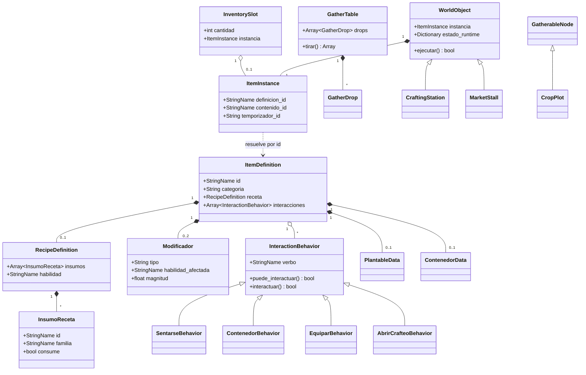
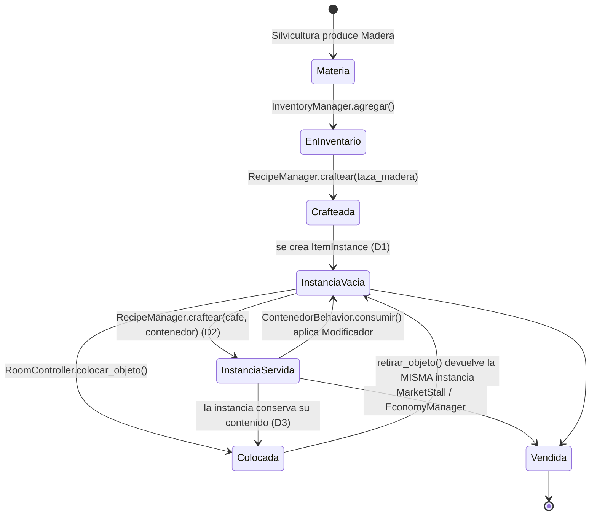

# MumiolaCity — Referencia de clases y objetos

**Versión:** 0.3 · **Fecha:** 2026-09-06 (D1, D2, D3, D7 y D11 cerradas; catálogo v0.4 con 42 ítems)
**Complementa:** [`SCRIPTS.md`](SCRIPTS.md) (qué scripts existen y en qué orden) y [`SISTEMAS.md`](SISTEMAS.md) (cómo se comunican y qué decisiones faltan).
**Este documento es la firma de cada clase:** de qué hereda, qué campos expone, qué estado guarda, qué señales emite, qué métodos ofrece y qué invariantes tiene que respetar. Es lo que se lee con el editor abierto, justo antes de escribir el archivo.

> **Estado:** especificación, no código escrito. Las firmas marcadas con **(D#)** salen de una decisión de [`SISTEMAS.md`](SISTEMAS.md) §6 — cinco ya cerradas (D1, D2, D3, D7, D11), el resto todavía abiertas — si esa decisión cambia, cambia la firma. Las clases marcadas **NUEVA** aparecieron al revisar el diseño: `SCRIPTS.md` las lista en su tabla "Las once clases que esta tabla no detalla", pero su firma solo existe acá.

---

## 0. Convenciones

**Nomenclatura.** Clases en `PascalCase` con `class_name`; métodos y variables en `snake_case`; privados con `_` inicial; constantes en `SCREAMING_SNAKE`. Los nombres de clase quedan en inglés donde son términos técnicos ya establecidos (`WorldObject`, `InventoryManager`) y los métodos en español, que es la convención que ya usa `SCRIPTS.md`.

**Tipado estricto siempre.** Toda variable, parámetro y retorno lleva tipo. En un proyecto orientado a datos, donde media docena de sistemas se pasan `ItemDefinition` entre sí, el tipado es lo que convierte un error de campo mal escrito en un error del editor en vez de un `null` a las tres de la mañana.

**`StringName` para todo identificador.** Ids de ítem, de habilidad, de familia y de verbo son `StringName` (`&"mineria"`), no `String`. Godot los internaliza: la comparación es por puntero en vez de carácter por carácter, y esas comparaciones ocurren en bucles de inventario y de recetas.

**Sin tildes ni mayúsculas en los ids.** `&"mineria"`, no `"Minería"`. El nombre con tilde es un campo de presentación aparte (**D4**).

**Señales, no polling.** Ningún nodo consulta a un manager en `_process()`. El manager avisa.

---

## 1. Capa de datos — `res://data/`

Recursos puros: sin escena, sin lógica de nodo, serializables a `.tres`. Son el contenido del juego y la razón por la que agregar una prenda nueva no debería requerir tocar código (GDD §8).

### 1.1 `ItemDefinition extends Resource`

El esquema de un ítem, correspondencia directa con una entrada de `items.json`. **Nunca se muta en runtime**: una `ItemDefinition` es compartida por todas las unidades de ese ítem que existan en el mundo.

```gdscript
class_name ItemDefinition extends Resource

@export var id: StringName                      # unico, snake_case: &"taza_madera"
@export var nombre: String                      # "Taza de madera" (presentacion)
@export_multiline var descripcion: String
@export_enum("materia_prima", "intermedio", "utensilio",
             "consumible", "equipable", "decorativo") var categoria: String
@export var habilidad_origen: StringName        # solo materia_prima (D11)
@export var peso: float = 0.1
@export var apilable: bool = true
@export var stack_maximo: int = 99
@export var valor_base: int = 1                 # referencia de precio, no precio

@export_group("Produccion")
@export var receta: RecipeDefinition            # null si no se craftea
@export var plantable: PlantableData            # solo semillas

@export_group("Comportamiento")
@export var familia: StringName                 # &"taza" | &"plato" | vacio
@export var contenedor: ContenedorData          # solo utensilios
@export var efecto: Modificador                 # solo consumibles
@export var bono: Modificador                   # solo equipables
@export var slot_equipo: StringName             # &"herramienta_mano", &"tocado", &"torso", &"piernas"
@export var interacciones: Array[InteractionBehavior] = []

@export_group("Colocacion")
@export var tamano_grilla: Vector2i = Vector2i.ONE
@export var rotable: bool = false

@export_group("Arte")
@export var icono: Texture2D
@export var sprite_mundo: Texture2D             # null salvo decorativos
@export var escena_mundo: PackedScene           # null -> se usa WorldObject generico

func es_apilable() -> bool
func tiene_estado_propio() -> bool               # contenedor != null (D1)
func tiene_interaccion(verbo: StringName) -> bool
func requiere_contenedor() -> StringName         # &"liquido" | &"solido" | &"" (D2)
```

**Invariantes.**
- `id` único en todo el catálogo — `ItemDatabase` debe fallar ruidosamente ante un duplicado, no quedarse con el último.
- `tiene_estado_propio() == true` ⇒ `apilable == false` y `stack_maximo == 1` **(D1)**. Ya se cumple: `items.json` v0.4 marca los seis utensilios como instancias únicas.
- `habilidad_origen` vacío para todo ítem con `receta` **(D11)**.
- `efecto` y `bono` comparten tipo pero no coexisten: un ítem es consumible o equipable, no ambos.
- Un `equipable` **sin** `bono` es cosmético puro (las prendas de Costura): ocupa su `slot_equipo` y cambia la capa correspondiente del avatar, sin tocar ninguna velocidad.

**Cambios respecto de `items.json`.** Tres campos del JSON se convierten en tipos en vez de quedar como diccionarios sueltos: `receta` → `RecipeDefinition`, `contenedor` → `ContenedorData`, `efecto`/`bono` → el mismo `Modificador` **(D5)**. Y aparecen dos campos que el JSON declara no tener: `interacciones` (GDD §6.1) y `escena_mundo`.

### 1.2 `RecipeDefinition extends Resource`

Recurso anidado dentro del `ItemDefinition` del resultado, tal como `items.json` ya modela las recetas.

```gdscript
class_name RecipeDefinition extends Resource

@export var insumos: Array[InsumoReceta] = []
@export var habilidad: StringName               # &"cocina"
@export var nivel_requerido: int = 1
@export var xp_otorgada: int = 0
@export var tiempo_crafteo_seg: float = 1.0
@export var cantidad_resultado: int = 1

func insumos_consumibles() -> Array[InsumoReceta]   # excluye consume == false
func requiere_familia(familia: StringName) -> bool
```

**Nota de diseño.** La receta no guarda su resultado: el resultado es el `ItemDefinition` que la contiene. Guardarlo en ambos lados es el mismo error que guardar nivel y xp por separado.

### 1.3 `InsumoReceta extends Resource`

```gdscript
class_name InsumoReceta extends Resource

@export var id: StringName                      # exclusivo con familia
@export var familia: StringName                 # "cualquier taza"
@export var cantidad: int = 1
@export var consume: bool = true                # false = requerido pero no destruido

func es_por_familia() -> bool
```

**Invariante:** exactamente uno de `id` o `familia` está poblado. Ambos vacíos o ambos llenos es un error de contenido y `ItemDatabase` debería detectarlo al cargar, no `RecipeManager` en medio de un crafteo.

### 1.4 `PlantableData extends Resource`

```gdscript
class_name PlantableData extends Resource

@export var produce_id: StringName
@export var habilidad: StringName = &"agricultura"
@export var tiempo_crecimiento_seg: float = 900.0
@export var xp_otorgada: int = 0
@export var cantidad_producida: int = 1
@export var sprites_etapas: Array[Texture2D] = []   # brote -> maduro
```

`sprites_etapas` es el campo que hace que una parcela se vea crecer en vez de aparecer madura de golpe: `CropPlot` interpola el índice contra el progreso que le da `TimeManager`.

### 1.5 `ContenedorData extends Resource`

```gdscript
class_name ContenedorData extends Resource

@export_enum("liquido", "solido") var tipo: String
@export var capacidad: int = 1

func acepta(item: ItemDefinition) -> bool       # item.requiere_contenedor() == tipo
```

**Contrato del contenedor (D2, decidida).** Un consumible con `es_liquido` o `es_solido` **no existe suelto en el inventario**: craftearlo ocupa una instancia concreta de utensilio de la familia pedida, y esa instancia queda servida hasta que alguien la consume, momento en que vuelve a estar vacía. De ahí sale la invariante de `ItemDefinition` (`contenedor` ⇒ no apilable) y el precio del conjunto: `valor_base(utensilio) + valor_base(contenido)`.

### 1.6 `Modificador extends Resource` — **NUEVA (D5)**

Unifica el `efecto` de los consumibles y el `bono` de los equipables, que hoy tienen esquemas distintos para hacer lo mismo.

```gdscript
class_name Modificador extends Resource

@export_enum("velocidad", "restaurar_energia", "energia_maxima") var tipo: String
@export var habilidad_afectada: StringName      # vacio = todas / no aplica
@export var magnitud: float = 0.0               # porcentaje o puntos, segun tipo
@export var duracion_seg: float = 0.0           # 0 = instantaneo o permanente
@export var estacable: bool = false

func es_instantaneo() -> bool                   # duracion_seg == 0
func multiplicador() -> float                   # 1.0 + magnitud / 100.0
```

**Por qué importa.** Con este tipo, la pala equipada y el café son el mismo objeto para el sistema de velocidad, y agregar una habilidad nueva no obliga a inventar un `tipo` nuevo ni a tocar un solo `match`. El esquema actual del café (`tipo: "buff_velocidad_manufactura"`) codifica la habilidad dentro del nombre del tipo y no escala.

### 1.7 `SkillDefinition extends Resource`

```gdscript
class_name SkillDefinition extends Resource

@export var id: StringName                      # &"mineria"
@export var nombre_display: String              # "Minería" (con tilde, D4)
@export_multiline var descripcion: String
@export_enum("recoleccion", "produccion", "soporte") var familia: String
@export var icono: Texture2D

@export_group("Progresion")
@export var nivel_maximo: int = 50
@export var curva_xp: Curve                     # normalizada 0..1
@export var xp_total_al_maximo: int = 100000
@export var desbloqueos: Dictionary = {}        # {nivel: int -> Array[StringName]}

func xp_para_nivel(nivel: int) -> int
func nivel_para_xp(xp: int) -> int
func desbloqueos_hasta(nivel: int) -> Array[StringName]
```

**Trampa del tipo `Curve`.** `Curve` devuelve valores normalizados entre 0 y 1: `curva_xp.sample(nivel / float(nivel_maximo)) * xp_total_al_maximo` es la fórmula real. La ventaja de usarla igual es concreta — la curva de progresión se balancea arrastrando puntos en el inspector, sin recompilar y sin que nadie tenga que discutir un exponente.

**`desbloqueos` como `Dictionary`** es la excepción al tipado estricto: Godot no exporta bien un `Dictionary[int, Array[StringName]]` en 4.x, así que se documenta la forma y se valida al cargar.

### 1.8 `ItemInstance extends Resource`

Una unidad concreta con estado propio: *esta* taza, no "las tazas de madera". Es la mitad **persistente** del estado de un objeto (**D3**) — la que sobrevive a cerrar el juego. En el inventario solo existe para ítems que `tiene_estado_propio()`, así que el trigo nunca genera una (**D1**); en el mundo, en cambio, todo `WorldObject` tiene la suya.

```gdscript
class_name ItemInstance extends Resource

@export var definicion_id: StringName           # no la referencia: el id (ver nota)
@export var contenido_id: StringName            # &"" = vacio; el consumible vive aqui (D2)
@export var contenido_cantidad: int = 0
@export var temporizador_id: String             # uuid para TimeManager
@export var datos: Dictionary = {}              # extension futura

func definicion() -> ItemDefinition              # ItemDatabase.obtener(definicion_id)
func esta_vacio() -> bool
func nombre_mostrado() -> String                 # "Taza de madera (Café)"
func valor_total() -> int                        # base + contenido (D2)
```

**Dos reglas duras, y las dos son la misma decisión D3.**

1. **Nunca guarda una referencia a un nodo.** Solo ids, números y textos — cosas que un archivo de guardado puede contener. Si un dato necesita apuntar a algo vivo, por definición es de sesión y va en `WorldObject.estado_runtime`. Esa sola regla elimina la clase entera de bugs de "el guardado apunta a un objeto que ya no existe".
2. **Nunca es un `.tres` en disco.** Se crea en runtime con `ItemInstance.new()` y se serializa *dentro* del `SaveGame`, no como asset propio. El motivo es un comportamiento del motor que muerde exactamente acá: Godot cachea los recursos cargados, así que `load()` del mismo archivo dos veces devuelve **el mismo objeto**. Si `ItemInstance` fuera un `.tres`, dos tazas del mismo tipo compartirían contenido y servir una serviría todas. Por lo mismo, partir un stack o craftear una taza nueva pide un `duplicate()` explícito, nunca reasignar la referencia.

**Por qué `definicion_id` y no `definicion: ItemDefinition`.** Si la instancia guardara la referencia al recurso, cada partida guardada embebería una copia completa de la definición del ítem — y al editar el `.tres` original, las partidas viejas seguirían usando la copia vieja. Guardando el id, la definición siempre se resuelve contra el catálogo actual. Es la diferencia entre un guardado de 2 KB y uno de 4 MB.

### 1.9 `InventorySlot extends Resource` — **NUEVA (D1)**

```gdscript
class_name InventorySlot extends Resource

@export var definicion_id: StringName
@export var cantidad: int = 0
@export var instancia: ItemInstance             # null si es un stack simple

func es_unico() -> bool                          # instancia != null
func peso_total() -> float
func puede_apilar_con(otro: InventorySlot) -> bool
```

**Invariante central del inventario:** `es_unico()` ⇒ `cantidad == 1`. Y `puede_apilar_con` devuelve `false` en cuanto cualquiera de los dos slots tiene instancia — una taza servida nunca se apila con una vacía, aunque compartan `definicion_id`.

### 1.10 `GatherTable` + `GatherDrop extends Resource` — **NUEVAS (D6)**

Donde vive "la semilla de manzana sale en baja proporción", que hoy no tiene dónde vivir.

```gdscript
class_name GatherDrop extends Resource
@export var item_id: StringName
@export var cantidad_min: int = 1
@export var cantidad_max: int = 1
@export_range(0.0, 1.0) var probabilidad: float = 1.0

class_name GatherTable extends Resource
@export var drops: Array[GatherDrop] = []
@export var xp_otorgada: int = 0
@export var habilidad: StringName
@export var tiempo_accion_seg: float = 2.0
@export var herramienta_requerida: StringName    # vacio = a mano

func tirar(rng: RandomNumberGenerator) -> Array[Dictionary]   # [{id, cantidad}]
```

Cada drop se tira de forma independiente, no como tabla de peso único: cosechar un manzano da **siempre** la manzana (`probabilidad: 1.0`) y **a veces** la semilla (`probabilidad: 0.05`), que es exactamente lo que describe `lista_items.md`.

### 1.11 `InteractionBehavior extends Resource` y su jerarquía

La clase base del sistema de verbos (GDD §6.1). **Sin estado, compartida entre todas las instancias del mismo tipo de objeto.**

```gdscript
class_name InteractionBehavior extends Resource

@export var verbo: StringName                   # &"sentarse"
@export var etiqueta: String                    # "Sentarse" (menu contextual)
@export var icono: Texture2D
@export var requiere_adyacencia: bool = true

func puede_interactuar(actor: Node, objeto: WorldObject) -> bool
func interactuar(actor: Node, objeto: WorldObject) -> bool      # (D8)
```

**`-> bool`, no `-> void` (D8).** El retorno es lo que el día del servidor autoritativo permite rechazar una acción sin haber mutado nada. Cambiar la firma después de tener quince comportamientos escritos es tocar quince archivos.

**Regla que no se puede romper:** ni `puede_interactuar` ni `interactuar` escriben en `self`. Si un comportamiento necesita recordar algo, va en `objeto.estado_runtime` o en `objeto.instancia` **(D3)**. Cincuenta sillas comparten un `SentarseBehavior.tres`.

#### Comportamientos concretos

```gdscript
class_name SentarseBehavior extends InteractionBehavior
@export var capacidad: int = 1                  # 1 silla, 3 banco
@export var offset_visual: Vector2
@export var animacion: StringName = &"sentado"
func ocupantes(objeto: WorldObject) -> Array    # lee estado_runtime
func levantarse(actor: Node, objeto: WorldObject) -> bool

class_name ContenedorBehavior extends InteractionBehavior
@export var tipo_aceptado: String               # "liquido" | "solido"
@export var capacidad: int = 1
func servir(objeto: WorldObject, contenido_id: StringName) -> bool
func vaciar(objeto: WorldObject) -> bool
func consumir(actor: Node, objeto: WorldObject) -> bool   # aplica efecto y vacia

class_name EquiparBehavior extends InteractionBehavior
@export var slot: StringName = &"herramienta_mano"
func equipar(actor: Node, instancia: ItemInstance) -> bool
func desequipar(actor: Node, slot: StringName) -> bool

class_name AbrirCrafteoBehavior extends InteractionBehavior   # NUEVA
@export var habilidad: StringName               # filtra las recetas mostradas
```

`AbrirCrafteoBehavior` es el comportamiento que `SCRIPTS.md` describe en prosa para `CraftingStation` ("el verbo que abre la UI es un `InteractionBehavior` más") sin llegar a nombrarlo. Nombrarlo importa: es lo que hace que una mesada de cocina y un banco de carpintería sean **el mismo objeto con distinto `.tres`**, sin una clase por estación.

### 1.12 `SaveGame extends Resource`

```gdscript
class_name SaveGame extends Resource

@export var version_formato: int = 1
@export var timestamp_guardado: int
@export var sala_actual: String                 # ruta al .tscn
@export var posicion_jugador: Vector2
@export var apariencia: Dictionary
@export var inventario: Array[InventorySlot] = []
@export var equipo: Dictionary = {}             # slot -> ItemInstance
@export var xp_habilidades: Dictionary = {}     # StringName -> int
@export var ducados: int = 0
@export var temporizadores: Dictionary = {}     # id -> {inicio, duracion}
@export var objetos_por_sala: Dictionary = {}   # ruta -> Array[{instancia, celda, rotacion}] (D3)
```

**`version_formato` desde el primer día.** Cuesta una línea ahora y es la diferencia entre poder migrar los guardados y tener que borrarlos cuando cambie el esquema — que va a pasar, porque las decisiones D1–D11 todavía no están cerradas.

**Lo que deliberadamente no está:** buffs activos ni ocupantes de sillas. Son estado de sesión — todo lo que vive en `WorldObject.estado_runtime` queda fuera por construcción (**D3**), porque ese diccionario no lleva `@export` y `ResourceSaver` no lo ve.

---

## 2. Managers — `res://autoloads/`

Singletons globales. Ninguno conoce la UI ni el mundo: exponen métodos y emiten señales. Cada uno se serializa a sí mismo.

### 2.1 `ItemDatabase extends Node` — **NUEVA (D10)**

El catálogo. Sin él, una receta que pide `familia: "taza"` no se puede resolver, porque Godot no autocarga los `.tres` de una carpeta.

```gdscript
extends Node   # autoload: ItemDatabase

var _por_id: Dictionary = {}            # StringName -> ItemDefinition
var _por_familia: Dictionary = {}       # StringName -> Array[ItemDefinition]
var _por_categoria: Dictionary = {}
var _recetas_por_habilidad: Dictionary = {}

func _ready() -> void                    # escanea res://data/items/
func obtener(id: StringName) -> ItemDefinition
func items_de_familia(familia: StringName) -> Array[ItemDefinition]
func items_de_categoria(categoria: String) -> Array[ItemDefinition]
func recetas_de(habilidad: StringName) -> Array[ItemDefinition]
func validar_catalogo() -> Array[String]     # ids duplicados, insumos rotos, etc.
```

**`validar_catalogo()` es la pieza que más tiempo ahorra a mediano plazo.** Recorre el catálogo al arrancar en modo debug y reporta: ids duplicados, recetas que apuntan a un `id` inexistente, insumos con `id` y `familia` a la vez, familias vacías, e ítems con `contenedor` marcados como apilables. Sin eso, un id mal escrito en un `.tres` se manifiesta como un crafteo que silenciosamente no hace nada.

**Primero en el orden de autoloads (D9).**

### 2.2 `GameManager extends Node`

```gdscript
extends Node   # autoload: GameManager

signal sala_cambiada(sala: RoomController)

var _sala_actual: RoomController
var _jugador: PlayerController

func cambiar_sala(escena: PackedScene) -> void
func sala_actual() -> RoomController
func jugador_actual() -> PlayerController
func registrar_jugador(p: PlayerController) -> void
```

**Quién registra a quién.** `GameManager` no busca al jugador con `get_node("/root/...")` — el `PlayerController` se registra a sí mismo en su `_ready()`. Así el manager no depende de la forma del árbol de escenas, que cambia cada vez que se reorganiza una sala.

### 2.3 `SkillManager extends Node`

```gdscript
extends Node   # autoload: SkillManager

signal xp_ganada(habilidad: StringName, cantidad: int)
signal nivel_subido(habilidad: StringName, nivel: int)
signal desbloqueo(habilidad: StringName, contenido_id: StringName)

var _xp: Dictionary = {}                 # StringName -> int  (unica fuente de verdad)
var _definiciones: Dictionary = {}       # StringName -> SkillDefinition

func agregar_xp(habilidad: StringName, cantidad: int) -> void
func nivel_de(habilidad: StringName) -> int          # derivado, nunca almacenado
func xp_de(habilidad: StringName) -> int
func progreso_nivel(habilidad: StringName) -> float  # 0..1 para la barra
func cumple_nivel(habilidad: StringName, minimo: int) -> bool
func to_dict() -> Dictionary
func from_dict(d: Dictionary) -> void
```

**Invariante:** el nivel es siempre `definicion.nivel_para_xp(_xp[habilidad])`. No hay un campo `nivel`. Guardar los dos es garantizar que algún día discrepen.

**`agregar_xp` con una habilidad desconocida debe hacer ruido**, no crear la entrada en silencio: es la red que atrapa el desync de tildes de **D4** si alguien pasa `"Minería"` en vez de `&"mineria"`.

### 2.4 `InventoryManager extends Node`

El sistema por el que pasa todo el juego, y por eso el más caro de cambiar tarde.

```gdscript
extends Node   # autoload: InventoryManager

signal inventario_cambiado
signal item_agregado(id: StringName, cantidad: int)
signal equipo_cambiado(slot: StringName, instancia: ItemInstance)
signal inventario_lleno

var _slots: Array[InventorySlot] = []
var _equipo: Dictionary = {}             # StringName -> ItemInstance
@export var capacidad_peso: float = 100.0

func agregar(id: StringName, cantidad: int = 1) -> int    # devuelve lo NO agregado
func agregar_instancia(inst: ItemInstance) -> bool
func quitar(id: StringName, cantidad: int = 1) -> bool
func quitar_instancia(inst: ItemInstance) -> bool
func cuenta(id: StringName) -> int
func cuenta_familia(familia: StringName) -> int           # (D2/D10)
func primera_instancia_de_familia(familia: StringName, vacia: bool = true) -> ItemInstance
func tiene_espacio(id: StringName, cantidad: int) -> bool
func peso_actual() -> float
func equipar(inst: ItemInstance, slot: StringName) -> bool
func equipado_en(slot: StringName) -> ItemInstance
func to_dict() -> Dictionary
func from_dict(d: Dictionary) -> void
```

**`agregar` devuelve `int`, no `bool`.** Recolectar 5 maderas con espacio para 3 no es "éxito" ni "fracaso": son 3 agregadas y 2 que se pierden o se quedan en el suelo. Un `bool` obliga a decidir esa política en cada sitio de llamada; el `int` la deja explícita.

**`tiene_espacio` antes de consumir un nodo de recolección**, no después (§4.1 de `SISTEMAS.md`).

**`agregar_instancia` es el punto donde el mundo vuelve a ser inventario (D3).** Recibe la instancia que traía un `WorldObject` y decide su forma: si `definicion.tiene_estado_propio()` es `false`, la colapsa en un stack normal y descarta la instancia; si es `true`, la guarda como slot único. Es el único sitio del juego donde ocurre esa conversión, y por eso es el único que hay que revisar si algún día algo llega al inventario sin su estado.

**Toda mutación pasa por estos métodos.** `_slots` es privado y nadie lo escribe desde fuera; si un sistema necesita algo que no está acá, se agrega un método, no se accede al array.

### 2.5 `RecipeManager extends Node`

```gdscript
extends Node   # autoload: RecipeManager

signal crafteo_iniciado(receta: RecipeDefinition)
signal crafteo_progreso(t: float)                 # 0..1
signal crafteo_completado(resultado: ItemDefinition, cantidad: int)
signal crafteo_cancelado(motivo: String)

var _en_curso: RecipeDefinition
var _insumos_reservados: Array = []

func puede_craftear(receta: RecipeDefinition) -> bool
func faltantes(receta: RecipeDefinition) -> Array[Dictionary]   # [{id, faltan}] para la UI
func craftear(receta: RecipeDefinition, contenedor: ItemInstance = null) -> bool   # obligatorio si el resultado es liquido/solido (D2)
func cancelar() -> void
func recetas_disponibles(habilidad: StringName) -> Array[RecipeDefinition]
```

**La transacción tiene que ser atómica.** Orden propuesto: validar nivel → validar insumos → **consumir y reservar** → esperar `tiempo_crafteo_seg` → entregar resultado. Consumir al inicio y no al final evita que dos crafteos lanzados en paralelo gasten la misma harina; `cancelar()` es entonces una devolución explícita de lo reservado.

**`faltantes()` existe para la UI**, y es lo que separa un botón gris de un botón gris que dice *"te faltan 2 Harina"*.

**El parámetro `contenedor` sale de D2, ya decidida.** Craftear un café exige decir *en qué taza*: `RecipeManager` muta esa instancia a `{contenido_id: &"cafe"}` en vez de crear un ítem suelto, y `puede_craftear` devuelve `false` si el jugador no tiene ningún utensilio vacío de la familia pedida. Es el punto donde la dependencia entre Cocina y Carpintería/Manufactura deja de ser una intención del GDD y pasa a ser código.

### 2.6 `TimeManager extends Node`

```gdscript
extends Node   # autoload: TimeManager

signal temporizador_cumplido(id: String)

var _temporizadores: Dictionary = {}     # id -> {inicio: int, duracion: float}

func registrar(id: String, duracion_seg: float) -> void
func tiempo_restante(id: String) -> float
func progreso(id: String) -> float       # 0..1
func esta_cumplido(id: String) -> bool
func cancelar(id: String) -> void
func nuevo_id() -> String                # uuid estable entre sesiones
func to_dict() -> Dictionary
func from_dict(d: Dictionary) -> void
```

**Solo para lo que debe sobrevivir a cerrar el juego.** Se apoya en `Time.get_unix_time_from_system()`. Un `Timer` de Godot se detiene al cerrar; para un cultivo eso es un bug, para un buff es una decisión de diseño (§3.5 de `SISTEMAS.md`).

**`nuevo_id()` no puede devolver `get_instance_id()`** — cambia al recargar la partida y el temporizador queda huérfano.

**El reloj del sistema se puede adelantar.** Un jugador que mueve el reloj de su máquina cosecha instantáneamente. En single-player es irrelevante; anotarlo para la fase 6, donde el timestamp lo pone el servidor.

### 2.7 `EconomyManager extends Node`

```gdscript
extends Node   # autoload: EconomyManager

signal ducados_cambiaron(nuevo: int)
signal transaccion(tipo: String, item_id: StringName, cantidad: int, total: int)

var _ducados: int = 0
@export var factor_piso_npc: float = 0.5         # solo materia_prima (SISTEMAS §3.7)

func ducados() -> int
func agregar_ducados(n: int) -> void
func gastar(n: int) -> bool
func precio_npc(item_id: StringName) -> int      # 0 si el NPC no lo compra
func vender_a_npc(item_id: StringName, cantidad: int) -> int
func to_dict() -> Dictionary
func from_dict(d: Dictionary) -> void
```

**Desacoplado del transporte (GDD §8).** Ningún método asume que la transacción es local. El día del servidor, la implementación de `vender_a_npc` cambia por dentro y ninguna de sus llamadas se toca.

**`precio_npc` devuelve 0 para todo lo que no sea `materia_prima`:** el GDD §5 es explícito en que el NPC no compra bienes intermedios ni de lujo, y esa red de seguridad no debe competir con vender a otro jugador.

### 2.8 `SaveManager extends Node`

```gdscript
extends Node   # autoload: SaveManager, ultimo (D9)

signal guardado_completado
signal carga_completada

const RUTA := "user://partida.tres"

func guardar() -> Error
func cargar() -> Error
func existe_partida() -> bool
func borrar() -> void
func _migrar(save: SaveGame) -> SaveGame         # segun version_formato
```

**Orquesta, no serializa.** Pide `to_dict()` a cada manager y lo mete en el `SaveGame`. Agregar un campo a `InventoryManager` no debería obligar a tocar este archivo.

**`ResourceSaver` con `SaveGame` es lo más corto**, y el propio `SCRIPTS.md` ya anota la alternativa: `FileAccess` + `JSON` da un archivo inspeccionable y sin riesgo de ejecutar código al cargar. Para un juego que apunta a ser online, la versión JSON es la que envejece mejor — un `.tres` cargado desde fuera puede contener rutas de script.

---

## 3. Mundo — `res://scenes/world/` y `res://scenes/avatar/`

### 3.1 `IsoGrid extends TileMapLayer`

```gdscript
class_name IsoGrid extends TileMapLayer

@export var grid_size: Vector2i = Vector2i(12, 12)

var _ocupadas: Dictionary = {}           # Vector2i -> WorldObject

func mundo_a_celda(pos: Vector2) -> Vector2i        # local_to_map()
func celda_a_mundo(celda: Vector2i) -> Vector2      # map_to_local()
func celda_valida(celda: Vector2i) -> bool
func esta_libre(celda: Vector2i, tamano: Vector2i = Vector2i.ONE) -> bool
func ocupar(celda: Vector2i, tamano: Vector2i, obj: WorldObject) -> bool
func liberar_objeto(obj: WorldObject) -> void
func objeto_en(celda: Vector2i) -> WorldObject
func celdas_ocupadas() -> Array[Vector2i]           # alimenta AStarGrid2D
```

**Un objeto de 2×1 registra las dos celdas apuntando a la misma instancia** — así `esta_libre()` funciona igual sin importar el tamaño del objeto consultado.

**`liberar_objeto(obj)` y no `liberar(celda)`.** Liberar por celda obliga a quien llama a saber cuántas celdas ocupaba y cuáles; liberar por objeto lo resuelve la grilla, que ya lo sabe. Es un método menos propenso a dejar celdas fantasma ocupadas.

**Todo cambio de ocupación tiene que invalidar el `AStarGrid2D` del `PlayerController`** — el bug más previsible de la fase 4 (§3.1 de `SISTEMAS.md`). Emitir una señal `ocupacion_cambiada(celda)` es más barato que reconstruir la grilla entera.

### 3.2 `PlayerController extends CharacterBody2D`

```gdscript
class_name PlayerController extends CharacterBody2D

signal llego_a_celda(celda: Vector2i)
signal estado_cambiado(estado: StringName)

@export var velocidad: float = 120.0
@export var energia_maxima: float = 100.0        # existe, pero nada la gasta todavia (D7)

var energia: float
var celda_actual: Vector2i
var estado: StringName = &"idle"                 # idle | caminando | sentado | actuando
var _astar: AStarGrid2D
var _ruta: PackedVector2Array

func ir_a_celda(celda: Vector2i) -> void
func detener() -> void
func sentarse_en(objeto: WorldObject, offset: Vector2) -> bool
func levantarse() -> void
func gastar_energia(n: float) -> bool            # (D7)
func restaurar_energia(n: float) -> void
func esta_adyacente_a(objeto: WorldObject) -> bool
func reproducir_animacion(nombre: StringName) -> void
```

**`estado` como máquina explícita.** Sin ella, "estoy sentado" y "estoy caminando" terminan siendo dos booleanos que en algún momento son ambos `true`. Un `StringName` con transiciones claras es suficiente para el MVP; un `StateChart` es sobre-ingeniería a esta altura.

**`esta_adyacente_a`** es lo que consultan los `InteractionBehavior` con `requiere_adyacencia == true`: sentarse en una silla al otro lado de la sala no debería funcionar.

**`gastar_energia` devuelve `bool` pero no bloquea (D7):** devuelve `false` cuando la energía está por debajo del umbral, y quien llama decide penalizar la velocidad, no cancelar la acción. **En el MVP nadie lo llama todavía** — D7 quedó postergada a la fase 2 a propósito, así que el método se escribe pero la barra solo sube. Mientras tanto, los cuatro consumibles que restauran energía no cambian nada al comerlos.

### 3.3 `AvatarComposer extends Node2D`

```gdscript
class_name AvatarComposer extends Node2D

const CAPAS := [&"cuerpo", &"piernas", &"torso", &"cabeza", &"tocado"]   # orden de dibujo

@export var direccion: int = 0                   # 0..7, angulos isometricos

var _capas: Dictionary = {}                      # StringName -> AnimatedSprite2D

func actualizar_capa(capa: StringName, frames: SpriteFrames) -> void
func aplicar_equipo(item: ItemDefinition) -> void
func quitar_equipo(slot: StringName) -> void
func reproducir(animacion: StringName) -> void   # a todas las capas a la vez
func mirar_hacia(direccion: int) -> void
func to_dict() -> Dictionary                     # apariencia serializable
```

**Todas las capas comparten los nombres de animación.** Reproducir `&"caminar"` en las cinco a la vez las mantiene sincronizadas sin escribir un sistema de animación. La contrapartida es una regla de contenido dura: **cada `SpriteFrames` nueva debe tener exactamente el mismo conjunto de animaciones y el mismo número de cuadros**, o las capas se desfasan. Vale la pena que el pipeline de Blender (GDD §7) lo garantice desde el render, no que se descubra en el juego.

### 3.4 `RoomController extends Node2D`

```gdscript
class_name RoomController extends Node2D

signal objeto_colocado(obj: WorldObject)
signal objeto_retirado(obj: WorldObject)

@export_enum("comun", "vivienda", "produccion", "tienda") var tipo: String
@export var nombre_sala: String
@export var propietario_id: StringName           # vacio = publica

@onready var grid: IsoGrid = $IsoGrid
@onready var contenedor_objetos: Node2D = $Objetos     # y_sort_enabled = true

func colocar_objeto(inst: ItemInstance, celda: Vector2i, rotacion: int = 0) -> WorldObject
func retirar_objeto(obj: WorldObject) -> ItemInstance
func objetos() -> Array[WorldObject]
func to_dict() -> Dictionary
func from_dict(d: Dictionary) -> void
```

**`colocar_objeto` toma un `ItemInstance`, no un `ItemDefinition` (D3).** Es lo que permite dejar una taza servida sobre la mesa y que siga teniendo café. `retirar_objeto` devuelve **la misma** instancia — no una copia — para que vuelva al inventario con su estado intacto.

**La propiedad de la instancia tiene que ser exclusiva.** Los dos métodos son transacciones de tres pasos, y ninguno puede quedar a medias:

```
colocar_objeto(instancia, celda):        retirar_objeto(obj):
  1. InventoryManager.quitar_instancia()   1. IsoGrid.liberar_objeto(obj)
  2. WorldObject.instancia = instancia     2. InventoryManager.agregar_instancia(obj.instancia)
  3. IsoGrid.ocupar(celda, tamano, obj)    3. obj.queue_free()
```

Si el inventario conserva la referencia *y* el `WorldObject` también, el mismo objeto existe dos veces: es el bug de duplicación clásico, y con `Resource` — que se pasa por referencia — es facilísimo de cometer sin notarlo. Si el paso 2 puede fallar (inventario lleno al retirar), el paso 1 se revierte antes de tocar nada más.

**`contenedor_objetos` con `y_sort_enabled`** resuelve la profundidad sin calcular `z_index` a mano.

### 3.5 `WorldObject extends Area2D`

```gdscript
class_name WorldObject extends Area2D

signal interactuado(behavior: InteractionBehavior, actor: Node)

@export var instancia: ItemInstance              # estado persistente; NUNCA null (D3)
@export var celda_origen: Vector2i
@export var rotacion_grilla: int = 0

var estado_runtime: Dictionary = {}              # NO se serializa; puede contener nodos vivos (D3)

func definicion() -> ItemDefinition
func verbos_disponibles(actor: Node) -> Array[InteractionBehavior]
func ejecutar(behavior: InteractionBehavior, actor: Node) -> bool
func celdas_ocupadas() -> Array[Vector2i]        # segun tamano_grilla y rotacion
func _on_input_event(viewport, evento, idx) -> void
```

**`ejecutar()` es el único punto que muta estado.** Comprueba `puede_interactuar`, llama a `interactuar`, emite la señal. Ese embudo es lo que permite validarlo server-side el día de la fase 6 sin rediseñar nada **(D8)**.

**Las dos bolsas de estado son deliberadamente distintas (D3).** `instancia` es lo que sobrevive a cerrar el juego; `estado_runtime` es lo de la sesión, y es el **único** lugar del juego donde se permite guardar una referencia a un nodo vivo. El criterio para elegir es una pregunta: *¿tiene sentido que esto siga siendo cierto mañana?* Quién está sentado, no. Qué contiene la taza, sí.

**`instancia` nunca es `null`, ni siquiera para una silla** que no tiene estado propio. Es una asimetría a propósito con el inventario, que sí guarda como stack sin instancia todo lo que no tiene estado (**D1**): el inventario optimiza por volumen — 99 maderas no pueden ser 99 recursos — y el mundo por uniformidad, porque 50 objetos en una sala sí pueden ser 50 recursos y a cambio ningún script del mundo tiene que preguntar si hay instancia o no. La conversión entre las dos formas ocurre solo en `RoomController.colocar_objeto()` y `retirar_objeto()`.

**`celda_origen` y `rotacion_grilla` no van en la instancia**, aunque también sean datos de este objeto concreto: son del **emplazamiento**, no del objeto. Un mismo `ItemInstance` puede estar en distintas celdas a lo largo de su vida, y mientras está en la mochila no está en ninguna. Los persiste `RoomController`.

**Escenas que no vienen de un ítem.** Una mesada pública de la plaza no la colocó ningún jugador, pero `CraftingStation` y `MarketStall` heredan de acá. Para que la invariante se sostenga sin excepciones, esas escenas traen su `ItemInstance` creado dentro del propio `.tscn`.

### 3.6 `GatherableNode extends Area2D`

```gdscript
class_name GatherableNode extends Area2D

signal recolectado(drops: Array)
signal agotado
signal repuesto

@export var tabla: GatherTable                   # (D6)
@export var usos_antes_de_agotarse: int = 1
@export var respawn_seg: float = 5.0             # Timer de sesion

var _usos_restantes: int
var _rng := RandomNumberGenerator.new()

func puede_recolectar(actor: Node) -> bool       # rango, herramienta, energia, espacio
func recolectar(actor: Node) -> bool
func tiempo_efectivo(actor: Node) -> float       # tiempo_accion / multiplicador
func _on_respawn_timeout() -> void
```

**`puede_recolectar` comprueba el espacio de inventario antes de gastar el nodo** (§4.1 de `SISTEMAS.md`). También la energía, si se cierra **D7**.

**`tiempo_efectivo` es el único sitio donde se calcula la velocidad**, y consulta un solo lugar (`ModifierStack`) en vez de sumar a mano el bono de la herramienta y el buff del café **(D5)**.

### 3.7 `CropPlot extends GatherableNode`

```gdscript
class_name CropPlot extends GatherableNode

signal plantado(semilla: ItemDefinition)
signal maduro

@export var sprite_etapas: Sprite2D

var semilla_id: StringName
var temporizador_id: String

func puede_plantar(item: ItemDefinition) -> bool     # item.plantable != null
func plantar(semilla: ItemDefinition) -> bool
func esta_lista() -> bool                            # TimeManager.esta_cumplido()
func progreso() -> float                             # 0..1, para el sprite de etapa
func cosechar(actor: Node) -> bool
```

**El crecimiento va por `TimeManager`, no por el `Timer` de respawn que hereda.** Es la diferencia entre "mi manzano creció mientras no estaba" y el bug clásico de las granjas.

**`temporizador_id` se guarda en el `ItemInstance` de la parcela**, no en el nodo — si vive solo en el nodo, se pierde al recargar y el cultivo queda huérfano.

### 3.8 `CraftingStation extends WorldObject`

```gdscript
class_name CraftingStation extends WorldObject

@export var habilidad: StringName                # &"cocina", &"carpinteria"
@export var bono_velocidad: float = 0.0          # una mesada mejor craftea mas rapido

func recetas() -> Array[RecipeDefinition]        # ItemDatabase.recetas_de(habilidad)
```

**No necesita lógica propia de apertura de UI:** su `ItemDefinition.interacciones` incluye un `AbrirCrafteoBehavior` con la habilidad correspondiente. Una mesada de cocina y un banco de carpintería son la misma escena con distinto `.tres`.

### 3.9 `MarketStall extends WorldObject` · `NPCTrader extends Node` · `BuffController` / `ModifierStack extends Node`

```gdscript
class_name MarketStall extends WorldObject
@export var propietario_id: StringName
var _ofertas: Dictionary = {}                    # item_id -> {precio, cantidad}
func listar(item_id: StringName, precio: int, cantidad: int) -> bool
func comprar(actor: Node, item_id: StringName, cantidad: int) -> bool
func ofertas() -> Array[Dictionary]

class_name NPCTrader extends Node
@export var perfil: StringName                   # &"cocinero", &"constructor"
@export var ducados_iniciales: int = 500
@export var intervalo_tick_seg: float = 30.0
func evaluar_precio(item_id: StringName) -> int
func _on_tick_timeout() -> void

class_name ModifierStack extends Node            # antes BuffController (D5)
signal modificadores_cambiaron
var _activos: Array[Modificador] = []
func aplicar(mod: Modificador, origen: StringName) -> void
func retirar_por_origen(origen: StringName) -> void
func multiplicador_para(habilidad: StringName) -> float      # equipo + buffs, un solo numero
func activos() -> Array[Modificador]
```

**`ModifierStack` reemplaza a `BuffController` (D5)** y absorbe también los bonos del equipo. `multiplicador_para()` es el único número que necesita saber cualquier sistema de velocidad: sin él, `GatherableNode` y `RecipeManager` tendrían que consultar el slot de herramienta y la lista de buffs por separado y combinarlos a mano en cada punto donde importe.

**`retirar_por_origen`** es lo que permite desequipar la pala y quitar exactamente su bono, sin tocar el café que está corriendo en paralelo.

---

## 4. UI — `res://scenes/ui/`

Todas se suscriben a señales y ninguna es consultada por un manager. Todas se pueden borrar del árbol y el juego sigue funcionando — ese es el test de que la capa está bien puesta.

| Clase | Extends | Se suscribe a | Nodo nativo que hace el trabajo |
|---|---|---|---|
| `HUD` | `CanvasLayer` | `ducados_cambiaron`, energía del jugador | `ProgressBar`, `Label` |
| `InventoryUI` | `Control` | `inventario_cambiado` | `GridContainer` + drag & drop nativo de `Control` |
| `SkillsPanelUI` | `Control` | `nivel_subido`, `xp_ganada` | `VBoxContainer` + `ProgressBar` |
| `CraftingUI` | `Control` | `crafteo_progreso`, `inventario_cambiado` | `ItemList` / `Tree`, `ProgressBar` |
| `ContextMenuUI` | `PopupMenu` | — (se puebla al abrirse) | `PopupMenu` completo |
| `RoomBuilderUI` | `Control` | `objeto_colocado` | drag & drop nativo + `modulate.a` como fantasma |
| `MarketUI` | `Control` | `transaccion` | `Tree` (columnas ordenables) |

**El drag & drop no se implementa a mano.** `_get_drag_data()`, `_can_drop_data()` y `_drop_data()` de `Control` ya resuelven el arrastre, la previsualización y el destino — y son los mismos tres métodos para arrastrar dentro del inventario y para arrastrar del inventario a la sala.

**`ContextMenuUI` no conoce ningún verbo.** Se puebla con lo que devuelve `WorldObject.verbos_disponibles(actor)` y mapea el índice elegido de vuelta al `InteractionBehavior`. Agregar un verbo nuevo al juego no toca este archivo — que es la prueba de que el sistema del GDD §6.1 está bien planteado.

---

## 5. Mapa de clases



## 6. Ciclo de vida de un ítem

El recorrido completo de una taza de madera, que es el ítem que atraviesa más sistemas del juego y por eso el mejor caso de prueba de toda la arquitectura.



**Lo que esta transición hace visible:** las tres decisiones D1, D2 y D3 no son independientes. Si el inventario no distingue instancias (**D1**), la taza no puede tener contenido; si el contenido no vive en la instancia (**D2**), no hay nada que conservar; y si el mundo usa otra bolsa de estado (**D3**), dejar la taza servida sobre la mesa y volver a levantarla la vacía. Las tres ya están cerradas en esa dirección, y por eso el recorrido completo del diagrama funciona: la flecha que devuelve un objeto colocado al inventario entrega **el mismo recurso** que salió, con su contenido intacto.

## 7. Índice de clases

43 clases, contra los 32 scripts que detalla `SCRIPTS.md`. Las marcadas **NUEVA** son las que aparecieron al revisar el diseño; `SCRIPTS.md` las nombra en una tabla aparte, pero no las desarrolla.

| # | Clase | Capa | Extends | Fase |
|---|---|---|---|---|
| 1 | `IsoGrid` | Mundo | `TileMapLayer` | 1 |
| 2 | `PlayerController` | Mundo | `CharacterBody2D` | 1 |
| 3 | `AvatarComposer` | Mundo | `Node2D` | 1 |
| 4 | `RoomController` | Mundo | `Node2D` | 1 |
| 5 | `WorldObject` | Mundo | `Area2D` | 1 |
| 6 | `InteractionBehavior` | Datos | `Resource` | 1 |
| 7 | `SentarseBehavior` | Datos | `InteractionBehavior` | 1 |
| 8 | `ContextMenuUI` | UI | `PopupMenu` | 1 |
| 9 | `HUD` | UI | `CanvasLayer` | 1 |
| 10 | `GameManager` | Manager | `Node` | 1 |
| 11 | `SaveGame` | Datos | `Resource` | 1 |
| 12 | `SaveManager` | Manager | `Node` | 1 |
| 13 | **`ItemDatabase`** NUEVA (D10) | Manager | `Node` | 2 |
| 14 | `ItemDefinition` | Datos | `Resource` | 2 |
| 15 | `RecipeDefinition` | Datos | `Resource` | 2 |
| 16 | **`InsumoReceta`** NUEVA | Datos | `Resource` | 2 |
| 17 | **`PlantableData`** NUEVA | Datos | `Resource` | 2 |
| 18 | **`ContenedorData`** NUEVA | Datos | `Resource` | 2 |
| 19 | **`Modificador`** NUEVA (D5) | Datos | `Resource` | 2 |
| 20 | `SkillDefinition` | Datos | `Resource` | 2 |
| 21 | `ItemInstance` | Datos | `Resource` | 2 |
| 22 | **`InventorySlot`** NUEVA (D1) | Datos | `Resource` | 2 |
| 23 | **`GatherDrop`** NUEVA (D6) | Datos | `Resource` | 2 |
| 24 | **`GatherTable`** NUEVA (D6) | Datos | `Resource` | 2 |
| 25 | `SkillManager` | Manager | `Node` | 2 |
| 26 | `InventoryManager` | Manager | `Node` | 2 |
| 27 | `RecipeManager` | Manager | `Node` | 2 |
| 28 | `TimeManager` | Manager | `Node` | 2 |
| 29 | `EconomyManager` | Manager | `Node` | 2 |
| 30 | `GatherableNode` | Mundo | `Area2D` | 2 |
| 31 | `CropPlot` | Mundo | `GatherableNode` | 2 |
| 32 | `ContenedorBehavior` | Datos | `InteractionBehavior` | 2 |
| 33 | `ModifierStack` (ex `BuffController`, D5) | Mundo | `Node` | 2 |
| 34 | `InventoryUI` | UI | `Control` | 3 |
| 35 | `SkillsPanelUI` | UI | `Control` | 3 |
| 36 | `CraftingUI` | UI | `Control` | 3 |
| 37 | `CraftingStation` | Mundo | `WorldObject` | 3 |
| 38 | **`AbrirCrafteoBehavior`** NUEVA | Datos | `InteractionBehavior` | 3 |
| 39 | `RoomBuilderUI` | UI | `Control` | 4 |
| 40 | `EquiparBehavior` | Datos | `InteractionBehavior` | 4 |
| 41 | `MarketStall` | Mundo | `WorldObject` | 5 |
| 42 | `NPCTrader` | Mundo | `Node` | 5 |
| 43 | `MarketUI` | UI | `Control` | 5 |

**Son 43, no 32.** Once más que `SCRIPTS.md` porque los diccionarios anidados de `items.json` (`receta`, `plantable`, `contenedor`, `efecto`) se convierten en `Resource` tipados en vez de quedar como `Dictionary` sueltos. Eso no es más trabajo del que parece: seis de esas once clases son diez líneas de `@export` sin un solo método, y a cambio el editor de Godot valida cada campo y el inspector muestra formularios en lugar de un diccionario a mano.
