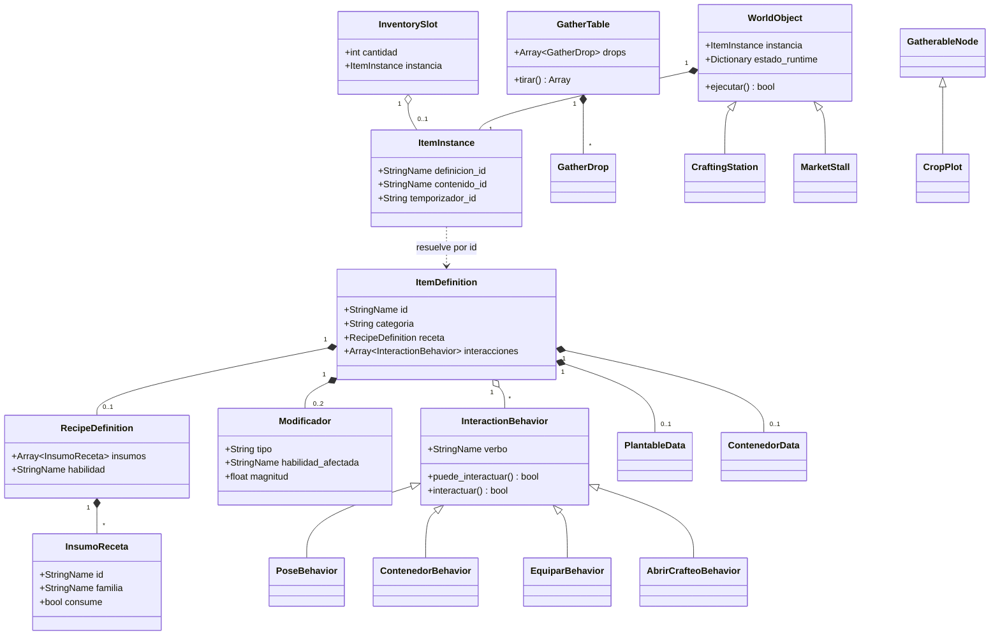
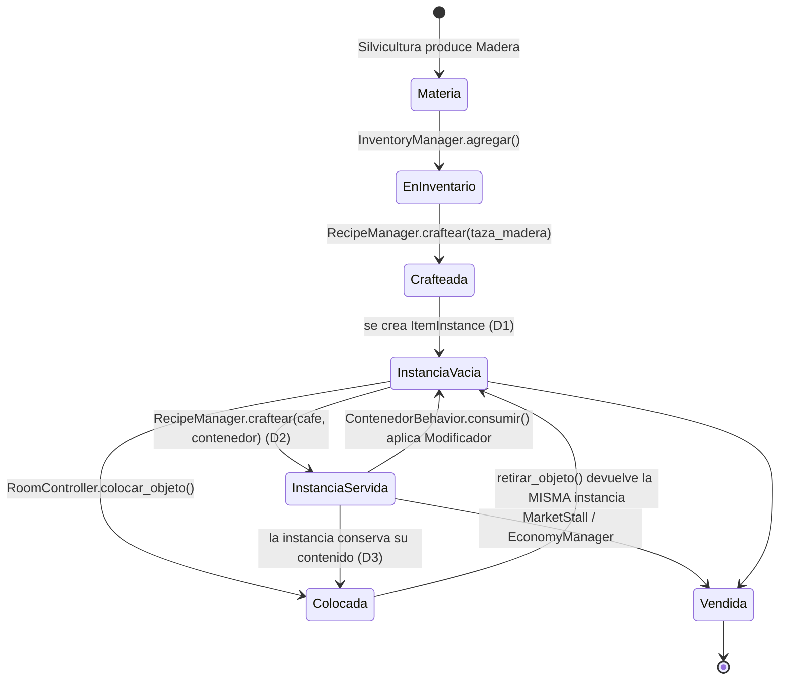

# MumiolaCity — Referencia de clases y objetos

**Versión:** 0.7 · **Fecha:** 2026-09-25 (fases 1, 2a y 3 implementadas; fase 4 en curso: `PoseBehavior` y `LevantarBehavior` hechos; **las cinco costuras de red puestas**; D23, D24 y D25 cerradas; catálogo v0.5 con 52 ítems)
**Complementa:** [`SCRIPTS.md`](SCRIPTS.md) (qué scripts existen y en qué orden) y [`SISTEMAS.md`](SISTEMAS.md) (cómo se comunican y qué decisiones faltan).
**Este documento es la firma de cada clase:** de qué hereda, qué campos expone, qué estado guarda, qué señales emite, qué métodos ofrece y qué invariantes tiene que respetar. Es lo que se lee con el editor abierto, justo antes de escribir el archivo.

> **Estado:** mezcla de código escrito y especificación. Todo lo de la fase 1 y la fase 2a está implementado y las firmas de acá son las reales; de la fase 3 en adelante siguen siendo especificación. Las firmas marcadas con **(D#)** salen de una decisión de [`SISTEMAS.md`](SISTEMAS.md) §6 —dieciocho cerradas y cuatro pendientes— y si esa decisión cambia, cambia la firma. Las clases marcadas **NUEVA** aparecieron al revisar el diseño: `SCRIPTS.md` las lista sin detallar, pero su firma solo existe acá.

---

## 0. Convenciones

**Nomenclatura.** Clases en `PascalCase` con `class_name`; métodos y variables en `snake_case`; privados con `_` inicial; constantes en `SCREAMING_SNAKE`. Los nombres de clase quedan en inglés donde son términos técnicos ya establecidos (`WorldObject`, `InventoryManager`) y los métodos en español, que es la convención que ya usa `SCRIPTS.md`.

**Tipado estricto siempre.** Toda variable, parámetro y retorno lleva tipo. En un proyecto orientado a datos, donde media docena de sistemas se pasan `ItemDefinition` entre sí, el tipado es lo que convierte un error de campo mal escrito en un error del editor en vez de un `null` a las tres de la mañana.

**`StringName` para todo identificador.** Ids de ítem, de habilidad, de familia y de verbo son `StringName` (`&"mineria"`), no `String`. Godot los internaliza: la comparación es por puntero en vez de carácter por carácter, y esas comparaciones ocurren en bucles de inventario y de recetas.

**Sin tildes ni mayúsculas en los ids.** `&"mineria"`, no `"Minería"`. El nombre con tilde es un campo de presentación aparte (**D4**).

**Señales, no polling.** Ningún nodo consulta a un manager en `_process()`. El manager avisa.

**Rechazos con código, no con `bool`.** Toda operación que el juego pueda rechazar devuelve un `Errores.Codigo`, nunca un booleano pelado. Un `bool` obliga a quien llama a adivinar el motivo o a inventarse un string, y el mismo texto termina escrito en varios lugares que se desincronizan. Ver §0.1.

---

### 0.0 `Habilidades` — los ids, y el único lugar donde se escriben

```gdscript
class_name Habilidades extends RefCounted

const AGRICULTURA := &"agricultura"
const COCINA := &"cocina"
const CARPINTERIA := &"carpinteria"
const TODAS : Array[StringName] = [AGRICULTURA, COCINA, CARPINTERIA]

static func existe(id: StringName) -> bool
```

Cierra el lado del código de **D4**. La regla es que **ninguna cadena literal de habilidad se escribe fuera de este archivo**; el nombre con tilde para mostrar sale de `SkillDefinition.nombre_display`.

Las otras seis habilidades del GDD no están declaradas a propósito: una constante para algo que ningún ítem produce invita a escribir código que nunca se puede ejecutar. Se agregan cuando tengan contenido.

---

### 0.1 `Errores` — códigos de rechazo

```gdscript
class_name Errores extends RefCounted

enum Codigo {
	OK = 0,
	# 1xx  grilla y colocacion
	CELDA_INEXISTENTE = 101, CELDA_OCUPADA = 102, HAY_PARED = 103,
	FUERA_DEL_AREA = 104, PARTIRIA_LA_SALA = 105, NO_APOYADO = 106,
	NO_ES_SUPERFICIE = 107, SUPERFICIE_LLENA = 108, NO_SE_APILA = 109,
	# 2xx  inventario y propiedad
	NO_ES_TUYO = 201, INVENTARIO_LLENO = 202, NO_TIENE_ITEM = 203, ITEM_EN_USO = 204,
	# 3xx  economia
	SALDO_INSUFICIENTE = 301, PRECIO_INVALIDO = 302,
	# 4xx  habilidades y produccion
	NIVEL_INSUFICIENTE = 401, FALTAN_MATERIALES = 402, ESTACION_OCUPADA = 403,
	FALTA_ESTACION = 404, FALTA_UTENSILIO = 405,
	# 5xx  permisos y salas
	SIN_PERMISO = 501, SALA_LLENA = 502,
	# 6xx  datos y archivos
	ARCHIVO_NO_EXISTE = 601, ARCHIVO_CORRUPTO = 602, FORMATO_DESCONOCIDO = 603,
	NO_SE_PUDO_ESCRIBIR = 604, NOMBRE_INVALIDO = 605,
}

const MENSAJES := { ... }                       # codigo -> texto para el jugador
static func mensaje(codigo: Codigo) -> String
static func ok(codigo: Codigo) -> bool
```

Vive en `res://nucleo/Errores.gd`. **No es autoload**: `class_name` ya lo hace global y así no cuesta nada en runtime.

**El alcance es deliberadamente estrecho.** Acá solo entran los rechazos que hay que explicarle al jugador. Los errores de programación —un `@export` sin asignar, un nodo que falta— siguen siendo `push_error()` y nunca reciben código: no son para el jugador, y mezclarlos convierte el enum en un cajón de sastre que crece sin control.

**El mensaje vive al lado del enum y no en la UI**, para que agregar un código sin su texto sea imposible de pasar por alto. `mensaje()` nunca devuelve vacío: si falta, avisa por consola y devuelve un genérico, porque una ventana de error en blanco es peor para el jugador que un mensaje impreciso.

**Los números son explícitos y están agrupados por sistema.** Así se puede reordenar, insertar y borrar sin que un código viejo cambie de significado en un guardado o en un log.

**`FUERA_DEL_AREA` (D12) y `PARTIRIA_LA_SALA` (D14) ya existen aunque esas decisiones sigan abiertas.** Ese es el punto: **D14** advierte que agregar un motivo de rechazo cuando ya hay comportamientos escritos encima obliga a tocar todas las llamadas. El hueco está hecho y la fase 4 solo tiene que llenarlo.

---

### 0.2 `OperacionSala extends Resource` — **NUEVA (D23)**

Un cambio a una sala, como dato en vez de como llamada. Es la costura por donde va a entrar la red.

```gdscript
class_name OperacionSala extends Resource

enum Tipo { COLOCAR, RETIRAR, PINTAR, BORRAR }

const SIN_RANURA := -1                   # el objeto esta en el piso

@export var tipo: Tipo
@export var celda: Vector2i
@export var ranura: int                  # -1 = piso, 0+ = encima de la superficie (D25)
@export var item: StringName             # COLOCAR
@export var rotacion: int                # COLOCAR
@export var estado: Dictionary           # COLOCAR
@export var capa: StringName             # PINTAR / BORRAR
@export var pieza: StringName            # PINTAR
@export var orientacion: int             # PINTAR

static func colocar(item_id: StringName, en_celda: Vector2i, giro := 0, estado_inicial := {}, en_ranura := SIN_RANURA) -> OperacionSala
static func retirar(en_celda: Vector2i, en_ranura := SIN_RANURA) -> OperacionSala
static func pintar(en_capa: StringName, en_celda: Vector2i, que_pieza: StringName, giro := 0) -> OperacionSala
static func borrar(en_capa: StringName, en_celda: Vector2i) -> OperacionSala

func to_dict() -> Dictionary                          # solo los campos que su tipo usa
static func desde_dict(d: Dictionary) -> OperacionSala   # null si esta mal formada
func descripcion() -> String
```

Vive en `res://nucleo/OperacionSala.gd`, al lado de `Errores`. **No es autoload:** se instancia una por gesto del editor.

**Por qué un dato y no tres llamadas.** Si el editor llamara directo a `colocar_objeto()`, `retirar_objeto()` y `IsoGrid.pintar()`, el día que haya servidor habría **tres formas distintas que interceptar** y el editor habría que reescribirlo. Con una operación hay un solo punto: local se aplica en el acto, online se manda, el servidor valida y retransmite, y el mismo `aplicar()` corre en todos los clientes.

**No es previsión gratuita.** Un registro de operaciones da **deshacer y rehacer casi gratis**, y eso lo necesita el editor hoy, no el servidor mañana. La costura online sale de yapa; si no fuera así, no estaría acá.

**`desde_dict()` devuelve `null` en vez de una operación a medias.** Lo que llega de un archivo —o algún día de la red— no es confiable, y una operación con la celda puesta pero el tipo en basura es peor que ninguna: se aplicaría.

**Los constructores estáticos y no `OperacionSala.new()` suelto.** Cada tipo usa un subconjunto distinto de los campos, y `colocar(&"silla_madera", Vector2i(3, 4))` no deja lugar a una operación de colocar con `capa` llena y `item` vacío.

**`celda` más `ranura` son la identidad de un objeto (D25).** Dos enteros y una coordenada, estables entre clientes sin ponerse de acuerdo en nada — que es justo lo que hace falta el día del servidor. `ranura` se serializa **sólo cuando dice algo**, así que mientras nada se apoye sobre nada ningún documento de sala engorda por esto.

**El campo existe antes que su comportamiento, a propósito.** `SuperficieBehavior` es fase 4, pero el documento de sala y el historial se escriben en la fase 3: si la identidad les creciera un campo después, habría que rehacerlos enteros. Por eso `RoomController.aplicar()` **rechaza** hoy cualquier ranura distinta de `-1` con `NO_ES_SUPERFICIE`, en lugar de ignorarla — un campo que existiera y se ignorara colocaría la taza en el piso sin decir nada.

---

## 1. Capa de datos — `res://data/`

Recursos puros: sin escena, sin lógica de nodo, serializables a `.tres`. Son el contenido del juego y la razón por la que agregar una prenda nueva no debería requerir tocar código (GDD §8).

### 1.1 `ItemDefinition extends Resource`

El esquema de un ítem, correspondencia directa con una entrada de `items.json`. **Nunca se muta en runtime**: una `ItemDefinition` es compartida por todas las unidades de ese ítem que existan en el mundo.

```gdscript
class_name ItemDefinition extends Resource

@export var id: StringName                      # unico, snake_case: &"taza_madera"
@export var nombre: String                      # "Taza de madera" (presentacion)
@export_multiline var descripcion: String
@export_enum("materia_prima", "intermedio", "utensilio",
             "consumible", "equipable", "decorativo") var categoria: String
@export var habilidad_origen: StringName        # solo materia_prima (D11)
@export var peso: float = 0.1
@export var apilable: bool = true
@export var stack_maximo: int = 99
@export var valor_base: int = 1                 # referencia de precio, no precio

@export_group("Produccion")
@export var receta: RecipeDefinition            # null si no se craftea
@export var plantable: PlantableData            # solo semillas

@export_group("Comportamiento")
@export var familia: StringName                 # &"taza" | &"plato" | vacio
@export var contenedor: ContenedorData          # solo utensilios
@export var efecto: Modificador                 # solo consumibles
@export var bono: Modificador                   # solo equipables
@export var slot_equipo: StringName             # &"herramienta_mano", &"tocado", &"torso", &"piernas"
@export var interacciones: Array[InteractionBehavior] = []

@export_group("Colocacion")
@export var tamano_grilla: Vector2i = Vector2i.ONE
@export var rotable: bool = false

@export_group("Arte")
@export var icono: Texture2D
@export var sprite_mundo: Texture2D             # null salvo decorativos
@export var escena_mundo: PackedScene           # null -> se usa WorldObject generico

func es_apilable() -> bool
func tiene_estado_propio() -> bool               # contenedor != null (D1)
func tiene_interaccion(verbo: StringName) -> bool
func requiere_contenedor() -> StringName         # &"liquido" | &"solido" | &"" (D2)
```

**Cuatro campos del plan original no existen, y no es que falten.** El catálogo v0.5 los volvió innecesarios: `plantable` porque plantar es una receta cuya estación es la parcela; `contenedor` porque servir y vaciar son verbos, y el tipo y la capacidad viven en el `ContenedorBehavior` del ítem; `efecto` y `bono` porque no hay buffs ni energía en el MVP. Si alguno vuelve, vuelve con su clase.

**Y tres campos nuevos que el catálogo sí usa:** `comprable` y `vendible` para el comercio con el NPC — poner `comprable: false` saca un ítem de la tienda el día que su cadena se complete, sin tocar código — y `colocable`, porque una semilla no se deja en el suelo y un tomate sí.

`tiene_estado_propio()` se implementa como «no es apilable»: hoy la única fuente de estado por unidad es contener algo, y un contenedor nunca se apila, así que las dos condiciones coinciden. Si alguna vez divergen, ese método es el único lugar a corregir.

**Invariantes.**
- `id` único en todo el catálogo — `ItemDatabase` debe fallar ruidosamente ante un duplicado, no quedarse con el último.
- `tiene_estado_propio() == true` ⇒ `apilable == false` y `stack_maximo == 1` **(D1)**. Ya se cumple: `items.json` v0.4 marca los seis utensilios como instancias únicas.
- `habilidad_origen` vacío para todo ítem con `receta` **(D11)**.
- `efecto` y `bono` comparten tipo pero no coexisten: un ítem es consumible o equipable, no ambos.
- Un `equipable` **sin** `bono` es cosmético puro (las prendas de Costura): ocupa su `slot_equipo` y cambia la capa correspondiente del avatar, sin tocar ninguna velocidad.

**Cambios respecto de `items.json`.** Tres campos del JSON se convierten en tipos en vez de quedar como diccionarios sueltos: `receta` → `RecipeDefinition`, `contenedor` → `ContenedorData`, `efecto`/`bono` → el mismo `Modificador` **(D5)**. Y aparecen dos campos que el JSON declara no tener: `interacciones` (GDD §6.1) y `escena_mundo`.

### 1.2 `RecipeDefinition extends Resource`

Recurso anidado dentro del `ItemDefinition` del resultado, tal como `items.json` ya modela las recetas.

```gdscript
class_name RecipeDefinition extends Resource

@export var insumos: Array[InsumoReceta] = []
@export var habilidad: StringName               # &"cocina"
@export var nivel_requerido: int = 1
@export var xp_otorgada: int = 0
@export var tiempo_crafteo_seg: float = 1.0
@export var cantidad_resultado: int = 1

func insumos_consumibles() -> Array[InsumoReceta]   # excluye consume == false
func requiere_familia(familia: StringName) -> bool
```

**Nota de diseño.** La receta no guarda su resultado: el resultado es el `ItemDefinition` que la contiene. Guardarlo en ambos lados es el mismo error que guardar nivel y xp por separado.

### 1.3 `InsumoReceta extends Resource`

```gdscript
class_name InsumoReceta extends Resource

@export var id: StringName                      # exclusivo con familia
@export var familia: StringName                 # "cualquier taza"
@export var cantidad: int = 1
@export var consume: bool = true                # false = requerido pero no destruido

func es_por_familia() -> bool
```

**Invariante:** exactamente uno de `id` o `familia` está poblado. Ambos vacíos o ambos llenos es un error de contenido y `ItemDatabase` debería detectarlo al cargar, no `RecipeManager` en medio de un crafteo.

### 1.4 `PlantableData` — **disuelta en el catálogo v0.5**

Plantar es una receta cuyo insumo es la semilla y cuya estación es la parcela, con su `tiempo_crafteo_seg` haciendo de tiempo de crecimiento. No hace falta un tipo aparte.

<details><summary>La definición original, por si vuelve</summary>


```gdscript
class_name PlantableData extends Resource

@export var produce_id: StringName
@export var habilidad: StringName = &"agricultura"
@export var tiempo_crecimiento_seg: float = 900.0
@export var xp_otorgada: int = 0
@export var cantidad_producida: int = 1
@export var sprites_etapas: Array[Texture2D] = []   # brote -> maduro
```

`sprites_etapas` es el campo que hace que una parcela se vea crecer en vez de aparecer madura de golpe: `CropPlot` interpola el índice contra el progreso que le da `TimeManager`.

</details>

### 1.5 `ContenedorData` — **disuelta: vive en el comportamiento**

Servir y vaciar son verbos, así que el tipo aceptado y la capacidad son `@export` de `ContenedorBehavior` y no de un recurso de datos aparte. El contrato de **D2** no cambia: un consumible con contenedor no existe suelto, ocupa una instancia concreta de utensilio hasta que alguien lo consume.

<details><summary>La definición original, por si vuelve</summary>


```gdscript
class_name ContenedorData extends Resource

@export_enum("liquido", "solido") var tipo: String
@export var capacidad: int = 1

func acepta(item: ItemDefinition) -> bool       # item.requiere_contenedor() == tipo
```

**Contrato del contenedor (D2, decidida).** Un consumible con `es_liquido` o `es_solido` **no existe suelto en el inventario**: craftearlo ocupa una instancia concreta de utensilio de la familia pedida, y esa instancia queda servida hasta que alguien la consume, momento en que vuelve a estar vacía. De ahí sale la invariante de `ItemDefinition` (`contenedor` ⇒ no apilable) y el precio del conjunto: `valor_base(utensilio) + valor_base(contenido)`.

</details>

### 1.6 `Modificador` — **disuelta mientras no haya buffs**

El catálogo v0.5 no tiene consumibles con efecto ni equipo con bono, así que no hay nada que modificar. **D5** queda en suspenso con su esquema de datos ya resuelto: el día que vuelvan los buffs, la forma está decidida y solo falta `ModifierStack`.

<details><summary>La definición original, por si vuelve</summary>


Unifica el `efecto` de los consumibles y el `bono` de los equipables, que hoy tienen esquemas distintos para hacer lo mismo.

```gdscript
class_name Modificador extends Resource

@export_enum("velocidad", "restaurar_energia", "energia_maxima") var tipo: String
@export var habilidad_afectada: StringName      # vacio = todas / no aplica
@export var magnitud: float = 0.0               # porcentaje o puntos, segun tipo
@export var duracion_seg: float = 0.0           # 0 = instantaneo o permanente
@export var estacable: bool = false

func es_instantaneo() -> bool                   # duracion_seg == 0
func multiplicador() -> float                   # 1.0 + magnitud / 100.0
```

**Por qué importa.** Con este tipo, la pala equipada y el café son el mismo objeto para el sistema de velocidad, y agregar una habilidad nueva no obliga a inventar un `tipo` nuevo ni a tocar un solo `match`. El esquema actual del café (`tipo: "buff_velocidad_manufactura"`) codifica la habilidad dentro del nombre del tipo y no escala.

</details>

### 1.7 `SkillDefinition extends Resource`

```gdscript
class_name SkillDefinition extends Resource

@export var id: StringName                      # &"mineria"
@export var nombre_display: String              # "Minería" (con tilde, D4)
@export_multiline var descripcion: String
@export_enum("recoleccion", "produccion", "soporte") var familia: String
@export var icono: Texture2D

@export_group("Progresion")
@export var nivel_maximo: int = 50
@export var curva_xp: Curve                     # normalizada 0..1
@export var xp_total_al_maximo: int = 100000
@export var desbloqueos: Dictionary = {}        # {nivel: int -> Array[StringName]}

func xp_para_nivel(nivel: int) -> int
func nivel_para_xp(xp: int) -> int
func desbloqueos_hasta(nivel: int) -> Array[StringName]
```

**Trampa del tipo `Curve`.** `Curve` devuelve valores normalizados entre 0 y 1: `curva_xp.sample(nivel / float(nivel_maximo)) * xp_total_al_maximo` es la fórmula real. La ventaja de usarla igual es concreta — la curva de progresión se balancea arrastrando puntos en el inspector, sin recompilar y sin que nadie tenga que discutir un exponente.

**`desbloqueos` como `Dictionary`** es la excepción al tipado estricto: Godot no exporta bien un `Dictionary[int, Array[StringName]]` en 4.x, así que se documenta la forma y se valida al cargar.

### 1.8 `ItemInstance extends Resource`

Una unidad concreta con estado propio: *esta* taza, no "las tazas de madera". Es la mitad **persistente** del estado de un objeto (**D3**) — la que sobrevive a cerrar el juego. En el inventario solo existe para ítems que `tiene_estado_propio()`, así que el trigo nunca genera una (**D1**); en el mundo, en cambio, todo `WorldObject` tiene la suya.

```gdscript
class_name ItemInstance extends Resource

@export var definicion_id: StringName           # no la referencia: el id (ver nota)
@export var contenido_id: StringName            # &"" = vacio; el consumible vive aqui (D2)
@export var contenido_cantidad: int = 0
@export var temporizador_id: String             # uuid para TimeManager
@export var datos: Dictionary = {}              # extension futura

func definicion() -> ItemDefinition              # ItemDatabase.obtener(definicion_id)
func esta_vacio() -> bool
func nombre_mostrado() -> String                 # "Taza de madera (Café)"
func valor_total() -> int                        # base + contenido (D2)
```

**Dos reglas duras, y las dos son la misma decisión D3.**

1. **Nunca guarda una referencia a un nodo.** Solo ids, números y textos — cosas que un archivo de guardado puede contener. Si un dato necesita apuntar a algo vivo, por definición es de sesión y va en `WorldObject.estado_runtime`. Esa sola regla elimina la clase entera de bugs de "el guardado apunta a un objeto que ya no existe".
2. **Nunca es un `.tres` en disco.** Se crea en runtime con `ItemInstance.new()` y se serializa *dentro* del `SaveGame`, no como asset propio. El motivo es un comportamiento del motor que muerde exactamente acá: Godot cachea los recursos cargados, así que `load()` del mismo archivo dos veces devuelve **el mismo objeto**. Si `ItemInstance` fuera un `.tres`, dos tazas del mismo tipo compartirían contenido y servir una serviría todas. Por lo mismo, partir un stack o craftear una taza nueva pide un `duplicate()` explícito, nunca reasignar la referencia.

**Por qué `definicion_id` y no `definicion: ItemDefinition`.** Si la instancia guardara la referencia al recurso, cada partida guardada embebería una copia completa de la definición del ítem — y al editar el `.tres` original, las partidas viejas seguirían usando la copia vieja. Guardando el id, la definición siempre se resuelve contra el catálogo actual. Es la diferencia entre un guardado de 2 KB y uno de 4 MB.

### 1.9 `InventorySlot extends Resource` — **NUEVA (D1)**

```gdscript
class_name InventorySlot extends Resource

@export var definicion_id: StringName
@export var cantidad: int = 0
@export var instancia: ItemInstance             # null si es un stack simple

func es_unico() -> bool                          # instancia != null
func peso_total() -> float
func puede_apilar_con(otro: InventorySlot) -> bool
```

**Invariante central del inventario:** `es_unico()` ⇒ `cantidad == 1`. Y `puede_apilar_con` devuelve `false` en cuanto cualquiera de los dos slots tiene instancia — una taza servida nunca se apila con una vacía, aunque compartan `definicion_id`.

### 1.10 `GatherTable` + `GatherDrop` — **disueltas con D6**

El catálogo v0.5 no tiene recolección aleatoria: plantar una semilla da siempre su verdura. Sin azar no hay tabla de drops que modelar.

<details><summary>La definición original, por si vuelve</summary>


Donde vive "la semilla de manzana sale en baja proporción", que hoy no tiene dónde vivir.

```gdscript
class_name GatherDrop extends Resource
@export var item_id: StringName
@export var cantidad_min: int = 1
@export var cantidad_max: int = 1
@export_range(0.0, 1.0) var probabilidad: float = 1.0

class_name GatherTable extends Resource
@export var drops: Array[GatherDrop] = []
@export var xp_otorgada: int = 0
@export var habilidad: StringName
@export var tiempo_accion_seg: float = 2.0
@export var herramienta_requerida: StringName    # vacio = a mano

func tirar(rng: RandomNumberGenerator) -> Array[Dictionary]   # [{id, cantidad}]
```

Cada drop se tira de forma independiente, no como tabla de peso único: cosechar un manzano da **siempre** la manzana (`probabilidad: 1.0`) y **a veces** la semilla (`probabilidad: 0.05`), que es exactamente lo que describe `lista_items.md`.

</details>

### 1.11 `InteractionBehavior extends Resource` y su jerarquía

La clase base del sistema de verbos (GDD §6.1). **Sin estado, compartida entre todas las instancias del mismo tipo de objeto.**

```gdscript
class_name InteractionBehavior extends Resource

@export var verbo: StringName                   # &"sentarse"
@export var etiqueta: String                    # "Sentarse" (menu contextual)
@export var icono: Texture2D
@export var requiere_adyacencia: bool = true

func etiqueta_para(actor: Node, objeto: WorldObject) -> String   # por defecto, etiqueta
func puede_interactuar(actor: Node, objeto: WorldObject) -> bool
func interactuar(actor: Node, objeto: WorldObject) -> bool      # (D8)
```

**`-> bool`, no `-> void` (D8).** El retorno es lo que el día del servidor autoritativo permite rechazar una acción sin haber mutado nada. Cambiar la firma después de tener quince comportamientos escritos es tocar quince archivos.

**Regla que no se puede romper:** ni `puede_interactuar` ni `interactuar` escriben en `self`. Si un comportamiento necesita recordar algo, va en `objeto.estado_runtime` o en `objeto.instancia` **(D3)**. Cincuenta sillas comparten un `sentarse.tres`.

**El actor se comprueba por método, no por tipo.** El parámetro es `Node` a propósito, para que un NPC pueda sentarse sin heredar de `PersonajeControlador`; los comportamientos usan `actor.has_method(&"sentarse_en")` en vez de un `is`.

**`ocupantes()` filtra referencias muertas.** `estado_runtime` es el único lugar del juego que guarda referencias a nodos vivos, y un NPC liberado —o una sala descargada— deja una entrada que apunta a nada. Sin ese filtro una silla queda ocupada para siempre por un fantasma, y `is_instance_valid()` es la única forma de notarlo.

**El ocupante se anota después de que el actor confirmó.** Si se anotara antes y sentarse fallara, la silla quedaría ocupada por alguien que sigue parado al lado. Y `salir()` lo desanota aunque el actor devuelva `false`, porque dejarlo en la lista mantiene la silla ocupada por nadie.

#### Comportamientos concretos

```gdscript
class_name PoseBehavior extends InteractionBehavior   # IMPLEMENTADO — ver §3.4c
const CLAVE_OCUPANTES := &"pose_ocupantes"      # una sola para las tres poses
@export var capacidad: int = 1                  # 1 silla, 3 banco
@export var offset_visual: Vector2              # metros, para asientos descentrados
@export var giro_salida: float = 180.0
@export var animacion_entrada: StringName       # sentarse | sentarse_piso | acostarse
@export var animacion_bucle: StringName
@export var animacion_salida: StringName
@export var etiqueta_salir: String = "Levantarse"
func ocupantes(objeto: WorldObject) -> Array    # ids de actor, no nodos
func salir(actor: Node, objeto: WorldObject) -> bool

class_name ContenedorBehavior extends InteractionBehavior
@export var tipo_aceptado: String               # "liquido" | "solido"
@export var capacidad: int = 1
func servir(objeto: WorldObject, contenido_id: StringName) -> bool
func vaciar(objeto: WorldObject) -> bool
func consumir(actor: Node, objeto: WorldObject) -> bool   # aplica efecto y vacia

class_name EquiparBehavior extends InteractionBehavior
@export var slot: StringName = &"herramienta_mano"
func equipar(actor: Node, instancia: ItemInstance) -> bool
func desequipar(actor: Node, slot: StringName) -> bool

class_name AbrirCrafteoBehavior extends InteractionBehavior   # NUEVA
@export var habilidad: StringName               # filtra las recetas mostradas
```

`AbrirCrafteoBehavior` es el comportamiento que `SCRIPTS.md` describe en prosa para `CraftingStation` ("el verbo que abre la UI es un `InteractionBehavior` más") sin llegar a nombrarlo. Nombrarlo importa: es lo que hace que una mesada de cocina y un banco de carpintería sean **el mismo objeto con distinto `.tres`**, sin una clase por estación.

### 1.12 `SaveGame extends Resource`

```gdscript
class_name SaveGame extends Resource

@export var version_formato: int = 1
@export var timestamp_guardado: int
@export var sala_actual: String                 # ruta al .tscn
@export var celda_jugador: Vector2i             # la celda, no la posicion de mundo
@export var apariencia: Dictionary
@export var inventario: Array[InventorySlot] = []
@export var equipo: Dictionary = {}             # slot -> ItemInstance
@export var xp_habilidades: Dictionary = {}     # StringName -> int
@export var ducados: int = 0
@export var temporizadores: Dictionary = {}     # id -> {inicio, duracion}
@export var objetos_por_sala: Dictionary = {}   # ruta -> Array[{instancia, celda, rotacion}] (D3)
```

**`version_formato` desde el primer día.** Cuesta una línea ahora y es la diferencia entre poder migrar los guardados y tener que borrarlos cuando cambie el esquema — que va a pasar, porque las decisiones D1–D11 todavía no están cerradas.

**Lo que deliberadamente no está:** buffs activos ni ocupantes de sillas. Son estado de sesión — todo lo que vive en `WorldObject.estado_runtime` queda fuera por construcción (**D3**), porque ese diccionario no lleva `@export` y `ResourceSaver` no lo ve.

---

## 2. Managers — `res://autoloads/`

Singletons globales. Ninguno conoce la UI ni el mundo: exponen métodos y emiten señales. Cada uno se serializa a sí mismo.

### 2.1 `ItemDatabase extends Node` — **NUEVA (D10)**

El catálogo. Sin él, una receta que pide `familia: "taza"` no se puede resolver, porque Godot no autocarga los `.tres` de una carpeta.

```gdscript
extends Node   # autoload: ItemDatabase

var _por_id: Dictionary = {}            # StringName -> ItemDefinition
var _por_familia: Dictionary = {}       # StringName -> Array[ItemDefinition]
var _por_categoria: Dictionary = {}
var _recetas_por_habilidad: Dictionary = {}

func _ready() -> void                    # escanea res://data/objetos/
func obtener(id: StringName) -> ItemDefinition
func items_de_familia(familia: StringName) -> Array[ItemDefinition]
func items_de_categoria(categoria: String) -> Array[ItemDefinition]
func colocables() -> Array[ItemDefinition]   # colocable y con escena, ordenados por id
func version() -> String                     # la del catalogo, para el documento de sala
func recetas_de(habilidad: StringName) -> Array[ItemDefinition]
func validar_catalogo() -> Array[String]     # ids duplicados, insumos rotos, etc.
```

**`validar_catalogo()` es la pieza que más tiempo ahorra a mediano plazo.** Recorre el catálogo al arrancar en modo debug y reporta: ids duplicados, recetas que apuntan a un `id` inexistente, insumos con `id` y `familia` a la vez, familias vacías, e ítems con `contenedor` marcados como apilables. Sin eso, un id mal escrito en un `.tres` se manifiesta como un crafteo que silenciosamente no hace nada.

**`colocables()` ordena por id a propósito.** El catálogo se arma recorriendo una carpeta, y ese recorrido no promete ningún orden: sin ordenar, la paleta del editor cambiaría de orden entre un arranque y el siguiente. Filtra además por `escena_mundo != null`, porque un ítem sin malla no se puede previsualizar ni colocar.

**Primero en el orden de autoloads (D9).**

### 2.2 `GameManager extends Node`

```gdscript
extends Node   # autoload: GameManager   # IMPLEMENTADO (paso 9)

signal sala_cambiada(sala: RoomController)
signal jugador_registrado(jugador: PersonajeControlador)
signal aviso(texto: String)
signal ayuda_cambiada(texto: String)
signal modo_cambiado(modo: Modo)

enum Modo { JUGANDO, EDITANDO }

func registrar_jugador(jugador: PersonajeControlador) -> void
func registrar_contenedor(nodo: Node) -> void      # de donde cuelgan las salas
func jugador_actual() -> PersonajeControlador
func sala_actual() -> RoomController
func salas() -> Array[RoomController]
func ir_a_sala(sala: RoomController) -> bool
func ir_a_indice(indice: int) -> bool
func siguiente_sala() -> void
func cargar_sala(escena: PackedScene) -> RoomController

func avisar(texto: String) -> void
func avisar_error(codigo: Errores.Codigo) -> void
func mostrar_ayuda(texto: String) -> void
func ayuda() -> String

func modo() -> Modo
func editando() -> bool
func cambiar_modo(nuevo: Modo) -> bool
func alternar_modo() -> void
```

**El modo vive acá y no en el editor.** Ya es la autoridad de «dónde estamos», y quienes tienen que cambiar de conducta al editar —`PersonajeControlador`, que deja de caminar al clic, y `WorldObject`, que deja de abrir el menú contextual— no deberían conocer al editor para preguntárselo. Los dos consultan `GameManager.editando()` y salen temprano.

**`cambiar_modo(JUGANDO)` olvida el historial de la sala.** Deshacer sirve mientras estás editando; una vez que volviste a jugar, un `Ctrl+Z` que retire un mueble que ya usaste es una fuente de estados imposibles.

**El aviso y la ayuda son señales, no llamadas al HUD.** Así el HUD se puede borrar del árbol sin que nada se rompa: nadie lo nombra, solo se suscribe.

**No usa `change_scene_to_packed()`, aunque este documento lo proponía.** Esa llamada reemplaza el árbol entero — jugador incluido — y obligaría a reconstruirlo y reubicarlo en cada puerta. Las salas conviven en un contenedor y se encienden de a una con `RoomController.activar()`, lo que además permite volver a la anterior sin recargarla. `cargar_sala()` queda para las que no están puestas de antemano — las viviendas de otros jugadores, que no tiene sentido tener todas cargadas.

**Un autoload sobrevive a los cambios de escena**, así que todo lo que guarde son referencias que pueden quedar colgando. `registrar_contenedor()` limpia la sala actual y todo acceso pasa por `is_instance_valid()`: una referencia muerta acá no da error, devuelve basura.

**Quién registra a quién.** `GameManager` no busca al jugador con `get_node("/root/...")` — el `PersonajeControlador` se registra a sí mismo en su `_ready()`. Así el manager no depende de la forma del árbol de escenas, que cambia cada vez que se reorganiza una sala.

### 2.3 `SkillManager extends Node` — **IMPLEMENTADO (fase 2a)**

```gdscript
extends Node   # autoload: SkillManager

signal xp_ganada(habilidad: StringName, cantidad: int, total: int)
signal nivel_subido(habilidad: StringName, nivel: int)

func definicion(id: StringName) -> SkillDefinition
func xp_de(id: StringName) -> int
func nivel_de(id: StringName) -> int
func progreso_de(id: StringName) -> Vector2i      # {llevado, tamano del nivel}
func alcanza_nivel(id: StringName, nivel: int) -> bool
func agregar_xp(id: StringName, cantidad: int) -> void
func todos_los_niveles() -> Dictionary
func reiniciar() -> void
func to_dict() -> Dictionary
func from_dict(d: Dictionary) -> void
```

**Guarda xp y nunca el nivel.** El nivel se deriva de la xp contra la curva de la habilidad. Guardar los dos sería tener dos fuentes para un solo hecho, y el día que una se actualice sin la otra el jugador tendría nivel 7 con la xp de nivel 3 y nadie sabría cuál creer.

**`nivel_subido` se emite una vez por cada nivel alcanzado**, no una sola por la ganancia: si un crafteo da para subir tres niveles, quien escuche se entera de los tres. Una interfaz que anuncie «¡nivel 5!» sin haber anunciado el 3 y el 4 se siente rota.

**Una habilidad desconocida devuelve nivel 0, no 1.** Así la diferencia entre «no la tiene todavía» y «está en el primer nivel» es visible en vez de confundirse.

**`alcanza_nivel()` existe aunque sea un `>=`.** Para que el criterio viva en un solo lugar el día que deje de serlo, y para que quien valide una receta no escriba la comparación cada vez.

### 2.4 `InventoryManager extends Node` — **IMPLEMENTADO (fase 2a)**

```gdscript
extends Node   # autoload: InventoryManager

signal inventario_cambiado()

const CASILLAS := 40
const PESO_MAXIMO := 200.0

# Consulta
func slots() -> Array[InventorySlot]              # copia, no la lista viva
func cantidad_de(id: StringName) -> int
func tiene(id: StringName, cantidad := 1) -> bool
func cantidad_de_familia(familia: StringName) -> int
func buscar_familia(familia: StringName) -> InventorySlot
func peso_total() -> float
func hay_lugar_para(def: ItemDefinition) -> Errores.Codigo   # pregunta sin agregar

# Escritura — todas devuelven Errores.Codigo (D16)
func agregar(id: StringName, cantidad := 1) -> Errores.Codigo
func agregar_instancia(inst: ItemInstance) -> Errores.Codigo
func quitar(id: StringName, cantidad := 1) -> Errores.Codigo
func quitar_familia(familia: StringName, cantidad := 1) -> Errores.Codigo
func quitar_instancia(inst: ItemInstance) -> ItemInstance
func vaciar() -> void

func to_dict() -> Dictionary
func from_dict(d: Dictionary) -> void
```

**Acá aterriza D1.** La lista guarda dos formas distintas: una casilla con `cantidad` para lo apilable, y una casilla con `instancia` para lo que tiene estado propio. Noventa y nueve tomates idénticos son una casilla; *esta* taza servida con café es la suya.

**`agregar()` decide la forma, no quien llama.** Si el ítem tiene estado propio crea una instancia por unidad en vez de apilarlas, así nadie tiene que acordarse de cuál de los dos métodos corresponde para cada ítem.

**Nada se escribe a medias.** `agregar()` comprueba peso y casillas *antes* de tocar nada, y `quitar()` no saca nada si no hay suficiente: consumir la mitad de una receta y fallar después deja al jugador peor que si no hubiera intentado.

**`hay_lugar_para()` existe porque hay acciones que tienen que preguntar *antes* de mutar otra cosa.** Levantar un mueble lo saca de la sala y lo mete en la mochila; si se descubre que no entra cuando el mueble ya no está, el objeto se perdió. La alternativa —agregarlo primero y devolverlo si falla— lo deja en dos lugares durante un instante, que es justo lo que **D3** prohíbe. `agregar_instancia()` lo usa en vez de repetir la regla, así que no hay dos definiciones de «entra».

**`slots()` devuelve una copia.** Si la interfaz recibiera la lista viva, cualquier widget podría modificar el inventario sin pasar por acá ni emitir la señal — y el bug aparecería como «la UI muestra algo distinto a lo que hay».

**`quitar_instancia()` devuelve la misma instancia**, no una copia: es la que va a quedar dentro del `WorldObject` al colocarla, y la propiedad tiene que ser exclusiva (**D3**).

**Las búsquedas por familia** son lo que permite que una receta pida «cualquier taza» sin enumerarlas, y lo que hace que agregar una taza nueva no obligue a tocar ninguna receta.

### 2.5 `RecipeManager extends Node` — **IMPLEMENTADO (fase 2a)**

```gdscript
extends Node   # autoload: RecipeManager

signal crafteo_empezado(resultado_id: StringName, segundos: float)
signal crafteo_terminado(resultado_id: StringName, cantidad: int, fallo: bool)

const XP_AL_FALLAR := 0.5

func recetas_disponibles(estacion := &"") -> Array[ItemDefinition]
func puede_craftear(resultado: ItemDefinition, estacion := &"") -> Errores.Codigo
func craftear(resultado: ItemDefinition, estacion := &"") -> Errores.Codigo
```

**El crafteo es en dos tiempos.** `craftear()` valida, consume y devuelve si la acción fue **aceptada**; el producto llega después por `crafteo_terminado`. Devolverlo directamente obligaría a que todo crafteo fuera instantáneo, y entonces `tiempo_crafteo_seg` no serviría para nada.

**El tiempo va por temporizador de escena, no por marca de tiempo.** Un crafteo dura segundos y no tiene sentido que siga corriendo con el juego cerrado. Lo que sí debe sobrevivir —un cultivo creciendo— es de `TimeManager`.

**El hueco del inventario se comprueba antes de consumir**, midiendo contra el estado de *después* de consumir, porque los insumos que se van liberan peso. Quedarse sin los insumos y sin el producto porque no entraba es la peor forma de fallar.

**Equivocarse da xp, la mitad.** Sin eso, alguien que solo tiene insumos de una receta que todavía no domina los quema una y otra vez sin avanzar nunca.

**El orden de las comprobaciones es el orden en que se le explican al jugador:** si existe la receta, si está en el lugar correcto, si sabe hacerlo, y recién al final si tiene con qué. De ahí salen `FALTA_ESTACION` y `FALTA_UTENSILIO`, dos códigos nuevos — «te falta la sartén» y «te falta la carne» son cosas distintas.

**Cuando un insumo se pide por familia se gasta el primero que aparezca.** Da igual cuál mientras ninguno tenga estado propio; el día que el jugador tenga que poder elegir —una taza servida y una vacía— la elección va a llegar como parámetro, no como una regla escondida en el manager.

### 2.6 `TimeManager extends Node`

```gdscript
extends Node   # autoload: TimeManager

signal temporizador_cumplido(id: String)

var _temporizadores: Dictionary = {}     # id -> {inicio: int, duracion: float}

func registrar(id: String, duracion_seg: float) -> void
func tiempo_restante(id: String) -> float
func progreso(id: String) -> float       # 0..1
func esta_cumplido(id: String) -> bool
func cancelar(id: String) -> void
func nuevo_id() -> String                # uuid estable entre sesiones
func to_dict() -> Dictionary
func from_dict(d: Dictionary) -> void
```

**Solo para lo que debe sobrevivir a cerrar el juego.** Se apoya en `Time.get_unix_time_from_system()`. Un `Timer` de Godot se detiene al cerrar; para un cultivo eso es un bug, para un buff es una decisión de diseño (§3.5 de `SISTEMAS.md`).

**`nuevo_id()` no puede devolver `get_instance_id()`** — cambia al recargar la partida y el temporizador queda huérfano.

**El reloj del sistema se puede adelantar.** Un jugador que mueve el reloj de su máquina cosecha instantáneamente. En single-player es irrelevante; anotarlo para la fase 6, donde el timestamp lo pone el servidor.

### 2.7 `EconomyManager extends Node`

```gdscript
extends Node   # autoload: EconomyManager

signal ducados_cambiaron(nuevo: int)
signal transaccion(tipo: String, item_id: StringName, cantidad: int, total: int)

var _ducados: int = 0
@export var factor_piso_npc: float = 0.5         # solo materia_prima (SISTEMAS §3.7)

func ducados() -> int
func agregar_ducados(n: int) -> void
func gastar(n: int) -> bool
func precio_npc(item_id: StringName) -> int      # 0 si el NPC no lo compra
func vender_a_npc(item_id: StringName, cantidad: int) -> int
func to_dict() -> Dictionary
func from_dict(d: Dictionary) -> void
```

**Desacoplado del transporte (GDD §8).** Ningún método asume que la transacción es local. El día del servidor, la implementación de `vender_a_npc` cambia por dentro y ninguna de sus llamadas se toca.

**`precio_npc` devuelve 0 para todo lo que no sea `materia_prima`:** el GDD §5 es explícito en que el NPC no compra bienes intermedios ni de lujo, y esa red de seguridad no debe competir con vender a otro jugador.

### 2.8 `SaveManager extends Node`

```gdscript
extends Node   # autoload: SaveManager, ultimo (D9)   # IMPLEMENTADO (paso 10)

signal guardado_completado
signal carga_completada

const RUTA := "user://partida.json"   # D21
const VERSION_ACTUAL := 1
const DIR_SALAS := "user://salas"     # una sala por archivo

# La partida
func guardar() -> Error
func cargar() -> Error
func existe_partida() -> bool
func borrar() -> void
func _migrar(datos: Dictionary) -> Dictionary    # segun version_formato
func _aplicar(partida: SaveGame) -> void

# Las salas sueltas (D24)
func guardar_sala(sala: RoomController, nombre := "") -> Errores.Codigo
func cargar_sala(sala: RoomController, nombre: String) -> Errores.Codigo
func salas_guardadas() -> Array[String]
func existe_sala(nombre: String) -> bool
func _nombre_archivo(nombre: String) -> String   # "Mi Habitación" -> "mi_habitacion"
```

**Orquesta, no serializa.** Pide `to_dict()` a cada manager y lo mete en el `SaveGame`. Agregar un campo a `InventoryManager` no debería obligar a tocar este archivo.

**`ResourceSaver` con `SaveGame` es lo más corto**, y el propio `SCRIPTS.md` ya anota la alternativa: `FileAccess` + `JSON` da un archivo inspeccionable y sin riesgo de ejecutar código al cargar. Para un juego que apunta a ser online, la versión JSON es la que envejece mejor — un `.tres` cargado desde fuera puede contener rutas de script.

**Una partida y una sala son cosas distintas.** La partida es *tu* estado —inventario, habilidades, dónde estás— y vive en un archivo. Una sala guardada es un **documento portable que no tiene dueño**: sirve para armar mapas y versionarlos, para compartir una sala, y es lo que un servidor almacenaría (**D24**). De ahí que sean dos APIs y no una con un parámetro.

**`_nombre_archivo()` no es cosmética, es el borde.** Un nombre de sala lo escribe una persona y algún día va a llegar de la red: sin filtrar, un nombre con `../` escribiría fuera de la carpeta de salas. Pasa las tildes a su letra pelada antes de filtrar, para que «Mi Habitación» y «Mi Habitacion» no terminen en dos archivos distintos, y corta a 64 caracteres.

**Comprueba que el archivo haya aparecido** en vez de confiar en que no hubo error. Es la lección que dejó el importador, que reportó 52 guardados y escribió uno.

---

## 3. Mundo — `res://escenas/mundo/` y `res://escenas/personaje/`

> **Revisado el 2026-09-15.** Esta es la única capa que cambió al pasar de sprites 2.5D a mundo 3D en tiempo real (GDD §7): las bases pasan a `Node3D`, `CharacterBody3D` y `Area3D`, `IsoGrid` se reorganiza sobre dos `GridMap` y desaparece el y-sort. Las capas de Datos, Managers y UI quedaron sin tocar — eso es lo que compraba la regla de dirección de `SISTEMAS.md` §1.

### 3.1 `IsoGrid extends Node3D`

Escena propia con dos capas de escenario como hijas:

```
IsoGrid (Node3D)
├── Suelo   (GridMap)     # lo caminable
└── Paredes (GridMap)     # el anillo exterior
```

```gdscript
class_name IsoGrid extends Node3D

const SIN_CELDA := Vector2i.MAX                     # celda_bajo_puntero() sin impacto

signal ocupacion_cambiada(celdas : Array[Vector2i])
signal estructura_cambiada(capa : StringName)       # tras pintar o borrar escenario

@export var suelo : GridMap                         # define que celdas existen
@export var paredes : GridMap                       # bloquean, no definen celdas
@export var altura_piso : float                     # cara superior del suelo, no 0
@export var piezas_transitables : Array[StringName] # excepciones de paredes (D15)

var _ocupadas : Dictionary = {}                     # Vector2i -> WorldObject
var _paredes_planta : Dictionary = {}               # planta de paredes, cache perezosa
var _astar : AStarGrid2D = null                     # uno por sala, perezoso

# Geometria
func celda_a_mundo(celda: Vector2i) -> Vector3
func mundo_a_celda(pos: Vector3) -> Vector2i
func celda_bajo_puntero(camara: Camera3D, pos_pantalla: Vector2) -> Vector2i
func celdas_de(origen: Vector2i, size: Vector2i, rotacion := 0) -> Array[Vector2i]
func centro_de(origen: Vector2i, size: Vector2i, rotacion := 0) -> Vector3
func region_usada() -> Rect2i

# Transitabilidad
func celda_valida(celda: Vector2i) -> bool          # hay suelo pintado?
func hay_pared(celda: Vector2i) -> bool
func esta_libre(origen: Vector2i, size := Vector2i.ONE, rotacion := 0) -> bool
func motivo_bloqueo(origen: Vector2i, size := Vector2i.ONE, rotacion := 0) -> Errores.Codigo
func recalcular_paredes() -> void                   # tras repintar paredes en runtime

# Ocupacion
func ocupar(origen: Vector2i, size: Vector2i, obj: WorldObject, rotacion := 0) -> bool
func liberar_objeto(obj: WorldObject) -> bool      # false si no ocupaba nada
func objeto_en(celda: Vector2i) -> WorldObject
func celda_libre_vecina(celda: Vector2i) -> Vector2i   # SIN_CELDA si esta rodeada

# Estructura (fase 3)
func pieza_en(capa: StringName, celda: Vector2i) -> Dictionary   # {pieza, orientacion} o {}
func pintar(capa: StringName, celda: Vector2i, pieza: StringName, orientacion := 0) -> bool
func borrar_celda(capa: StringName, celda: Vector2i) -> bool
func celdas_en_rectangulo(desde: Vector2i, hasta: Vector2i) -> Array[Vector2i]
func celdas_pintadas(capa: StringName) -> Array[Vector2i]        # para guardar la sala
func limpiar_capa(capa: StringName) -> void                      # antes de repintarla
func biblioteca_de(capa: StringName) -> MeshLibrary              # la usa la paleta

# Rutas
func ruta(origen: Vector2i, destino: Vector2i) -> Array[Vector2i]
```

**`Node3D` y no `extends GridMap`.** El script podría colgar del `GridMap` del suelo y heredar las conversiones gratis, pero eso haría de las paredes un apéndice de la capa de suelo cuando son dos vistas de la misma sala. `IsoGrid` es dueño de la ocupación y del área construible (`SISTEMAS.md` §3.1), no de dibujar el piso. El costo es un `suelo.` por conversión; la ganancia es que una tercera capa —techos, decoración fija— entra sin reorganizar nada.

**Dos `GridMap` y no uno.** Una celda de `GridMap` admite **un solo ítem**: pintar una pared sobre una celda de suelo la reemplazaría. Con dos capas, una celda puede tener losa *y* muro a la vez, que es justo lo que hace falta.

**El suelo se pinta entero, también debajo de las paredes.** Sin losa abajo, la pieza de muro queda flotando y la sala se ve desconectada del piso. Vale para el perímetro, para los tabiques interiores y para el vano de una puerta, que si no queda intransitable por falta de suelo. La consecuencia importante es que **«¿se puede caminar acá?» no es «¿hay suelo pintado acá?»**: es «hay suelo **y** no hay una pieza de pared que bloquee», que es exactamente lo que combina `esta_libre()`.

**`celda_valida()` pregunta por el suelo, no por un rectángulo.** `get_cell_item(...) != GridMap.INVALID_CELL_ITEM` hace que el área caminable sea *lo que pintaste*: salas en L o irregulares salen gratis. Por eso desapareció el `@export var grid_size` del diseño original — con el suelo como fuente de verdad, sobra.

**La API pública habla en `Vector2i`** (planta del piso) y convierte a `Vector3i` solo para hablar con los `GridMap`. Así `celda_origen` (**D3**), los `tamano_grilla` de `items.json` y el `AStarGrid2D` siguen valiendo sin cambios.

**El `AStarGrid2D` vive acá, no en cada personaje.** Es un índice derivado de la grilla, no un dato de quien camina: cincuenta NPCs en una sala comparten este mismo mapa de celdas sólidas en vez de mantener cincuenta copias. Se construye de forma perezosa —la primera vez que alguien pide una `ruta()`— para no depender del orden de `_ready()` entre nodos, y `ocupar()` lo parchea desde dentro. Esto último es lo que convierte el bug más previsible de la fase 4 (§3.1 de `SISTEMAS.md`) en algo imposible: ya no hay nada que un personaje nuevo pueda olvidarse de conectar.

**`pintar()` recibe el nombre de la pieza, no su id (D18).** Los ids de una `MeshLibrary` se asignan por orden de los hijos de la escena de origen y no sobreviven a un re-export, así que un documento de sala que los guardara quedaría inservible al agregar una pieza. `CatalogoPiezas.id_de()` traduce nombre → id contra la biblioteca cargada, y ése es el único lugar donde un id existe. Online la razón se vuelve más fuerte todavía: dos clientes tienen que coincidir en qué es `suelo_base` sin compartir la misma biblioteca en memoria.

**Un cambio de estructura tira el `AStarGrid2D` entero en vez de parchearlo.** `ocupar()` sí lo parchea, porque mueve una celda o cuatro; pintar arrastrando toca cientos, y recalcular el camino por cada una sería más caro que reconstruirlo una vez de forma perezosa cuando alguien vuelva a pedir una `ruta()`.

**`celdas_en_rectangulo()` existe para pintar arrastrando**, que es la diferencia entre hacer un suelo de 20×20 en un gesto o en cuatrocientos clics. Normaliza las esquinas, así que da igual hacia dónde se arrastre.

**`ruta()` devuelve el camino sin la celda de origen.** Que `get_id_path()` incluya el punto de partida es un detalle del motor, y conviene que lo sepa un solo lugar en vez de cada quien que pida una ruta.

**`celda_bajo_puntero()` también vive acá, y no en el personaje.** Lo necesitan al menos dos cosas —quien camina y la vista previa de colocación—, y duplicar esa matemática es garantizar que algún día discrepen. La altura del plano es `altura_piso`, propiedad de la grilla: usar la altura del personaje funcionaba solo mientras hubiera uno solo parado en el piso.

**Invariante:** los dos hijos van con transformación en cero y el origen de `IsoGrid` es el origen de la sala. `map_to_local()` trabaja en el espacio local del `GridMap`: si alguien mueve un hijo, las conversiones mienten sin dar error.

**Un objeto de 2×1 registra las dos celdas apuntando a la misma instancia** — así `esta_libre()` funciona igual sin importar el tamaño del objeto consultado.

**Devuelve `bool` y no `void`.** `false` significa que el objeto no ocupaba ninguna celda, que casi siempre es un síntoma de doble liberación: el paso 1 de `retirar_objeto()` (`CLASES.md` §3.4) ya corrió y alguien lo está repitiendo. Devolverlo hace que la transacción pueda abortar en vez de seguir como si nada.

**`esta_libre()` delega en `motivo_bloqueo()`.** Con dos copias del criterio de transitabilidad, tarde o temprano una dice que sí y la otra que no. Además es lo que le permite a `colocar_objeto()` responder «ahí hay una pared» en lugar de un no pelado (**D16**); el orden de las comprobaciones —existe, está construido, está ocupado— es el orden en que se le explican al jugador.

**`liberar_objeto(obj)` y no `liberar(celda)`.** Liberar por celda obliga a quien llama a saber cuántas celdas ocupaba y cuáles; liberar por objeto lo resuelve la grilla, que ya lo sabe. Es un método menos propenso a dejar celdas fantasma ocupadas.

**Todo cambio de ocupación tiene que invalidar el `AStarGrid2D` del `PersonajeControlador`** — el bug más previsible de la fase 4 (§3.1 de `SISTEMAS.md`). Emitir una señal `ocupacion_cambiada(celda)` es más barato que reconstruir la grilla entera.

### 3.2 `PersonajeControlador extends CharacterBody3D`

```gdscript
class_name PersonajeControlador extends CharacterBody3D

signal llego_a_celda(celda: Vector2i)

@export var grid: IsoGrid                        # la reapunta entrar_en() al cambiar de sala
@export var camara: Camera3D
@export var velocidad: float = 3.0               # m/s; con celdas de 1 m, tambien celdas/s

var estado: StringName = &"idle"                 # idle | caminando | en_pose | saliendo_pose
var _ruta: Array[Vector2i]                       # celdas pendientes del recorrido
var _en_pose_sobre: WorldObject                  # referencia viva: solo de sesion (D3)
var _saliendo_de: WorldObject                    # mientras dura la animacion de levantarse

func ir_a_celda(destino: Vector2i) -> bool
func detener() -> void
func entrar_en(sala: RoomController) -> void
func esta_en_pose() -> bool
func adoptar_pose(objeto: WorldObject, pose: Dictionary) -> bool
func dejar_pose() -> bool
func ubicar_en_celda(celda: Vector2i) -> void
func hacer_gesto(animacion: StringName, mirar_a: Vector3 = Vector3.ZERO) -> bool
func interactuar_con(objeto: WorldObject, verbo: InteractionBehavior) -> bool
```

**`adoptar_pose()` recibe un diccionario** y no seis parametros, para que agregar un dato a la pose no cambie esta firma y sobre todo para que el personaje no tenga que conocer `PoseBehavior`: lo unico que sabe es que le llegan un offset, un giro, una altura y tres nombres de animacion.

**`dejar_pose()` no mueve al personaje: reproduce la animacion de salida y difiere el paso al costado** a `_terminar_salida()`, enganchado a `AvatarComposer.transicion_terminada`. Moverlo antes lo dejaba de pie junto al mueble mientras todavia se estaba incorporando. El paso no es cosmetico: en pose esta parado sobre una celda solida, y desde ahi el A* no traza ninguna ruta.

**`hacer_gesto()` es lo que le da cuerpo a los verbos que no son poses** —levantar algo, usarlo, saludar—: reproduce una animacion de una pasada y vuelve a idle. **No cambia `estado` a proposito**, porque un gesto no es un modo, y tratarlo como uno obligaria a cada verbo a acordarse de salir de el. Si el jugador clickea a mitad del gesto, camina, y eso esta bien.

**`estado` como máquina explícita.** Sin ella, "estoy sentado" y "estoy caminando" terminan siendo dos booleanos que en algún momento son ambos `true`. Un `StringName` con transiciones claras es suficiente para el MVP; un `StateChart` es sobre-ingeniería a esta altura.

**La adyacencia la resuelve `interactuar_con()`**, no cada comportamiento. Si el verbo pide adyacencia y no la hay, el personaje camina hasta una celda vecina del objeto y ejecuta el verbo al llegar; sentarse en una silla al otro lado de la sala no teletransporta a nadie. Lo que queda pendiente se olvida si el jugador cambia de rumbo.

**El pathfinding no vive acá.** `ir_a_celda()` delega en `IsoGrid.ruta()`, que mantiene un único `AStarGrid2D` por sala. El personaje solo guarda la lista de celdas que le queda por recorrer. `AStarGrid2D` sigue sirviendo aunque el mundo sea 3D: opera sobre una grilla de enteros y no le importa la dimensión del render, y cada celda del resultado se convierte con `celda_a_mundo()`.

**La energía no llegó a existir (D7):** quedó disuelta antes de escribirse, así que no hay `gastar_energia()` ni barra que subir. Los consumibles que la restauraban no restauran nada; el día que haga falta un sumidero de tiempo, se diseña entero en vez de dejar medio sistema puesto.

### 3.3 `AvatarComposer extends Node3D`

```gdscript
class_name AvatarComposer extends Node3D

const SLOTS := [&"cuerpo", &"piernas", &"torso", &"cabeza", &"tocado"]

signal transicion_terminada(destino: StringName)

@export var animaciones: Dictionary              # nombre logico -> "Libreria/Clip" de KayKit
@export var animador: AnimationPlayer
@export var esqueleto: Skeleton3D
@export var en_bucle: Array[StringName]          # las que hay que marcar ciclicas a mano

func reproducir(animacion: StringName) -> void
func reproducir_encadenado(transicion: StringName, destino: StringName) -> bool
func animacion_actual() -> StringName
func actualizar_parte(slot: StringName, malla: Mesh) -> void     # pendiente de contenido
func aplicar_equipo(item: ItemDefinition) -> void                # pendiente de contenido
```

**`reproducir_encadenado()` es lo que separa sentarse de estar sentado:** `Sit_Chair_Down` se reproduce una vez y deja al avatar en la pose que `Sit_Chair_Idle` continúa en bucle. Sin el encadenado habría que elegir entre no tener transición o quedarse congelado en el último cuadro. Devuelve `false` cuando no hay transición que esperar, para que quien llamó sepa que el estado final ya está puesto.

**`transicion_terminada` existe para poder esperar una transición.** Levantarse de una cama tiene que mover al personaje recién cuando la animación terminó; moverlo antes lo hace aparecer de pie al costado del mueble mientras todavía se está incorporando.

**`animaciones` es el único sitio del proyecto donde se escribe un nombre de KayKit.** Cambiar de pack de animaciones es reescribir ese diccionario y nada más. De las ocho librerías del pack hay tres cargadas en la escena (`General`, `MovementBasic`, `Simulation`); sumar una animación nueva es agregar la librería al `.tscn` y una entrada acá.

**Un esqueleto, un `BoneAttachment3D` por slot.** Cambiar de camiseta es cambiar la malla que cuelga del attachment del torso; el `AnimationPlayer` del rig mueve todo junto. Desapareció `mirar_hacia(direccion)`: la orientación es la rotación del nodo, no un índice de ángulo pre-renderizado — y con ella se fue la regla dura de que cada capa tuviera el mismo número de cuadros en cada uno de los 8 ángulos.

**Sigue siendo un requisito, no un lujo:** la ropa de Costura es mercancía comerciable y tiene que verse puesta. Es la habilidad que le da contenido económico al avatar.

**Pendiente de contenido, no de estructura.** El maniquí de KayKit son seis mallas separadas pesadas al mismo esqueleto (`ArmLeft`, `ArmRight`, `Body`, `Head`, `LegLeft`, `LegRight`), y el esqueleto tiene veintiún huesos, de los que `hand.l` y `hand.r` son los que sirven para colgar herramientas con un `BoneAttachment3D`. Intercambiar una parte es asignarle otro `Mesh` a su `MeshInstance3D`. Lo que falta son prendas que ponerle: hasta que existan, `actualizar_parte()` queda sin implementar porque no habría con qué probarla.

**`animaciones` traduce nombres lógicos a nombres del pack.** El juego pide `&"caminar"` y el diccionario decide que eso es `"Rig_Medium_MovementBasic/Walking_A"`. Sin esa capa, el nombre de un archivo de KayKit se filtraría hasta `PersonajeControlador`.

### 3.3b `IndicadorCelda extends MeshInstance3D`

Resalta las celdas que ocuparía algo y muestra un fantasma translúcido de lo que se va a colocar. Dejó de ser la ayuda de desarrollo que era —una celda, dos colores— para ser la vista previa del editor, que es lo mismo mirado con más resolución.

```gdscript
class_name IndicadorCelda extends MeshInstance3D

signal motivo_cambiado(codigo : Errores.Codigo)

const CELDAS_RESERVADAS := 16
const NODO_VISUAL := ^"Visual"

@export var grid : IsoGrid
@export var camara : Camera3D
@export var seguir_puntero : bool                   # false cuando manda el editor
@export var color_libre : Color
@export var color_bloqueado : Color
@export var transparencia : float                   # del fantasma, 0 a 1
@export var alzado : float                          # separacion del piso, anti z-fighting

func elegir(definicion: ItemDefinition, rotacion := 0) -> void    # que mostrar
func mostrar(definicion: ItemDefinition, celda: Vector2i, rotacion := 0) -> void  # y donde
func ocultar() -> void
func motivo() -> Errores.Codigo
func celda() -> Vector2i
func huella() -> Vector2i
```

**Dos modos, un solo cuerpo.** Con `seguir_puntero` en `true` se maneja solo y lee el mouse cada cuadro: es como funciona hoy en `SalaComun` y `SalaPrivada`. Con `seguir_puntero` en `false` se queda quieto hasta que alguien le dice qué mostrar, que es como lo va a usar el editor, donde quien decide la celda puede estar arrastrando o acabar de hacer scroll en la paleta.

**`elegir()` y `mostrar()` están separadas a propósito.** Cambiar de mueble en la paleta no debería moverlo de lugar, y mover el cursor no debería cambiar de mueble. Son dos ejes independientes y por eso son dos métodos.

**El color sale de `motivo_bloqueo()` y no de `esta_libre()`.** Con un booleano, rojo solo significa «no». Con un código, el `signal motivo_cambiado` le permite al HUD escribir *por qué*, y el motivo se calcula **celda por celda**: en una mesa de 2×2 se ve cuál de las cuatro es la que estorba, que es la diferencia entre «no cabe» y «no cabe por ese lado».

**El fantasma no instancia la escena del objeto entera.** La raíz de una escena generada es un `Area3D` con `WorldObject.gd`, que en `_ready()` se conecta a `input_event` y exige una `instancia` no nula: instanciarla dejaría un objeto de mundo a medias, clickeable y quejándose por consola. Como `instantiate()` **no corre `_ready()` hasta que el nodo entra al árbol**, `_extraer_visual()` le saca el hijo `Visual` y libera el resto sin haberlo agregado nunca. Las 45 escenas colocables tienen ese hijo.

**Se transparenta con `GeometryInstance3D.transparency`, no con `modulate`.** `modulate` es de `CanvasItem` y no hace absolutamente nada sobre una malla 3D. Se recorre el subárbol porque un modelo de KayKit trae varias `MeshInstance3D`, y transparentar una sola se ve peor que no transparentar ninguna.

**El giro del fantasma usa `RoomController.PASO_ROTACION`**, la misma constante que aplica `colocar_objeto()`. Una vista previa que pudiera desfasarse de lo que termina colocado no sirve para lo único para lo que sirve.

**La raíz es `top_level` y con transformación identidad.** Todo lo que este nodo ubica lo ubica en coordenadas de mundo; componerlo además con la transformación de la sala dejaría el fantasma girado respecto del objeto real. Sigue siendo `MeshInstance3D` —con `mesh` en `null`, porque dibujan sus hijos— por una razón menor pero real: es el tipo con el que está declarado el nodo en las dos escenas de sala, y cambiarlo obligaría a editarlas a mano.

**Los recuadros se reciclan.** Dieciséis creados una vez y mostrados u ocultados según la huella; nada se crea ni se destruye por cuadro. El objeto más grande del catálogo ocupa 2×2, así que sobra de lejos.

**Ya encontró un bug que era invisible de otro modo:** una pieza de puerta bloqueaba la celda del hueco y dejaba libres las dos de muro, exactamente al revés de lo correcto. Sin el indicador eso se manifestaba solo como «el personaje camina raro por ahí» (**D15**).

### 3.4 `RoomController extends Node3D`

```gdscript
class_name RoomController extends Node3D

signal activada()
signal desactivada()
signal objeto_colocado(obj: WorldObject)
signal objeto_retirado(obj: WorldObject)
signal operacion_aplicada(op: OperacionSala)

const PASO_ROTACION := PI / 2.0

@export_enum("comun", "vivienda", "produccion", "tienda") var tipo: String
@export var nombre_sala: String
@export var propietario_id: StringName           # vacio = publica
@export var celda_entrada: Vector2i              # donde aparece quien entra

@onready var grid: IsoGrid = $IsoGrid
@onready var contenedor_objetos: Node3D = $Objetos
@onready var pivote: Node3D = $Pivote
@onready var camara: Camera3D = $Pivote/Camera3D
@onready var indicador: IndicadorCelda = get_node_or_null(^"IndicadorCelda")

# Ciclo de vida
func activar() -> void
func desactivar() -> void
func esta_activa() -> bool
func posicion_de_entrada() -> Vector3

# Encuadre
func rotar(pasos: int) -> void                   # cuartos de vuelta
func desplazar(delta_pantalla: Vector2) -> void  # arrastre, en pixeles
func acercar(pasos: int) -> void                 # positivo acerca
func zoom() -> float
func centrar() -> void                           # encuadra la sala entera

# Contenido
func objetos() -> Array[WorldObject]
func colocar_objeto(inst: ItemInstance, celda: Vector2i, rotacion: int = 0) -> Errores.Codigo
func retirar_objeto(obj: WorldObject) -> ItemInstance
func to_dict() -> Dictionary
func from_dict(d: Dictionary) -> Errores.Codigo

# Operaciones (D23)
func puede_editar(actor: Node) -> bool           # hoy siempre true
func aplicar(op: OperacionSala, registrar := true) -> Errores.Codigo
func deshacer() -> bool
func rehacer() -> bool
func puede_deshacer() -> bool
func puede_rehacer() -> bool
func olvidar_historial() -> void
```

**`aplicar()` es el único punto que muta una sala.** Colocar, retirar, pintar y borrar siguen existiendo por separado, pero el editor no los llama: construye una `OperacionSala` y la entrega acá. Con un solo punto de entrada, el día del servidor hay **una** cosa que interceptar.

**Cada operación se guarda junto con su inversa, no sola.** La inversa no se puede deducir de la operación: deshacer un pintado necesita saber *qué había antes*, y eso solo se sabe mirando la sala justo antes de aplicarlo. Por eso `_inversa_de()` corre **antes** que `_ejecutar()`.

**Deshacer y rehacer viven en un array con un cursor**, y aplicar algo nuevo trunca en el cursor: la rama que habías deshecho se pierde, igual que en cualquier editor. `registrar := false` es por donde entran las operaciones que ya son parte del historial —las del propio deshacer— sin volver a anotarse.

**`puede_editar(actor)` devuelve siempre `true` hoy, y está bien.** Lo importante no es la comprobación sino que exista el lugar donde va (la costura 4 del replan). `Errores.Codigo.NO_ES_TUYO` y `SIN_PERMISO` ya están en el enum esperándola, y `propietario_id` ya existe.

**`indicador` es opcional por contrato**, como la interfaz: sacar el nodo del árbol quita la ayuda visual y no rompe nada.

#### El documento de sala (D24)

`to_dict()` no vuelca sólo los muebles: incluye **la estructura de las dos capas de escenario**, más `version_formato`, la versión del catálogo con que se creó, el nombre, el tipo, el propietario y la celda de entrada. Eso es lo que convierte una sala en un dato que puede viajar, y la razón por la que el `.tscn` pasa a ser sólo el molde vacío.

```json
"estructura": { "suelo": [[3, 4, "suelo_base", 0], …], "paredes": [[0, 0, "pilar_base", 22], …] }
```

**Cada celda por nombre de pieza y nunca por id (D18).** Los ids de una `MeshLibrary` se asignan al exportarla, así que un re-export los reasigna y una sala guardada por id se repinta con mallas distintas **sin que nada dé error**: las paredes se vuelven suelo y lo descubrís mirando.

**Plano y repetido a propósito.** Agrupar por pieza ahorraría algo de espacio —una sala de 700 celdas ocupa 19 KB— y costaría poder abrir el archivo y entender qué dice.

**`from_dict()` pinta la estructura antes que los muebles.** Sin suelo debajo, cada mueble sería rechazado con `CELDA_INEXISTENTE` y la sala se cargaría vacía. Y **limpia las capas antes de pintar**: si no, cargar sobre una sala ya pintada deja lo viejo donde el documento no diga nada, y el resultado es la unión de dos salas.

**Devuelve un código y no `void`.** Un documento de una versión más nueva no se puede interpretar, y adivinar es peor que decir que no. Lo que **no** lo aborta es que falte un mueble: eso se avisa y la sala entra igual, porque media sala es mejor que ninguna.

**Cargar olvida el historial.** El deshacer es de lo que hiciste en esta sesión de edición; un `Ctrl+Z` que empiece a desarmar una sala recién abierta no es lo que nadie espera.

**La sala no conoce al personaje.** `activar()` enciende la sala y le da la cámara; quien cambia de sala es el que ubica al jugador con `PersonajeControlador.entrar_en(sala)`. Si `RoomController` importara `PersonajeControlador`, una sala no podría existir sin un jugador adentro — y eso rompe los NPCs, el guardado y cualquier previsualización de sala. Es la regla de dirección de dependencias de `SISTEMAS.md` §1.

**`desactivar()` apaga, no solo oculta.** Pone `process_mode` en `DISABLED` además de `visible = false`, porque si no la vista previa de la sala dormida sigue corriendo su `_process()` y persiguiendo el mouse desde una sala que nadie mira. `activar()` rehabilita el procesamiento **antes** de tomar la cámara, porque una sala deshabilitada no puede.

**`celda_entrada` no es comodidad.** **D14** define la validación de que un tabique no parta la sala como «todas las celdas con suelo siguen siendo alcanzables *desde la entrada*». Sin una entrada declarada, esa comprobación no tiene desde dónde medir.

**`rotar()` gira el pivote, nunca el contenido.** Los objetos conservan sus coordenadas de grilla, así que celdas, rutas y ocupación no se enteran. El clic tampoco: `celda_bajo_puntero()` intersecta contra el plano del piso y no depende de por dónde mire la cámara.

**La sala atiende sus propios controles de cámara** —rueda, botón del medio, `Inicio`— y no lo hace `Mundo` ni `EditorSala`. Una sala apagada tiene `process_mode` en `DISABLED`, así que **sólo la activa recibe input** y no hay que preguntar cuál es; y mover la cámara sirve igual jugando que editando, así que ponerlo en el editor lo dejaría fuera de la mitad del juego.

**`desplazar()` tiene una sutileza que decide si se siente bien o mal.** La escala es obvia: en una cámara ortográfica un píxel son `camara.size / alto_de_pantalla` unidades de mundo, y como `size` está en la fórmula, el arrastre sigue siendo exacto después de acercar. Lo que no es obvio es que **proyectar el eje vertical al piso lo acorta**: moverse una unidad sobre esa dirección desplaza la imagen sólo por el coseno de la inclinación de la cámara —0.58 con el isométrico de manual—, así que sin compensarlo el arrastre vertical se queda corto un 42 % y el mundo patina bajo el mouse. Dividir por `lejos.dot(base.y)` lo corrige. Medido: **0.00000 m de desvío**, con y sin giro, a cualquier zoom.

**El zoom es multiplicativo.** Un paso fijo se siente lentísimo de lejos y brusquísimo de cerca.

**`centrar()` usa la región realmente pintada** y no un tamaño declarado, por lo mismo que `celda_valida()`: el área de una sala es lo que pintaste. Encuadra por la diagonal y no por el lado, porque en isométrico una región de N×M se ve más ancha que N.

**`colocar_objeto` devuelve un `Errores.Codigo`, no el objeto creado (D16).** Rechazar una colocación tiene al menos cuatro motivos distintos —no hay piso, hay pared, está ocupada, partiría la sala— y un `null` no los distingue. El `WorldObject` recién creado se recupera con `grid.objeto_en(celda)` justo después de un `OK`, así que no hacen falta parámetros de salida ni devolver un diccionario.

**`colocar_objeto` toma un `ItemInstance`, no un `ItemDefinition` (D3).** Es lo que permite dejar una taza servida sobre la mesa y que siga teniendo café. `retirar_objeto` devuelve **la misma** instancia — no una copia — para que vuelva al inventario con su estado intacto.

**La propiedad de la instancia tiene que ser exclusiva.** Los dos métodos son transacciones de tres pasos, y ninguno puede quedar a medias:

```
colocar_objeto(instancia, celda):        retirar_objeto(obj):
  1. InventoryManager.quitar_instancia()   1. IsoGrid.liberar_objeto(obj)
  2. WorldObject.instancia = instancia     2. InventoryManager.agregar_instancia(obj.instancia)
  3. IsoGrid.ocupar(celda, tamano, obj)    3. obj.queue_free()
```

Si el inventario conserva la referencia *y* el `WorldObject` también, el mismo objeto existe dos veces: es el bug de duplicación clásico, y con `Resource` — que se pasa por referencia — es facilísimo de cometer sin notarlo. Si el paso 2 puede fallar (inventario lleno al retirar), el paso 1 se revierte antes de tocar nada más.

**La profundidad ya no es asunto de nadie.** Con el render 3D la resuelve el búfer de profundidad: desapareció el y-sort, el `z_index` y toda la clase de bugs de objetos dibujados en el orden equivocado. `contenedor_objetos` queda solo como agrupador de la escena.

**La cámara vive en la escena de la sala**, no acá: un `Node3D` pivote centrado con una `Camera3D` ortográfica como hija (GDD §7). Rotar la sala al estilo Habbo es interpolar `pivote.rotation.y` en pasos de 90°.

### 3.4a `MirarBehavior extends InteractionBehavior` — el verbo universal

```gdscript
class_name MirarBehavior extends InteractionBehavior

const LARGO_MAXIMO := 160

func puede_interactuar(actor: Node, objeto: WorldObject) -> bool    # siempre true
func interactuar(actor: Node, objeto: WorldObject) -> bool
func texto_de(objeto: WorldObject) -> String
```

**No vive en `items.json`.** Lo agrega `WorldObject.MIRAR` a todo objeto, y es a propósito: mirar es una propiedad de *ser un objeto del mundo*, no contenido de un ítem concreto. Si estuviera en el catálogo habría que acordarse de ponerlo en cada ítem nuevo, y olvidarse **no daría error** — ese mueble simplemente no se podría mirar. Así además alcanza a los objetos que no vienen del catálogo, como una mesada puesta a mano en una sala.

**Su valor no es la descripción sino que todo conteste algo.** Con 44 de 45 muebles sin ningún verbo, hacer clic derecho y que no pase nada se lee como que el juego está roto. Con esto, lo que falta se nota como lo que es: verbos sin escribir, no objetos muertos.

**Es el único verbo sin adyacencia ni comprobaciones**, porque no altera nada: mirar siempre se puede, incluso sin definición en el catálogo — ahí baja hasta el nombre del nodo.

**Va último en el menú**, no primero: lo que el jugador suele querer es la acción del mueble.

### 3.4c `PoseBehavior extends InteractionBehavior` — sentarse, en el piso, acostado

```gdscript
class_name PoseBehavior extends InteractionBehavior

const CLAVE_OCUPANTES := &"pose_ocupantes"

@export var capacidad: int = 1
@export var offset_visual: Vector2
@export var giro_cuerpo: float = 180.0      # desfase de modelado, no ajuste fino
@export var altura: float = 0.0             # a que altura del piso queda el cuerpo
@export var angulo_salida: float = NAN      # NAN = se sale por donde se mira
@export var animacion_entrada: StringName   # se reproduce una vez
@export var animacion_bucle: StringName     # tiene que estar en AvatarComposer.en_bucle
@export var animacion_salida: StringName
@export var etiqueta_salir: String

func ocupantes(objeto: WorldObject) -> Array          # ids, no nodos
func tiene_a(actor: Node, objeto: WorldObject) -> bool
func datos_de_pose() -> Dictionary
func salir(actor: Node, objeto: WorldObject) -> bool
```

**Tres `.tres` del mismo script**, no tres scripts: `sentarse`, `sentarse_piso` y `acostarse` son el mismo gesto —entrar en una pose, mantenerla, salir— con animaciones y números distintos. El pack de KayKit trae las tres secuencias completas, que es lo que lo hace posible.

**Los ocupantes se guardan por id de actor y no por nodo, y ésa es la quinta costura del multijugador.** Un nodo del cliente A no existe en el B; lo que se replica es el hecho —«el actor 7 está en pose sobre el mueble de la celda 3,4»— y cada cliente resuelve su propio nodo con `GameManager.actor_por_id()`. Hacerlo ahora salió gratis porque este script se reescribía igual; hacerlo después, con quince comportamientos encima, es tocarlos todos.

**Una sola clave de ocupantes para todas las poses**, no una por verbo: lo que está ocupado es el mueble, no el verbo. Nadie puede estar sentado y acostado en la misma cama a la vez, y con una clave por verbo eso sería posible.

**`datos_de_pose()` devuelve un diccionario** en vez de pasarle seis parámetros al personaje. Así agregar un dato a la pose no cambia la firma de `adoptar_pose()`, y sobre todo el personaje no tiene que conocer esta clase: lo único que sabe es que le llegan un offset, un giro y tres nombres de animación.

**Un solo verbo que alterna**, no dos comportamientos: entrar y salir son el mismo gesto sobre el mismo mueble, y separarlos obligaría a que el menú mostrara siempre uno de los dos en gris.

**`altura` y `angulo_salida` son la respuesta a «¿esto se va a romper con los modelos finales?».** Las animaciones del pack están hechas al ras del suelo —`Lie_Down` es acostarse *en el piso*—, así que sobre una cama hay que subir el cuerpo hasta el colchón o el avatar queda enterrado en el mueble. Es un número por pose y no una cuenta sobre la malla, porque el AABB de una cama incluye la cabecera, que es mucho más alta que el colchón. `acostarse` vale `0.55`, elegido mirando renders a 0.45 / 0.55 / 0.65.

**Por dónde se sale es otra cosa que hacia dónde se mira**, y por eso son dos números: de una silla se sale por delante, pero de una cama se sale por el costado y no por la cabecera. Con `NAN` se usa el giro del cuerpo, que es lo correcto para sentarse.

**Los cuatro números de ajuste son `@export` por `.tres`**, así que cuando lleguen animaciones y modelos definitivos se reajustan en el inspector y no en el código. Ése es todo el motivo de haberlos sacado de ahí.

### 3.4d `LevantarBehavior extends InteractionBehavior` — el otro verbo universal

```gdscript
class_name LevantarBehavior extends InteractionBehavior

@export var animacion: StringName = &"levantar"

func puede_interactuar(actor: Node, objeto: WorldObject) -> bool
func interactuar(actor: Node, objeto: WorldObject) -> bool
```

**Cuelga de `WorldObject.LEVANTAR`, no de `items.json`**, por lo mismo que mirar: todo lo que se pudo colocar se puede volver a levantar, así que una lista por ítem sería una lista que hay que acordarse de completar, y olvidarse no daría error — ese mueble quedaría clavado en el piso y nadie se enteraría hasta intentar sacarlo.

**La exclusión sale gratis.** Un objeto sin definición en el catálogo —una mesada puesta a mano en una sala— no tiene id que meter en la mochila, así que no ofrece el verbo. Es escenario, y queda fijo sin necesidad de mantener una lista de excepciones.

**Es el primer verbo que muta la sala**, y por eso es el primero que pasa por `RoomController.aplicar()` en vez de llamar a `retirar_objeto()` por atrás: ahí **D23** deja de ser sólo cosa del editor. Pasa con `registrar = false`, porque deshacer es del editor; si levantar jugando entrara al historial, un `Ctrl+Z` posterior devolvería el mueble a la sala **y** lo dejaría en la mochila.

**El orden es lo único delicado: preguntar si entra → retirar → guardar.** Retirar primero y descubrir después que no entraba destruye el objeto; guardarlo antes de retirarlo lo deja existiendo en dos lugares a la vez, que es lo que **D3** prohíbe. Para poder preguntar antes, `InventoryManager` ganó `hay_lugar_para()`.

**La división entre `puede_interactuar()` e `interactuar()` no es casual.** El primero decide si el verbo **aparece** en el menú, y eso depende del objeto y no de cuánto te queda libre: un mueble que desaparece del menú cuando tenés la mochila llena se lee como que el juego se rompió. Que no entre se dice al intentarlo, con el motivo escrito.

**Un mueble ocupado no se levanta**, o quien estuviera en pose quedaría apuntando a un nodo liberado. Se pregunta por método (`has_method(&"ocupantes")`) y no por tipo, igual que hace el personaje al desanotarse: este verbo no conoce `PoseBehavior`.

### 3.4b `SuperficieBehavior extends InteractionBehavior` — **fase 4 (D25)**

El verbo de apoyar cosas encima. Es lo que le da espacio a la decoración personal, que en un sandbox es el producto y no un extra.

```gdscript
class_name SuperficieBehavior extends InteractionBehavior

@export var capacidad: int = 4              # cuantas ranuras ofrece
@export var altura_apoyo: float = 0.75      # Y local de la cara de apoyo
@export var filas: int = 2                  # como se reparten sobre la huella
@export var columnas: int = 2
@export var margen: float = 0.15
@export var acepta: Array[String] = []      # categorias; vacio = cualquiera que no sea superficie

func punto_de(ranura: int, huella: Vector2i) -> Vector3
func ranura_libre(objeto: WorldObject) -> int        # -1 si no hay
```

**La superficie es la dueña de lo que tiene encima.** Lo apoyado cuelga del `WorldObject` de abajo, no de `contenedor_objetos` ni de `IsoGrid`, y **no ocupa ninguna celda**: una taza sobre la mesa es invisible para `esta_libre()` y para el A\*, que es lo correcto.

**Retirar la superficie se lleva lo de encima.** Es lo que cualquiera espera, y es la única parte de D25 que le cuesta trabajo a **D23**: `RoomController._inversa_de()` de un retiro deja de ser una operación y pasa a ser una lista, porque deshacer tiene que devolver el mueble **y** todo lo que estaba sobre él.

**Un estante de tres repisas es una superficie con más ranuras, no tres superficies apiladas.** No se anida (**D25**): con anidamiento la identidad pasa a ser una ruta de longitud arbitraria y el documento de sala se vuelve recursivo sin límite.

**Es un `Resource` compartido y sin estado**, como todos los comportamientos: la capacidad y la disposición son del *tipo* de mueble; qué hay apoyado ahora mismo es de la *unidad* y vive en su `WorldObject`.

### 3.5 `WorldObject extends Area3D`

```gdscript
class_name WorldObject extends Area3D

const MIRAR: InteractionBehavior     = preload(".../mirar.tres")      # verbo universal
const LEVANTAR: InteractionBehavior  = preload(".../levantar.tres")   # verbo universal

signal interactuado(behavior: InteractionBehavior, actor: Node)
signal clickeado(objeto: WorldObject)

@export var instancia: ItemInstance              # estado persistente; NUNCA null (D3)
@export var celda_origen: Vector2i
@export var rotacion_grilla: int = 0

var estado_runtime: Dictionary = {}              # NO se serializa; puede contener nodos vivos (D3)

func definicion() -> ItemDefinition
func verbos_disponibles(actor: Node) -> Array[InteractionBehavior]
func ejecutar(behavior: InteractionBehavior, actor: Node) -> bool
func celdas_ocupadas(grid: IsoGrid) -> Array[Vector2i]   # segun tamano_grilla y rotacion
func sala() -> RoomController                    # sube por el arbol; null si no esta colocado
func _on_input_event(viewport, evento, idx) -> void
```

**`ejecutar()` es el único punto que muta estado.** Comprueba `puede_interactuar`, llama a `interactuar`, emite la señal. Ese embudo es lo que permite validarlo server-side el día de la fase 6 sin rediseñar nada **(D8)**.

**Los dos verbos universales viven acá y no en el catálogo.** Mirar y levantar son propiedades de *ser un objeto del mundo*, no contenido de un ítem concreto; si estuvieran en `items.json` habría que acordarse de agregarlos a cada ítem nuevo, y olvidarse no daría error. `verbos_disponibles()` los pone al final —levantar penúltimo, mirar último— porque lo que el jugador suele querer es la acción del mueble, levantar es destructivo y no tiene que quedar bajo el cursor al abrirse el menú, y mirar es lo que queda cuando no hay otra cosa. Mirar va **incluso sin definición**, que es el único caso en que la lista podría salir vacía; levantar no, y eso es lo que deja fijo al escenario puesto a mano.

**Las dos bolsas de estado son deliberadamente distintas (D3).** `instancia` es lo que sobrevive a cerrar el juego; `estado_runtime` es lo de la sesión, y es el **único** lugar del juego donde se permite guardar una referencia a un nodo vivo. El criterio para elegir es una pregunta: *¿tiene sentido que esto siga siendo cierto mañana?* Quién está sentado, no. Qué contiene la taza, sí.

**`instancia` nunca es `null`, ni siquiera para una silla** que no tiene estado propio. Es una asimetría a propósito con el inventario, que sí guarda como stack sin instancia todo lo que no tiene estado (**D1**): el inventario optimiza por volumen — 99 maderas no pueden ser 99 recursos — y el mundo por uniformidad, porque 50 objetos en una sala sí pueden ser 50 recursos y a cambio ningún script del mundo tiene que preguntar si hay instancia o no. La conversión entre las dos formas ocurre solo en `RoomController.colocar_objeto()` y `retirar_objeto()`.

**`celda_origen` y `rotacion_grilla` no van en la instancia**, aunque también sean datos de este objeto concreto: son del **emplazamiento**, no del objeto. Un mismo `ItemInstance` puede estar en distintas celdas a lo largo de su vida, y mientras está en la mochila no está en ninguna. Los persiste `RoomController`.

**Escenas que no vienen de un ítem.** Una mesada pública de la plaza no la colocó ningún jugador, pero `CraftingStation` y `MarketStall` heredan de acá. Para que la invariante se sostenga sin excepciones, esas escenas traen su `ItemInstance` creado dentro del propio `.tscn`.

### 3.6 `GatherableNode extends Area3D`

```gdscript
class_name GatherableNode extends Area3D

signal recolectado(drops: Array)
signal agotado
signal repuesto

@export var tabla: GatherTable                   # (D6)
@export var usos_antes_de_agotarse: int = 1
@export var respawn_seg: float = 5.0             # Timer de sesion

var _usos_restantes: int
var _rng := RandomNumberGenerator.new()

func puede_recolectar(actor: Node) -> bool       # rango, herramienta, energia, espacio
func recolectar(actor: Node) -> bool
func tiempo_efectivo(actor: Node) -> float       # tiempo_accion / multiplicador
func _on_respawn_timeout() -> void
```

**`puede_recolectar` comprueba el espacio de inventario antes de gastar el nodo** (§4.1 de `SISTEMAS.md`). También la energía, si se cierra **D7**.

**`tiempo_efectivo` es el único sitio donde se calcula la velocidad**, y consulta un solo lugar (`ModifierStack`) en vez de sumar a mano el bono de la herramienta y el buff del café **(D5)**.

### 3.7 `CropPlot extends GatherableNode`

```gdscript
class_name CropPlot extends GatherableNode

signal plantado(semilla: ItemDefinition)
signal maduro

@export var mallas_etapas: Array[Mesh]           # una por etapa de crecimiento

var semilla_id: StringName
var temporizador_id: String

func puede_plantar(item: ItemDefinition) -> bool     # item.plantable != null
func plantar(semilla: ItemDefinition) -> bool
func esta_lista() -> bool                            # TimeManager.esta_cumplido()
func progreso() -> float                             # 0..1, para el sprite de etapa
func cosechar(actor: Node) -> bool
```

**El crecimiento va por `TimeManager`, no por el `Timer` de respawn que hereda.** Es la diferencia entre "mi manzano creció mientras no estaba" y el bug clásico de las granjas.

**`temporizador_id` se guarda en el `ItemInstance` de la parcela**, no en el nodo — si vive solo en el nodo, se pierde al recargar y el cultivo queda huérfano.

### 3.8 `CraftingStation extends WorldObject`

```gdscript
class_name CraftingStation extends WorldObject

@export var habilidad: StringName                # &"cocina", &"carpinteria"
@export var bono_velocidad: float = 0.0          # una mesada mejor craftea mas rapido

func recetas() -> Array[RecipeDefinition]        # ItemDatabase.recetas_de(habilidad)
```

**No necesita lógica propia de apertura de UI:** su `ItemDefinition.interacciones` incluye un `AbrirCrafteoBehavior` con la habilidad correspondiente. Una mesada de cocina y un banco de carpintería son la misma escena con distinto `.tres`.

### 3.9 `MarketStall extends WorldObject` · `NPCTrader extends Node` · `BuffController` / `ModifierStack extends Node`

```gdscript
class_name MarketStall extends WorldObject
@export var propietario_id: StringName
var _ofertas: Dictionary = {}                    # item_id -> {precio, cantidad}
func listar(item_id: StringName, precio: int, cantidad: int) -> bool
func comprar(actor: Node, item_id: StringName, cantidad: int) -> bool
func ofertas() -> Array[Dictionary]

class_name NPCTrader extends Node
@export var perfil: StringName                   # &"cocinero", &"constructor"
@export var ducados_iniciales: int = 500
@export var intervalo_tick_seg: float = 30.0
func evaluar_precio(item_id: StringName) -> int
func _on_tick_timeout() -> void

class_name ModifierStack extends Node            # antes BuffController (D5)
signal modificadores_cambiaron
var _activos: Array[Modificador] = []
func aplicar(mod: Modificador, origen: StringName) -> void
func retirar_por_origen(origen: StringName) -> void
func multiplicador_para(habilidad: StringName) -> float      # equipo + buffs, un solo numero
func activos() -> Array[Modificador]
```

**`ModifierStack` reemplaza a `BuffController` (D5)** y absorbe también los bonos del equipo. `multiplicador_para()` es el único número que necesita saber cualquier sistema de velocidad: sin él, `GatherableNode` y `RecipeManager` tendrían que consultar el slot de herramienta y la lista de buffs por separado y combinarlos a mano en cada punto donde importe.

**`retirar_por_origen`** es lo que permite desequipar la pala y quitar exactamente su bono, sin tocar el café que está corriendo en paralelo.

---

## 4. UI — `res://escenas/ui/`

Todas se suscriben a señales y ninguna es consultada por un manager. Todas se pueden borrar del árbol y el juego sigue funcionando — ese es el test de que la capa está bien puesta.

**Todo `Control` de la capa va con `mouse_filter = IGNORE`.** Un `Label` transparente que ocupa el ancho de la pantalla se come los clics del mundo 3D sin dejar rastro: no se ve, no da error, y el síntoma es «el personaje no camina si hago clic abajo».

| Clase | Extends | Se suscribe a | Nodo nativo que hace el trabajo |
|---|---|---|---|
| `HUD` **(implementado, paso 8)** | `CanvasLayer` | `ducados_cambiaron`, energía del jugador | `ProgressBar`, `Label`, `Timer` |
| `InventoryUI` | `Control` | `inventario_cambiado` | `GridContainer` + drag & drop nativo de `Control` |
| `SkillsPanelUI` | `Control` | `nivel_subido`, `xp_ganada` | `VBoxContainer` + `ProgressBar` |
| `CraftingUI` | `Control` | `crafteo_progreso`, `inventario_cambiado` | `ItemList` / `Tree`, `ProgressBar` |
| `ContextMenuUI` **(implementado, paso 7)** | `PopupMenu` | — (se puebla al abrirse) | `PopupMenu` completo |
| `RoomBuilderUI` | `Control` | `objeto_colocado` | drag & drop nativo; el fantasma lo pone `IndicadorCelda` |
| `MarketUI` | `Control` | `transaccion` | `Tree` (columnas ordenables) |

**El drag & drop no se implementa a mano.** `_get_drag_data()`, `_can_drop_data()` y `_drop_data()` de `Control` ya resuelven el arrastre, la previsualización y el destino — y son los mismos tres métodos para arrastrar dentro del inventario y para arrastrar del inventario a la sala.

**Un verbo puede llamarse distinto según quién pregunte.** `etiqueta_para(actor, objeto)` existe porque el recurso lo comparten cincuenta muebles y la etiqueta no puede guardarse en `self`: se calcula cada vez. Es lo que deja que la misma silla ofrezca «Sentarse» o «Levantarse» con **un solo comportamiento**. Separarlos en dos obligaría a que el menú mostrara siempre uno de los dos en gris.

**`ContextMenuUI` no conoce ningún verbo.** Se puebla con lo que devuelve `WorldObject.verbos_disponibles(actor)` y mapea el índice elegido de vuelta al `InteractionBehavior`. Agregar un verbo nuevo al juego no toca este archivo — que es la prueba de que el sistema del GDD §6.1 está bien planteado.

---

## 5. Mapa de clases



## 6. Ciclo de vida de un ítem

El recorrido completo de una taza de madera, que es el ítem que atraviesa más sistemas del juego y por eso el mejor caso de prueba de toda la arquitectura.



**Lo que esta transición hace visible:** las tres decisiones D1, D2 y D3 no son independientes. Si el inventario no distingue instancias (**D1**), la taza no puede tener contenido; si el contenido no vive en la instancia (**D2**), no hay nada que conservar; y si el mundo usa otra bolsa de estado (**D3**), dejar la taza servida sobre la mesa y volver a levantarla la vacía. Las tres ya están cerradas en esa dirección, y por eso el recorrido completo del diagrama funciona: la flecha que devuelve un objeto colocado al inventario entrega **el mismo recurso** que salió, con su contenido intacto.

## 7. Índice de clases

56 clases, contra los 39 scripts que detalla `SCRIPTS.md`. Las marcadas **NUEVA** son las que aparecieron al revisar el diseño; `SCRIPTS.md` las nombra en una tabla aparte, pero no las desarrolla.

| # | Clase | Capa | Extends | Fase |
|---|---|---|---|---|
| 0 | `Errores` | Transversal | `RefCounted` | 1 |
| 0b | `CatalogoPiezas` | Transversal | `RefCounted` | 1 |
| 0c | `Habilidades` | Transversal | `RefCounted` | 2 |
| 0d | `OperacionSala` | Transversal | `Resource` | 3 |
| 0e | **`CatalogoInfo`** NUEVA (D24) | Datos | `Resource` | 3 |
| 1 | `IsoGrid` | Mundo | `Node3D` | 1 |
| 2 | `PersonajeControlador` | Mundo | `CharacterBody3D` | 1 |
| 3 | `AvatarComposer` | Mundo | `Node3D` | 1 |
| 3b | `IndicadorCelda` | Mundo | `MeshInstance3D` | 1 y 3 |
| 4 | `RoomController` | Mundo | `Node3D` | 1 |
| 5 | `WorldObject` | Mundo | `Area3D` | 1 |
| 6 | `InteractionBehavior` | Datos | `Resource` | 1 |
| 7 | **`PoseBehavior`** (ex `SentarseBehavior`) | Datos | `InteractionBehavior` | 4 |
| 7b | **`MirarBehavior`** NUEVA | Datos | `InteractionBehavior` | 3 |
| 7c | **`LevantarBehavior`** | Datos | `InteractionBehavior` | 4 |
| 8 | `ContextMenuUI` | UI | `PopupMenu` | 1 |
| 9 | `HUD` | UI | `CanvasLayer` | 1 |
| 10 | `GameManager` | Manager | `Node` | 1 |
| 11 | `SaveGame` | Datos | `Resource` | 1 |
| 12 | `SaveManager` | Manager | `Node` | 1 |
| 13 | **`ItemDatabase`** NUEVA (D10) | Manager | `Node` | 2 |
| 14 | `ItemDefinition` | Datos | `Resource` | 2 |
| 15 | `RecipeDefinition` | Datos | `Resource` | 2 |
| 16 | **`InsumoReceta`** NUEVA | Datos | `Resource` | 2 |
| 17 | **`PlantableData`** NUEVA | Datos | `Resource` | — disuelta |
| 18 | **`ContenedorData`** NUEVA | Datos | `Resource` | — disuelta |
| 19 | **`Modificador`** NUEVA (D5) | Datos | `Resource` | — disuelta |
| 20 | `SkillDefinition` | Datos | `Resource` | 2 |
| 21 | `ItemInstance` | Datos | `Resource` | 2 |
| 22 | **`InventorySlot`** NUEVA (D1) | Datos | `Resource` | 2 |
| 23 | **`GatherDrop`** NUEVA (D6) | Datos | `Resource` | 5 |
| 24 | **`GatherTable`** NUEVA (D6) | Datos | `Resource` | 5 |
| 25 | `SkillManager` | Manager | `Node` | 2 |
| 26 | `InventoryManager` | Manager | `Node` | 2 |
| 27 | `RecipeManager` | Manager | `Node` | 2 |
| 28 | `TimeManager` | Manager | `Node` | 5 |
| 29 | `EconomyManager` | Manager | `Node` | 5 |
| 30 | `GatherableNode` | Mundo | `Area3D` | 5 |
| 31 | `CropPlot` | Mundo | `GatherableNode` | 5 |
| 32 | `ContenedorBehavior` | Datos | `InteractionBehavior` | 4 |
| 33 | `ModifierStack` (ex `BuffController`, D5) | Mundo | `Node` | — sin buffs en el MVP |
| 34 | `InventoryUI` | UI | `Control` | 4 |
| 35 | `SkillsPanelUI` | UI | `Control` | 4 |
| 36 | `CraftingUI` | UI | `Control` | 4 |
| 37 | `CraftingStation` | Mundo | `WorldObject` | 4 |
| 38 | **`AbrirCrafteoBehavior`** NUEVA | Datos | `InteractionBehavior` | 4 |
| 39 | `RoomBuilderUI` | UI | `Control` | 3 |
| 40 | `EquiparBehavior` | Datos | `InteractionBehavior` | 4 |
| 41 | `MarketStall` | Mundo | `WorldObject` | 5 |
| 42 | `NPCTrader` | Mundo | `Node` | 5 |
| 43 | `MarketUI` | UI | `Control` | 5 |
| 44 | **`EditorSala`** NUEVA (D23) | Mundo | `Node3D` | 3 |
| 45 | **`PoseBehavior`** NUEVA | Datos | `InteractionBehavior` | 4 |
| 46 | **`LevantarBehavior`** NUEVA | Datos | `InteractionBehavior` | 4 |
| 47 | **`SuperficieBehavior`** NUEVA (D25) | Datos | `InteractionBehavior` | 4 |
| 48 | **`AlternarBehavior`** NUEVA | Datos | `InteractionBehavior` | 4 |

**Son más que los scripts de `SCRIPTS.md`,** porque los diccionarios anidados de `items.json` se convierten en `Resource` tipados en vez de quedar como `Dictionary` sueltos. Eso no es más trabajo del que parece: varias de esas clases son diez líneas de `@export` sin un solo método, y a cambio el editor de Godot valida cada campo y el inspector muestra formularios en lugar de un diccionario a mano. Tres de las que este documento preveía —`PlantableData`, `ContenedorData` y `Modificador`— se disolvieron con el catálogo v0.5 y sus secciones explican por qué.
