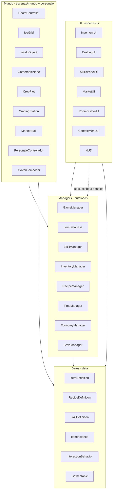
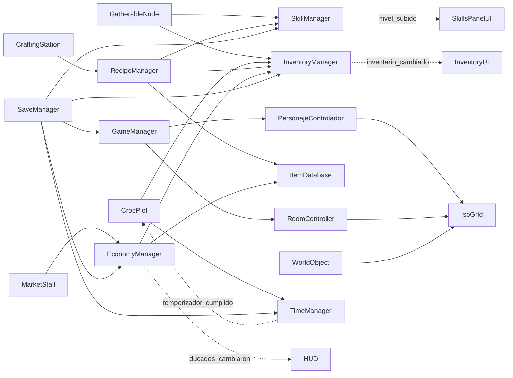
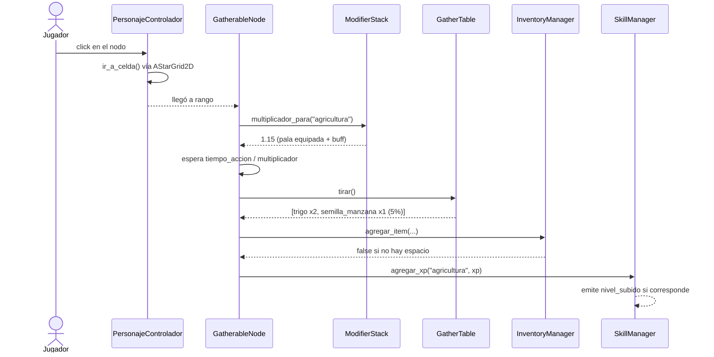
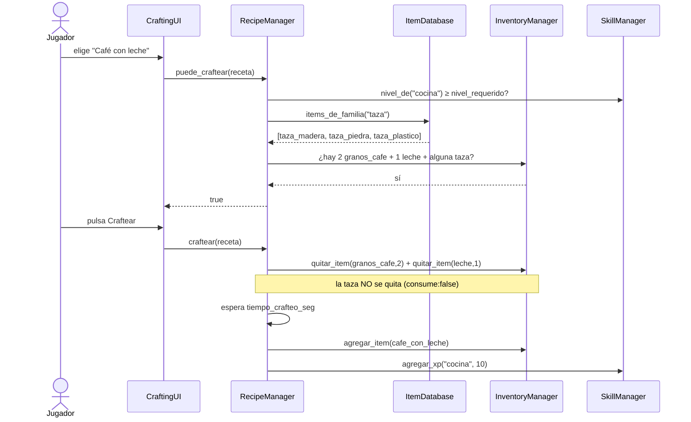
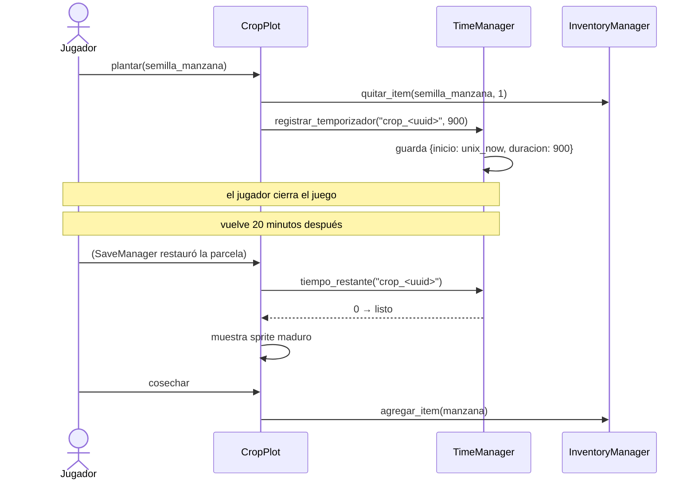
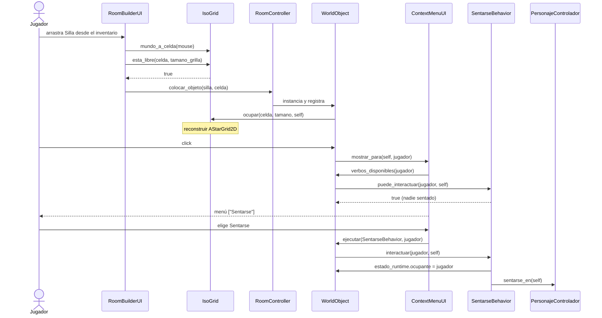
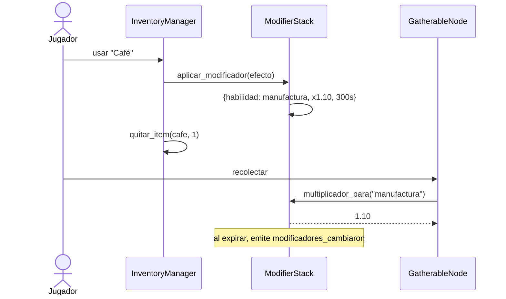
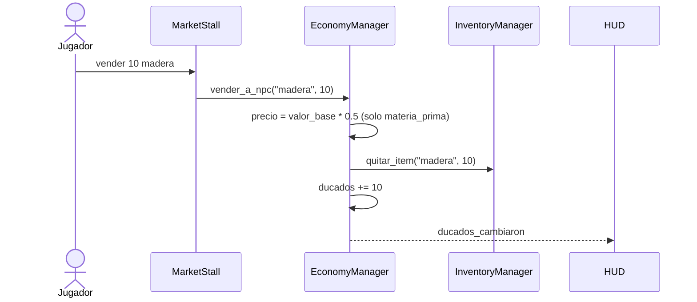
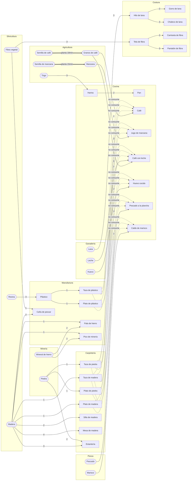

# MumiolaCity — Sistemas y cómo interactúan

**Versión:** 0.4 · **Fecha:** 2026-09-15 (render 3D en tiempo real; decisiones D1, D2, D3, D7 y D11 cerradas; catálogo v0.4)
**Complementa:** [`GDD.md`](GDD.md) (qué es el juego) y [`SCRIPTS.md`](SCRIPTS.md) (qué scripts existen).
**Este documento responde otra pregunta:** *cómo se comunican esos scripts entre sí, quién es dueño de cada dato, y qué decisiones de arquitectura hay que cerrar antes de escribir código.* La referencia de clases campo por campo está en [`CLASES.md`](CLASES.md).

> **Cómo leerlo.** Las secciones §1–§4 describen la arquitectura tal como se deduce de `SCRIPTS.md`. La §5 (modelo de estado), la §6 (decisiones D1–D15) y la §7 (estado de los datos) son **nuevas**: son huecos que aparecieron al revisar el diseño en profundidad. De las quince decisiones de la §6, **siete ya están cerradas** (D1, D2, D3, D7, D11, D15 y la dirección de D12, más el lado de datos de D5); el resto sigue como propuesta, escrita así precisamente porque cambiarlas después de implementadas sale caro.

---

## 1. Las cuatro capas y la regla de dirección

Todo el juego cabe en cuatro capas. La regla que las mantiene sanas es una sola: **las dependencias apuntan siempre hacia abajo, y lo que sube lo hace por señal.**

| Capa | Qué vive acá | Puede llamar a | Nunca conoce a |
|---|---|---|---|
| **UI** (`res://escenas/ui/`) | `InventoryUI`, `CraftingUI`, `SkillsPanelUI`, `MarketUI`, `RoomBuilderUI`, `ContextMenuUI`, `HUD` | Managers, Datos | — |
| **Mundo** (`res://escenas/mundo/`, `personaje/`) | `RoomController`, `IsoGrid`, `WorldObject`, `GatherableNode`, `CropPlot`, `CraftingStation`, `MarketStall`, `PersonajeControlador`, `AvatarComposer` | Managers, Datos | La UI |
| **Managers** (`res://autoloads/`) | `GameManager`, `SkillManager`, `InventoryManager`, `RecipeManager`, `TimeManager`, `EconomyManager`, `SaveManager`, `ItemDatabase` | Datos, otros managers | La UI **y** el Mundo |
| **Datos** (`res://data/`) | `ItemDefinition`, `RecipeDefinition`, `SkillDefinition`, `ItemInstance`, `InteractionBehavior` y sus hijos, `GatherTable` | Nada | Todo lo demás |

**Por qué importa la regla.** Si `InventoryManager` guardara una referencia a `InventoryUI` para refrescarla, el manager dejaría de poder correr sin interfaz — y el día del servidor autoritativo (GDD §8) esa es exactamente la situación: los managers corren en una máquina que no tiene ventana. Por eso los managers **emiten señales y no llaman a nadie hacia arriba**; la UI se suscribe. Es la misma razón por la que `EconomyManager` se pide desacoplado del transporte.

**Corolario práctico:** cualquier método de un manager tiene que poder ejecutarse en una escena vacía, sin jugador ni sala cargada. Si no puede, la lógica está en la capa equivocada.



---

## 2. Grafo de dependencias entre sistemas

Quién llama a quién, en concreto. Las flechas continuas son llamadas directas; las punteadas son señales (la dirección de la señal es la del aviso, no la de la dependencia).



**Lo que este grafo hace evidente:**

- **`InventoryManager` es el cuello de botella de todo el juego.** Recolectar, craftear, vender, equipar, colocar un mueble y guardar la partida pasan todos por él. Es el sistema que más caro sale cambiar después, y por eso la decisión **D1** (cómo representa un slot) es la primera que hay que cerrar de las once.
- **`ItemDatabase` no estaba en el mapa de scripts original y hace falta** — ver **D10**. Sin él, `RecipeManager` no puede resolver un insumo pedido por `familia`. Ya figura en `SCRIPTS.md`, en la tabla de las once clases que ese documento no detalla.
- **`SaveManager` depende de todos los demás y nadie depende de él.** Eso es correcto: es un sumidero. Debe ser el último autoload en el orden de carga (**D9**).
- **Nadie llama al `TimeManager` salvo `CropPlot`, `ModifierStack` y `SaveManager`** — es un servicio pequeño y aislado, buen candidato a implementar temprano y olvidarse.

---

## 3. Los sistemas, uno por uno

Para cada sistema: de qué es **dueño** (el dato que solo él puede mutar), qué **no** le corresponde, y por dónde entra y sale la información. La frontera de "de qué es dueño" es lo que evita que dos sistemas mantengan copias del mismo dato que luego se desincronizan.

### 3.1 Espacio — `IsoGrid` + `RoomController`

- **Dueño de:** qué celda está ocupada por qué `WorldObject`, y cuál es el área construible de la sala.
- **No le corresponde:** saber *qué* es el objeto que ocupa la celda (eso es `ItemDefinition`), ni si el jugador tiene permiso de construir ahí (eso es `RoomController` + nivel de Construcción), ni cómo se dibuja el escenario.
- **Cómo está construido (revisado el 2026-09-15):** `IsoGrid` es un `Node3D` con dos `GridMap` hijos, `Suelo` y `Paredes`. Una celda de `GridMap` admite un solo ítem, así que pintar una pared sobre una celda de suelo la reemplazaría; la regla de composición es **suelo por dentro, paredes por fuera**, en el anillo de celdas sin suelo. La consecuencia buena es que el área caminable deja de ser un rectángulo declarado y pasa a ser *lo que está pintado*: `celda_valida()` pregunta `get_cell_item()` al suelo, y las salas irregulares salen gratis.
- **Lo que un jugador puede tocar no va nunca en un `GridMap`.** Una celda no tiene `ItemInstance`, ni `estado_runtime`, ni verbos, ni recibe clics: el `GridMap` es escenario, y todo lo colocado por un jugador es un `WorldObject` (**D3**).
- **Entra:** peticiones de ocupar/liberar desde `RoomController` y `RoomBuilderUI`. **Sale:** `esta_libre()`, y la lista de celdas bloqueadas que alimenta el `AStarGrid2D` de `PersonajeControlador`.
- **Punto de acoplamiento a vigilar:** `IsoGrid` es la única fuente de verdad de la ocupación, pero `AStarGrid2D` mantiene su **propia** copia de celdas sólidas. Hay que reconstruirla (o parchear la celda afectada con `set_point_solid()`) cada vez que se coloca o se quita un objeto, o el jugador va a caminar atravesando muebles. Es el bug más previsible de la fase 4. **Resuelto de raiz:** el `AStarGrid2D` se mudó adentro de `IsoGrid`, así que `ocupar()` y `liberar_objeto()` lo parchean desde dentro y no hay nada que nadie tenga que recordar. `ocupacion_cambiada` sigue emitiéndose, pero ya no como mecanismo de sincronización sino como aviso para la interfaz de construcción de la fase 4.
- **`AStarGrid2D` sigue valiendo con el mundo en 3D:** opera sobre una grilla de enteros y no le importa la dimensión del render. Vive **dentro de `IsoGrid`**, uno por sala, y cada celda del camino se convierte con `celda_a_mundo()`.

### 3.2 Identidad e inventario — `ItemDatabase` + `InventoryManager`

- **Dueño de:** el catálogo de `ItemDefinition` indexado por `id` y por `familia` (`ItemDatabase`), y las pertenencias del jugador (`InventoryManager`).
- **No le corresponde:** decidir si una receta es válida (eso es `RecipeManager`) ni cuánto vale algo (eso es `EconomyManager` leyendo `valor_base`).
- **Entra:** `agregar_item` / `quitar_item` desde recolección, crafteo, compra y venta. **Sale:** la señal `inventario_cambiado`, y consultas de disponibilidad.
- **Invariante que hay que sostener:** peso total ≤ capacidad, y ningún slot con `cantidad > stack_maximo`. Toda mutación pasa por los dos métodos públicos; nadie escribe el array por fuera.

### 3.3 Progresión — `SkillManager` + `SkillDefinition`

- **Dueño de:** xp acumulada por habilidad. El **nivel es derivado**, nunca almacenado — se calcula desde la xp. Guardar ambos es garantizar que algún día no coincidan.
- **No le corresponde:** aplicar los efectos de los desbloqueos; solo declara qué nivel se alcanzó y emite `nivel_subido`. Quien tenga que reaccionar (recetas nuevas, parcela más grande) se suscribe.
- **Entra:** `agregar_xp()` desde `GatherableNode`, `CropPlot` y `RecipeManager`. **Sale:** `nivel_de()` y la señal.

### 3.4 Transformación — `RecipeManager`

- **Dueño de:** el acto de craftear como transacción atómica. Nadie más puede consumir insumos y producir resultado.
- **No le corresponde:** la interfaz (eso es `CraftingUI`) ni dónde se craftea (eso es `CraftingStation`).
- **La transacción tiene cuatro pasos y ninguno puede quedar a medias:** validar nivel → validar y reservar insumos → esperar `tiempo_crafteo_seg` → consumir insumos y entregar resultado. Si el jugador cierra el inventario, se mueve o cambia de sala en medio de la espera, hay que decidir si se cancela y se devuelve todo. **Recomendación: consumir los insumos al inicio, no al final** — así el jugador no puede gastar la misma harina dos veces lanzando dos crafteos en paralelo, y cancelar es una devolución explícita.

### 3.5 Tiempo — `TimeManager`

- **Dueño de:** todo temporizador que deba sobrevivir a cerrar el juego. Guarda `{id: timestamp_inicio, duracion}` y compara contra `Time.get_unix_time_from_system()`.
- **La distinción que hay que respetar sin excepción:** `Timer` y `create_timer()` sirven para esperas **dentro de una sesión** (respawn de un nodo de recolección, barra de progreso de un crafteo). Cualquier cosa que deba avanzar con el juego cerrado (crecimiento de cultivos) va por timestamps. Mezclarlas produce el bug de "cerré el juego y mi manzano no creció", que se descubre tarde y obliga a reescribir.
- **Consecuencia no obvia:** si los buffs de comida van por timestamp, un jugador puede tomarse un café, cerrar el juego 4 minutos y volver con el buff casi vencido. Si van por `Timer` de sesión, el buff se pausa. **Recomendación: buffs por sesión (`Timer`), cultivos por timestamp** — el buff es una recompensa por jugar activo, el cultivo es una razón para volver mañana. Son dos incentivos distintos y merecen relojes distintos.

### 3.6 Interacción — `InteractionBehavior` + `WorldObject` + `ContextMenuUI`

- **Dueño de:** el conjunto de verbos que un objeto ofrece, y el punto único de mutación (`WorldObject.ejecutar()`).
- **La regla dura del GDD §6.1 vale la pena repetirla:** el `Resource` de comportamiento es **compartido y sin estado**. Si `SentarseBehavior.tres` guardara "quién está sentado", las cincuenta sillas de la ciudad que apuntan a ese mismo archivo compartirían ocupante. El estado va en la instancia, siempre.
- **Ese es el sistema que sostiene el pilar 6 del GDD** (el rol emerge de la interactividad, no de minijuegos): cada verbo nuevo que se agrega multiplica lo que la gente puede hacer sin que nadie escriba una escena.

### 3.7 Valor — `EconomyManager`

- **Dueño de:** los Ducados del jugador y el precio piso del comprador NPC.
- **No le corresponde:** `valor_base` — ese es un dato del ítem, y es la *referencia* de precio, no el precio. El precio real lo fija el mercado (fase 5) o el piso NPC (fase 2).
- **Falta definir:** la relación entre `valor_base` y el precio piso NPC. **Recomendación: piso = 50 % de `valor_base`, y solo para `categoria == materia_prima`** — el GDD §5 dice explícitamente que el NPC no compra bienes intermedios ni de lujo, y un piso a mitad de precio nunca compite con vender a otro jugador.

### 3.8 Persistencia — `SaveManager`

- **Dueño de:** nada propio. Es un serializador: pide su estado a cada manager y lo escribe.
- **La pregunta que decide su diseño:** ¿cada manager expone `to_dict()`/`from_dict()`, o `SaveManager` conoce las tripas de todos? Lo primero: **cada manager se serializa a sí mismo**, `SaveManager` solo orquesta. Si no, agregar un campo a `InventoryManager` obliga a tocar `SaveManager` también, y esa es la clase de acoplamiento que hace que la gente deje de guardar cosas.

---

## 4. Flujos de extremo a extremo

Los seis recorridos que cubren todo el MVP. Si estos seis funcionan, el juego funciona.

### 4.1 Recolectar



**El detalle que hay que no olvidar:** `agregar_item` puede devolver `false` (inventario lleno). Si el nodo ya consumió su recurso antes de comprobarlo, el jugador pierde el material. **Comprobar espacio antes de consumir el nodo, no después.**

### 4.2 Craftear (con insumo por familia y utensilio no consumido)



**Dos decisiones escondidas en este flujo.** (a) Si el jugador tiene tres tazas distintas, ¿cuál "usa" la receta? Como no se consume, da igual — salvo que se adopte **D2**, en cuyo caso sí importa muchísimo y hay que dejar elegir. (b) `puede_craftear` se llama por cada receta de la lista cada vez que se abre la UI; con 29 ítems no es problema, con 500 sí. Cachear el resultado y recalcular solo con la señal `inventario_cambiado`.

### 4.3 Plantar y cosechar (atraviesa el cierre del juego)



**El id del temporizador tiene que ser estable entre sesiones.** No puede ser el `get_instance_id()` del nodo, que cambia al recargar. Un `uuid` generado al plantar y guardado en el `ItemInstance` de la parcela.

### 4.4 Colocar un objeto y usarlo



### 4.5 Consumir y trabajar con el buff



### 4.6 Vender



---

## 5. Dónde vive cada dato

La tabla más importante del documento. La mayoría de los bugs de un juego de este tipo salen de tener el mismo dato en dos lugares.

| Dato | Vive en | Se persiste | Nota |
|---|---|---|---|
| Qué es una silla (peso, receta, verbos) | `ItemDefinition` (`.tres` en disco) | No — es contenido | Nunca se muta en runtime |
| Cuántas maderas tengo | `InventoryManager`, slot apilado | Sí | Sin `ItemInstance`, ver **D1** |
| Qué contiene *esta* taza | `ItemInstance.contenido_id` | Sí | El consumible **es** el contenido: no existe suelto (**D2**) |
| Quién está sentado en *esta* silla | `WorldObject.estado_runtime` | **No** | Estado de sesión, y el único sitio donde se permite una referencia a un nodo vivo (**D3**) |
| En qué celda está *esta* mesa | `IsoGrid._ocupadas` + `WorldObject.celda_origen` | Sí, vía `RoomController` | Es dato del emplazamiento, no del objeto: no va en su `ItemInstance` (**D3**) |
| Xp de Cocina | `SkillManager` | Sí | El nivel se deriva, no se guarda |
| Nivel de Cocina | *derivado* de la xp vía `SkillDefinition` | No | |
| Cuánto le falta a mi manzano | `TimeManager` (timestamp de inicio) | Sí | No un `Timer` |
| Cuánto le queda a mi café | `ModifierStack` (`Timer` de sesión) | No | Ver §3.5 |
| Mis Ducados | `EconomyManager` | Sí | |
| Precio de mercado de la madera | `EconomyManager` (fase 5) | Sí | En fase 2 es `valor_base * 0.5` |
| En qué sala estoy | `GameManager` | Sí | |

**Las dos filas que hay que mirar dos veces** son las que dicen "No" en persistencia — son, precisamente, las que viven en `estado_runtime` (**D3**): ocupante de una silla y buffs activos. Que un jugador cargue la partida y aparezca de pie al lado de la silla, sin el buff del café, es aceptable y simplifica mucho. Que aparezca *dentro* de la silla porque se guardó el ocupante pero no la animación, no lo es.

---

## 6. Decisiones de arquitectura: catorce cerradas, siete pendientes

Once decisiones que hay que cerrar antes de escribir el sistema correspondiente, ordenadas por lo caro que sale cambiarlas después. **Cinco ya están cerradas** — D1, D2 y D11 aplicadas en `items.json`, D3 resuelta acá abajo, y D7 postergada a la fase 2 a propósito — y **D5 tiene el lado de los datos hecho y el del código pendiente**. Las demás siguen abiertas.

### D1 — ¿Un `ItemInstance` por unidad, o slots apilados? · **decidida**

`SCRIPTS.md` dice que `InventoryManager` "contiene los `ItemInstance` del jugador". Pero `items.json` marca el trigo como `apilable: true, stack_maximo: 99`: 99 objetos `Resource` para representar 99 trigos idénticos es puro desperdicio de memoria y de tamaño de guardado.

**Contradicción concreta en los datos:** las seis tazas y platos son `apilable: true, stack_maximo: 10` **y** tienen campo `contenedor`. Una taza vacía y una taza servida con café no pueden ocupar el mismo stack — son objetos distintos.

**Decisión:** el inventario es un `Array[InventorySlot]`, y el slot tiene dos formas:
- **Apilado:** `{definicion, cantidad}` con `instancia == null`. Para todo lo que no tiene estado propio.
- **Único:** `{definicion, cantidad: 1, instancia: ItemInstance}`. Para lo que sí lo tiene.

Y una regla derivada, **ya aplicada en `items.json` v0.4**: si un ítem tiene `contenedor`, `apilable` es `false` y `stack_maximo` es 1. Un ítem con estado no se apila, y eso convirtió las seis tazas y platos en instancias únicas.

### D2 — ¿Dónde vive el café: en un ítem propio o dentro de la taza? · **decidida: dentro de la taza**

Hoy hay dos lecturas incompatibles del mismo diseño. `items.json` define `cafe` como un ítem con su propio `valor_base`, y la receta pide una taza que **no se consume**. Pero `lista_items.md` dice que "una Taza puede estar vacía o servida con Café" como estado de instancia. ¿El café es un ítem que tengo, o es el contenido de una taza que tengo?

- **Modelo A (café como ítem suelto):** la taza es un requisito de crafteo que se comprueba una vez y no cuesta nada. Consecuencia: **una sola taza en todo el inventario habilita cafés infinitos**, y el sistema de contenedores queda decorativo.
- **Modelo B (café dentro de la taza):** craftear café muta un `ItemInstance` de taza a `{contenido: "cafe"}`. Consumirlo devuelve la taza vacía. Consecuencia: la cantidad de cafés que puedo llevar encima **es** la cantidad de tazas que tengo, y Cocina pasa a depender de verdad de Carpintería/Manufactura.

**Decisión: modelo B.** Es el que hace cierto el pilar 3 del GDD ("ninguna habilidad es una isla") en vez de dejarlo como intención: con el modelo A, un cocinero compra una taza una vez en su vida y ya no vuelve a necesitar a nadie. Con el B, un cocinero que quiere vender veinte cafés necesita veinte tazas de alguien. Implica que el precio de venta de un consumible líquido es `valor_base(contenido) + valor_base(recipiente)`, y que `es_liquido`/`es_solido` dejan de ser una anotación y pasan a ser una regla que `RecipeManager` aplica.

**Lo que ya cambió en los datos (v0.4):** los seis utensilios son `apilable: false, stack_maximo: 1`, y el `_readme` de `items.json` documenta el contrato completo — qué ocupa el contenido, cuándo se libera y cómo se calcula el precio del conjunto. **Lo que queda por escribir es el código:** `RecipeManager.craftear()` recibe la instancia de utensilio concreta, y `ContenedorBehavior.consumir()` aplica el efecto y la vacía.

### D3 — Unificar `ItemInstance` y `WorldObject.estado_instancia` · **decidida**

**El problema.** Una misma cosa concreta del juego — *esta* taza, no "las tazas de madera" — vive alternadamente en dos sitios: dentro del inventario del jugador y colocada en una sala. Godot ofrece un contenedor natural distinto para cada sitio: un `Resource` (`ItemInstance`), que se serializa solo dentro del guardado, y una propiedad del nodo (`estado_instancia: Dictionary`), que existe mientras la sala está cargada. Si cada sitio usa el suyo, el estado no sobrevive el viaje: **dejás una taza servida sobre la mesa, la volvés a levantar y el café desapareció**, porque nadie copió el diccionario del nodo de vuelta al recurso del inventario.

**Por qué "poner todo en `ItemInstance`" tampoco funciona.** Hay estado que *no debe* sobrevivir. Quién está sentado en esta silla es un dato real mientras jugás, pero carece de sentido después de cargar la partida: el jugador ya no está ahí. Serializarlo produce sillas con un fantasma sentado, o peor, una referencia a un nodo que ya no existe. El problema nunca fue que hubiera dos contenedores — fue que **no estaban nombrados ni tenían una regla**.

**Decisión: dos contenedores, con vidas distintas y declaradas.**

| | `ItemInstance` | `estado_runtime` |
|---|---|---|
| Qué es | `Resource` con `@export` | `Dictionary` sin `@export` |
| Vive en | el archivo de guardado | la escena cargada |
| Sobrevive a | cerrar el juego | nada: muere al descargar la sala |
| Puede guardar | solo datos serializables: ids, números, textos | también referencias vivas a nodos |
| Ejemplo | qué café tiene *esta* taza; cuánto lleva creciendo *esta* semilla | quién está sentado; qué animación corre |

**La regla para decidir en cuál va un dato es una pregunta:** *¿tiene sentido que esto siga siendo cierto mañana?* Qué contiene la taza, sí. Quién está sentado, no.

**Y el corolario que atrapa el error antes de cometerlo:** `ItemInstance` **nunca** guarda una referencia a un nodo. Si un dato necesita apuntar a algo vivo, por definición es de sesión y va en `estado_runtime`. Esa sola frase evita la clase entera de bugs de "guardado que apunta a un objeto que ya no existe".

**El viaje de ida y vuelta.** `WorldObject` **posee** un `ItemInstance`, y el ciclo mundo↔inventario es mover ese mismo recurso, no copiarlo:

```
InventoryManager (slot único)
   │
   ├─ RoomController.colocar_objeto(instancia, celda)
   │     1. InventoryManager.quitar_instancia(instancia)
   │     2. WorldObject.instancia = instancia      ← el mismo recurso, no un duplicado
   │     3. IsoGrid.ocupar(celda, tamano, obj)
   │
   └─ RoomController.retirar_objeto(obj)
         1. IsoGrid.liberar_objeto(obj)
         2. InventoryManager.agregar_instancia(obj.instancia)
         3. obj.queue_free()
```

**La propiedad tiene que ser exclusiva.** Si el inventario conserva la referencia *y* el `WorldObject` también, el mismo objeto existe dos veces — es el bug de duplicación clásico, y con `Resource`, que se pasa por referencia, es facilísimo de cometer sin notarlo. Quitar del inventario y asignar al nodo son un solo paso indivisible; si el paso 2 puede fallar, el 1 se revierte.

**Dónde *no* va el estado: la colocación.** En qué celda está y hacia dónde mira son datos del **emplazamiento**, no del objeto: un mismo `ItemInstance` puede estar en distintas celdas a lo largo de su vida, y mientras está en la mochila no está en ninguna. Van en `WorldObject.celda_origen` y `rotacion_grilla`, y los persiste `RoomController.to_dict()`, no el `ItemInstance`.

**Una asimetría deliberada entre el mundo y el inventario.** En el mundo, `WorldObject.instancia` **nunca es `null`**: hasta una silla, que no tiene estado propio, lleva la suya. En el inventario, en cambio, todo lo que no tiene estado propio se guarda como stack sin instancia (**D1**). Es a propósito, y las dos mitades optimizan cosas distintas: el inventario optimiza por volumen — 99 maderas no pueden ser 99 recursos — y el mundo optimiza por uniformidad, porque 50 objetos en una sala sí pueden ser 50 recursos y a cambio **ningún script del mundo tiene que preguntar si hay instancia o no**. La conversión entre las dos formas vive en `colocar_objeto()` y `retirar_objeto()`, y en ningún otro lugar: `agregar_instancia()` colapsa a stack lo que no tiene estado propio.

**Un detalle de Godot que muerde exactamente acá.** Los `Resource` se pasan por referencia y el motor **cachea los `.tres` cargados**: hacer `load()` del mismo archivo dos veces devuelve *el mismo objeto*. Por eso un `ItemInstance` **nunca es un archivo en disco** — se crea en runtime con `.new()` y se serializa dentro del `SaveGame`, no como asset propio. Si fuera un `.tres`, dos tazas del mismo tipo compartirían contenido y servir una serviría todas. Por lo mismo, duplicar un objeto (partir un stack, craftear una taza nueva) pide un `duplicate()` explícito, nunca reasignar la referencia.

**De regalo, encaja con el multijugador (D8).** La misma partición mapea a la división cliente/servidor sin rediseñar nada: `ItemInstance` es el estado autoritativo que el servidor posee y replica; `estado_runtime` es presentación local que cada cliente reconstruye solo.

**Escenas que no vienen de un ítem.** `CraftingStation` y `MarketStall` heredan de `WorldObject`, y una mesada pública de la plaza no la colocó ningún jugador. Para que la invariante «`instancia` nunca es `null`» se sostenga sin excepciones, esas escenas llevan su `ItemInstance` creado dentro del propio `.tscn`.

### D4 — Las habilidades no pueden ser `String` sueltos · **bloquea `SkillManager` (fase 2)**

`SCRIPTS.md` define `agregar_xp(habilidad: String, ...)`. Ya hay un desync latente: el GDD escribe **Minería, Carpintería, Ganadería** con tilde, e `items.json` escribe **Mineria, Carpinteria, Ganaderia** sin tilde. El día que alguien pase el nombre del GDD, la xp se acumula silenciosamente en una habilidad que no existe, sin error.

**Propuesta:** un `const Habilidades` con `StringName` en snake_case sin tildes (`&"mineria"`) como clave única de todo el sistema, y `SkillDefinition.nombre_display` con la tilde para mostrar. Ninguna cadena literal de habilidad se escribe fuera de ese archivo.

### D5 — Un solo esquema para buffs y bonos de equipo · **datos ya corregidos · falta el código**

`items.json` los modela de dos formas distintas: el café usa `efecto: {tipo: "buff_velocidad_manufactura", magnitud: 10}` — con la habilidad **codificada dentro del nombre del tipo** — mientras que la pala usa `bono: {habilidad_afectada: "Agricultura", magnitud: 15}`, que es la forma correcta. Con el esquema del café, cada habilidad nueva obliga a inventar un `tipo` nuevo y a agregar un `if` en el código que lo interpreta.

**Aplicado en `items.json` (v0.3):** `efecto` y `bono` ya comparten exactamente la misma forma, y el buff del café dejó de codificar la habilidad dentro del nombre del tipo:
```
{ tipo: &"velocidad", habilidad_afectada: &"manufactura", magnitud: 10.0, duracion_seg: 300.0, estacable: false }
```
**Lo que queda por decidir es el lado del código:** un único punto de consulta, `ModifierStack.multiplicador_para(habilidad) -> float`, que suma el equipo equipado y los buffs activos. Hoy `GatherableNode` tendría que consultar dos sistemas distintos (el slot de herramienta y el controlador de buffs, que antes de esta decisión eran dos clases separadas) y combinarlos a mano en cada sitio donde importe la velocidad.

### D6 — Falta la tabla de drops · **bloquea `GatherableNode` (fase 2)**

`lista_items.md` dice que la Semilla de manzana se obtiene "en baja proporción" al cosechar Manzana. **Esa proporción no tiene dónde vivir:** no es un campo de `items.json` ni un recurso de `SCRIPTS.md`. Terminaría hardcodeada en un script, que es exactamente lo que el GDD §8 prohíbe.

**Propuesta:** un recurso nuevo `GatherTable` con `Array[GatherDrop]{item_id, cantidad_min, cantidad_max, probabilidad}`, y `GatherableNode.@export var tabla: GatherTable`. Es una de las once clases que `SCRIPTS.md` lista pero no detalla (firma completa en [`CLASES.md`](CLASES.md) §1.10).

### D7 — La energía no tiene sumidero · **postergada a fase 2, a propósito**

Tres de los cinco consumibles restauran energía, el `HUD` muestra una barra de energía, y **nada en todo el diseño la gasta**. Tal como está, Pan, Jugo de manzana y Huevo cocido no sirven para nada y el 60 % de la habilidad de Cocina queda sin propósito.

**Decisión: no se resuelve todavía.** La barra sigue existiendo en el `HUD` y los tres consumibles siguen restaurándola, pero nada la gasta hasta que haya un ciclo económico real que balancear. Es una postergación consciente, no un olvido: poner un coste de energía antes de saber cuántas acciones por minuto hace un jugador es elegir un número a ciegas. **La consecuencia hay que tenerla presente: hasta que se cierre, Pan, Jugo de manzana, Huevo cocido y Pescado a la plancha no tienen uso real** — se craftean, se venden y se comen sin que comer cambie nada.

**La propuesta que quedó registrada para cuando llegue el momento:** cada acción de recolección cuesta energía (≈2 puntos sobre 100), y por debajo de 20 la velocidad de recolección cae un 50 % — **penaliza, no bloquea**. Bloquear al jugador por una barra vacía es la mecánica más odiada de los juegos sociales y no hace falta: basta con que comer sea claramente mejor que no comer. Con ~50 acciones por barra llena y +20 por Pan, la comida se vuelve un consumo constante y real, que es lo que sostiene la demanda de Cocina en el mercado. El momento natural para cerrarlo es junto con el primer balanceo de la fase 2, cuando ya se pueda medir el ritmo real de juego.

### D8 — Cómo se prepara la interacción para el servidor · **decisión barata ahora, cara después**

El GDD §6.1 dice que `interactuar()` "queda listo para multijugador sin rediseño". Para que eso sea cierto tiene que cumplir dos condiciones que hoy no están escritas: **devolver éxito/fracaso** en vez de ser `-> void` (el servidor necesita poder rechazar), y **no mutar nada directamente**, sino a través de los managers, que son los que un día correrán en el host.

**Propuesta:** `interactuar(actor, objeto) -> bool`, y ninguna escritura a estado de juego desde el cuerpo del comportamiento que no pase por un manager o por `objeto.estado_runtime`.

### D9 — Orden de carga de los autoloads · **trivial, pero rompe el arranque si se equivoca**

Los autoloads se inicializan en el orden del Project Settings, y `_ready()` de uno puede necesitar a otro ya listo.

**Propuesta:** `ItemDatabase` → `TimeManager` → `SkillManager` → `InventoryManager` → `RecipeManager` → `EconomyManager` → `GameManager` → `SaveManager`. `ItemDatabase` primero porque todos leen definiciones; `SaveManager` último porque restaura sobre todos los demás; `GameManager` penúltimo porque cambiar de sala presupone que los managers ya existen.

### D10 — Falta `ItemDatabase` · **resuelta**

`RecipeDefinition` admite insumos pedidos por `familia` ("cualquier taza"). Para resolver eso hace falta un índice `familia -> [ItemDefinition]`, y **ningún script de `SCRIPTS.md` tiene ese trabajo asignado**. Godot no autocarga los `.tres` de una carpeta: hay que recorrerla con `ResourceLoader`.

**Propuesta:** autoload `ItemDatabase` que en `_ready()` escanea `res://data/objetos/`, y expone `obtener(id)`, `items_de_familia(familia)`, `items_de_categoria(categoria)`. Con él y `GatherTable` (D6), más los recursos anidados que hoy son diccionarios sueltos, el catálogo real sube de los 32 scripts que detalla `SCRIPTS.md` a 43 clases — el índice completo está en [`CLASES.md`](CLASES.md) §7.

**Implementado en `res://autoloads/ItemDatabase.gd`**, con los tres métodos propuestos más `existe()`, `cantidad()` y `recargar()`, escaneando `res://data/objetos/definiciones/`. Se adelantó a la fase 1 porque no era opcional: `ItemInstance` guarda `definicion_id` y no la referencia al recurso (§1.8), así que sin un índice por id no hay forma de resolver la definición de nada.

Dos detalles que aparecieron al escribirlo. Un id duplicado es `push_error` y **no** se registra: quedarse con el último cargado hace que el catálogo dependa del orden del sistema de archivos, y el bug reaparece meses después como «este ítem tiene el precio de otro». Y el escaneo ignora el sufijo `.remap`, porque en una build exportada los `.tres` llegan renombrados y sin eso el catálogo queda vacío **solo en el juego exportado**, que es la peor forma posible de descubrirlo.

Queda contenido pendiente, no diseño: hoy hay una sola definición, `silla_madera`, para validar el paso 5. Las otras 26 salen de `items.json` en la fase 2.

### D11 — `habilidad_origen` es redundante en los ítems crafteados · **resuelta**

Verificado sobre los 29 ítems: para todo ítem con receta, `habilidad_origen` es **siempre** igual a `receta.habilidad`. Es un campo duplicado esperando a desincronizarse.

**Aplicado en `items.json` (v0.3):** `habilidad_origen` se eliminó de los 18 ítems crafteados y quedó solo en materia prima (de dónde se recolecta). Para lo crafteado, la fuente única es `receta.habilidad`.

---

### D12 — Paredes estructurales contra paredes del jugador · **decidida en dirección, pendiente de detalle**

**El problema.** Si el jugador puede levantar paredes, hay dos clases de pared con reglas opuestas: el perímetro de un departamento, que nadie debe poder tocar, y los tabiques con los que el propietario divide su sala. Tratarlas igual permite que alguien demuela la fachada; tratarlas como cosas sin relación obliga a dos sistemas de colocación, dos de guardado y dos de inventario.

**Decisión: las estructurales son escenario, los tabiques son objetos.**

| | Estructural | Del jugador |
|---|---|---|
| Vive en | `GridParedes`, pintada en el editor | `WorldObject` con su `ItemInstance` |
| La coloca | el diseño de la sala | el propietario, desde su inventario |
| Se puede quitar | no | sí, vuelve al inventario (**D3**) |
| Ocupa | una celda, siempre | lo que diga su `tamano_grilla` |
| Se persiste en | la escena `.tscn` | `RoomController.to_dict()` |

**El jugador compra las paredes y son suyas**, igual que una silla: se craftean, se venden y se colocan. Eso le da a Carpintería un producto de demanda recurrente —todo el mundo redecora— sin inventar una mecánica nueva, y es uno de los sumideros de Ducados que pide el GDD §5.

**El mismo ítem tiene dos usos**, y eso es exactamente para lo que existe la composición de `InteractionBehavior` (GDD §6.1): una pared se puede **colocar** como tabique o **aplicar** como revestimiento sobre una estructural (ver **D13**). Son dos comportamientos sobre la misma `ItemDefinition`, no dos ítems.

**Dónde vive el permiso.** No en `IsoGrid`, que solo sabe qué celdas existen y cuáles están ocupadas. La sala declara qué parte de sí misma es editable por el propietario, y `RoomController` es quien valida — como ya dice §3.1 de este documento. El límite de cuánto se puede ampliar se engancha con la habilidad de Construcción (GDD §3.3).

**Lo que queda por definir:** la forma exacta de esa área editable —un `Rect2i`, un conjunto de celdas, o una marca por celda— y si el perímetro es simplemente "lo que está fuera del área editable" o una lista aparte.

---

### D13 — El revestimiento de pared, ¿por sala o por celda? · **abierta, bloquea la fase 4**

Aplicar una pared como revestimiento **no coloca nada en la grilla**: cambia el aspecto de una celda estructural que ya existe. Por eso no es un `ItemInstance` en una celda y necesita su propio sitio.

- **Por sala** (lo que hace Habbo): un solo revestimiento para todos los muros. Un dato por sala, una interfaz trivial, y el ítem se consume una vez.
- **Por celda:** permite paredes de acento y decorar cada habitación distinto. Es más fiel a la idea de simulador de la vida (§1 del GDD), pero es estado nuevo por celda que hay que guardar, y una interfaz que exige elegir superficie.

**Recomendación: empezar por sala y dejar la puerta abierta.** Guardarlo como `Dictionary` de celda a revestimiento desde el principio cuesta lo mismo que guardar un solo valor, y permite pasar a por-celda después sin migrar el guardado. Lo que sí hay que decidir de entrada es **dónde vive ese dato**: es del emplazamiento, no del objeto, así que va en `RoomController.to_dict()` junto a `celda_origen` y `rotacion_grilla` (**D3**), nunca en el `ItemInstance` de la pared.

---

### D14 — Colocar un tabique no puede dejar la sala partida · **abierta, bloquea `RoomBuilderUI` (fase 4)**

**El problema.** Un jugador puede tapiar su propia puerta o aislar media casa. Con sus muebles es problema suyo y reversible, pero **una visita que entra a una sala mal dividida queda encerrada** o no puede llegar a la mitad de las habitaciones, y no tiene forma de arreglarlo porque los objetos no son suyos.

**La validación es barata porque la infraestructura ya está.** Antes de confirmar una colocación, comprobar que todas las celdas con suelo sigan siendo alcanzables desde la entrada: un relleno por inundación sobre la grilla, O(n) y despreciable para una sala. Si el tabique desconecta algo, se rechaza.

**Por qué hay que decidirlo antes de escribir el código y no después:** condiciona la firma de `RoomController.colocar_objeto()`, que tiene que poder devolver "no, esto parte la sala" como un fracaso distinto de "ahí no cabe". Agregar un motivo de rechazo cuando ya hay comportamientos escritos encima es tocar todas las llamadas.

**Cuándo implementarlo:** en la **fase 4**, junto con `RoomBuilderUI` y en el mismo momento en que se escriba `colocar_objeto()` — no después, como validación agregada. La regla es que ninguna colocación llegue a ejecutarse sin haber pasado por ahí, y eso solo se sostiene si la comprobación vive dentro de la transacción de colocación, igual que `esta_libre()`.

**Nota de alcance:** la comprobación es necesaria solo para lo que bloquea el paso. Una silla no puede partir una sala, así que conviene que solo la paguen los objetos cuyo `tamano_grilla` los convierte en obstáculo — o directamente los que declaren que bloquean, si más adelante hay objetos atravesables.

---

### D15 — Toda pieza de `GridMap` mide una celda · **decidida**

**El problema, encontrado en la práctica.** `GridMap.get_used_cells()` devuelve las celdas donde se *colocó* una pieza, no las que su malla **invade**. Una pared de dos metros de ancho pintada en una celda bloquea esa sola y el personaje la atraviesa por la otra mitad, sin que nada dé error. Con una puerta de tres celdas el efecto fue peor y exactamente inverso: bloqueaba el hueco y dejaba libres los dos muros.

**Decisión: toda pieza de escenario mide exactamente una celda, y bloquea o no bloquea entera.** Lo que abarca varias se pinta celda por celda. Dos losas de un metro se ven igual que una de dos, y a cambio *colocar* y *bloquear* vuelven a ser la misma operación.

**Un hueco de puerta es la ausencia de pared**, no una pieza de puerta: se pintan los muros a los lados y se deja la celda del medio vacía. Si se quiere el marco visual, es un `WorldObject` decorativo sobre la celda transitable, no escenario.

**La excepción declarada.** `IsoGrid.piezas_transitables` lista las piezas de la capa de paredes que no bloquean, para lo que es visualmente muro pero atravesable. Existe porque **dibujar y bloquear son cosas distintas** y no conviene deducir una de la otra: la capa donde se pinta una pieza dice cómo se ve, no cómo se comporta.

**Qué la protege.** `IsoGrid._validar_piezas()` compara la caja envolvente de cada pieza contra el tamaño de celda y avisa por consola al arrancar. Convierte un bug silencioso —el personaje atraviesa medio muro— en un mensaje que nombra la pieza culpable.

**Esto limita al `GridMap`, no al juego.** Los objetos del jugador sí son multicelda y siempre lo fueron: `celdas_de()` expande la huella, `esta_libre()` valida el conjunto y `ocupar()` registra todas las celdas apuntando a la misma instancia. El editor de salas del juego va a instanciar `WorldObject`, no a pintar celdas de `GridMap`, así que la regla se queda del lado del diseñador y no se le contagia al jugador.

---

### D16 — Los rechazos se comunican con un código, no con un `bool` · **decidida**

**El problema.** `ocupar()` devuelve `false` y quien llama no sabe por qué: puede no haber piso, puede haber una pared, puede estar ocupada o —en fase 4— puede que la colocación parta la sala en dos. Un booleano obliga a cada sistema a re-deducir el motivo o a inventarse su propio texto, y el mismo mensaje termina escrito en varios lugares que se desincronizan.

**Decisión: existe un único enum `Errores.Codigo`** (`res://nucleo/Errores.gd`), con números explícitos agrupados por sistema —`1xx` grilla, `2xx` inventario, `3xx` economía, `4xx` habilidades, `5xx` permisos— y una tabla de mensajes en castellano al lado. Toda operación que el jugador pueda ver rechazada devuelve un código.

**El alcance se defiende a propósito.** Solo entran los rechazos que hay que explicarle al jugador. Los errores de programación siguen siendo `push_error()` y no reciben código. Sin esa regla, el enum crece hasta volverse un cajón de sastre y deja de servir para lo único que tenía que servir.

**Por qué ahora y no en la fase 4.** Es la respuesta al punto que **D14** deja planteado: agregar un motivo de rechazo cuando ya hay comportamientos escritos encima obliga a tocar todas las llamadas. `FUERA_DEL_AREA` (D12) y `PARTIRIA_LA_SALA` (D14) ya están en el enum aunque las validaciones que los producen todavía no existan — el hueco está hecho y la fase 4 solo tiene que llenarlo.

**Consecuencia inmediata en la firma de `RoomController`.** `colocar_objeto()` devuelve `Errores.Codigo` y no `WorldObject`; el objeto recién creado se recupera con `IsoGrid.objeto_en(celda)` justo después de un `OK`. Así no hacen falta parámetros de salida ni devolver un diccionario.

---

### D17 — Plataforma: PC primero, móvil después, Web descartada · **decidida**

**El problema.** El proyecto declaraba Web (HTML5) como meta secundaria, y eso arrastraba una consecuencia técnica que quedó abierta durante toda la fase 1: el único método de render que exporta a Web es **Compatibility**, mientras que `project.godot` declara **Forward+**. Mientras la contradicción siguiera en pie, ninguna decisión de dirección de arte se podía cerrar, porque la mitad de los efectos existían o no según cuál ganara.

**Decisión: el destino principal es PC.** Móvil queda como segundo objetivo y Web sale del alcance. El motivo es de diseño antes que técnico: inventario, mercado, construcción de salas y chat son sesiones largas con teclado y mouse, y el género —mundo social persistente con economía de jugadores— vive en escritorio.

**Consecuencia inmediata: el proyecto se queda en Forward+** y recupera los tres efectos que Compatibility no tiene y que sí importan para el look: niebla volumétrica, SDFGI y **desenfoque de profundidad**, este último el que produce el efecto maqueta que la cámara ortográfica hace tan reconocible.

**Móvil no reabre la discusión, la traslada.** Godot permite un método de render por plataforma: `rendering/renderer/rendering_method.mobile = "mobile"` en `project.godot` deja Forward+ en escritorio y el renderizador Mobile en teléfonos, sin mantener dos proyectos. Mobile conserva LightmapGI, glow, LUT, niebla de profundidad, desenfoque de profundidad, decals y MSAA; pierde SSAO, niebla volumétrica, SDFGI y TAA. **No exportar a Android con Forward+**: no es una versión mejor del renderizador Mobile sino una tubería de escritorio, y rinde peor en teléfonos.

**Qué significa para la dirección de arte.** SSAO es el único efecto del set acogedor que habría que poder apagar por plataforma el día que exista la build de móvil. Todo lo demás —luz horneada, grado de color, glow, niebla de profundidad— sobrevive a los dos renderizadores, así que el trabajo visual se puede hacer una sola vez.

---

### D18 — Lo que se guarda viaja por nombre de pieza, nunca por id · **decidida**

**El problema.** Un `GridMap` guarda **ids**, y la `MeshLibrary` mapea id → malla + nombre. Los ids se asignan al exportar la biblioteca desde su escena fuente, **en el orden de los nodos de primer nivel**. Si un re-export los reasigna —agregar una ventana en el medio de la escena alcanza— cada sala pintada se repinta con mallas distintas y **nada da error**: las paredes se vuelven suelo y lo descubrís mirando.

No es hipotético. Los ids en uso hoy son 2, 3, 4 en el suelo y 5, 8, 10 en las paredes, con huecos en 0, 1, 6, 7 y 9: la huella de una biblioteca que ya se editó. Y el mapeo real no estaba escrito en ninguna parte — hubo que deducirlo del orden de los nodos de la escena fuente y validarlo cruzando qué ids aparecen en cada capa.

**Decisión: el nombre es el contrato estable; el id es un detalle de la sesión.** Todo lo que cruce el borde del proyecto —`RoomController.to_dict()`, el guardado de partidas, las salas que en el futuro viajen entre cliente y servidor— serializa **nombres de pieza**, y se resuelven a id contra la biblioteca cargada en ese momento con `MeshLibrary.find_item_by_name()`, envuelto en `CatalogoPiezas.id_de()`.

**Por qué ahora.** `to_dict()` todavía no existe. Escrito con ids, un re-export corrompe todas las salas guardadas de todos los jugadores sin vuelta atrás; escrito con nombres, sobreviven a cualquier reacomodo. Cuesta cero hoy y es una migración después — la misma forma que **D14** y **D16**.

**Qué lo protege mientras tanto.** `res://nucleo/CatalogoPiezas.gd` declara qué piezas tiene que traer cada capa y con qué prefijo se llaman, e `IsoGrid._validar_piezas()` lo comprueba al arrancar. Avisa de las tres fallas mudas: una pieza mayor que una celda (**D15**), un id pintado que la biblioteca ya no tiene, y una pieza pintada en la capa que no le corresponde.

**Una biblioteca por capa.** `suelos.meshlib` y `paredes.meshlib`, exportadas de `escenario_suelos.tscn` y `escenario_paredes.tscn`, en lugar de una compartida. Acota el radio: agregar una ventana deja de poder mover los ids del suelo, y pintar un suelo en la capa de paredes —un muro invisible que nadie podría explicar— deja de ser posible porque la pieza ni siquiera está en esa biblioteca.

**Reglas de mantenimiento**, que son el resto de la defensa:

1. Al re-exportar una biblioteca, usar siempre **Merge With Existing**. Sin eso los ids se reasignan desde cero.
2. **Nunca renombrar una pieza ya pintada.** No da error: `piezas_transitables` simplemente deja de reconocerla y el vano se vuelve muro.
3. Agregar piezas **al final** de la escena fuente, nunca en el medio.
4. Toda pieza nueva se declara también en `CatalogoPiezas.PIEZAS`. Si se olvida uno de los dos pasos, el arranque lo dice.

---

### D19 — Quién decide hacia dónde mira un mueble · **decidida la convención; el control del jugador, diferido**

**El síntoma.** Al girar el encuadre, una silla ya colocada se ve desde otro lado. Eso es correcto y no hay nada que arreglar — `rotar()` hace orbitar la cámara y los objetos se quedan donde están. Pero deja en evidencia que **orientar un mueble todavía no es una acción del jugador**: hoy `rotacion_grilla` se pasa como argumento a `colocar_objeto()` y nadie la elige.

Eran dos cosas distintas y se resolvieron por separado.

**1. Decidido: `rotacion_grilla = 0` es el norte absoluto de la sala.** No «mirando hacia la cámara», que es más cómodo de usar pero mucho más difícil de razonar. **No hay código que cambiar**: los objetos cuelgan de `Objetos`, que no rota — solo gira el pivote de la cámara — así que la rotación que `colocar_objeto()` aplica ya es absoluta respecto de la sala.

**2. Diferido: cómo rota el jugador sus muebles.** Es secundario frente a que las cosas funcionen, así que no bloquea nada por ahora. Cuando llegue, la opción a evaluar primero es la de Habbo — volver a hacer clic sobre un mueble ya colocado lo gira un cuarto de vuelta: es descubrible y no necesita interfaz. La alternativa es un control explícito en `RoomBuilderUI`.

**Lo que ya está resuelto y no hay que volver a discutir:** lo que se **guarda** es absoluto. Si `rotacion_grilla` significara algo relativo al ángulo de cámara, una sala guardada dependaría de cómo estaba mirando el jugador al colocar, y al recargarla los muebles apuntarían a cualquier lado. Una interfaz puede ser relativa a la vista; el dato nunca. Es el mismo criterio de **D18** — lo que cruza el borde del proyecto no depende del estado de la sesión.

**Invariante que hay que sostener**, y que hoy se cumple: el giro visual y la huella tienen que concordar. Una rotación impar cambia ancho por profundidad en `IsoGrid.celdas_de()`, y girar −90° en Y lleva el eje +X al +Z, que es por qué `colocar_objeto()` usa ese signo. Con muebles de 1×1 la discrepancia no se ve; con una mesa de 2×1 sí, y ahí el bug es «la mesa bloquea celdas donde no está».

**Además, `rotable` es por ítem.** `ItemDefinition.rotable` ya existe y `colocar_objeto()` fuerza la rotación a cero cuando es `false`, así que el control de orientación tiene que ofrecerse solo donde tiene sentido.

---

### D20 — El rig es el contrato del avatar, no el modelo · **decidida**

**La intención.** Conservar las animaciones y poder cambiar el modelo 3D por otro. El maniquí de KayKit es un placeholder y en algún momento se reemplaza, pero las bibliotecas de animación —que son muchas y ya están importadas— tienen que sobrevivir a ese cambio.

**La condición técnica es dura y conviene saberla antes de elegir modelo.** Una `AnimationLibrary` guarda sus pistas por **ruta de hueso**, no por índice: `Rig_Medium/Skeleton3D:lowerleg.l`. Un modelo nuevo solo sirve si trae **el mismo esqueleto, con los mismos nombres de hueso y la misma jerarquía**. Si no, todas las pistas fallan a la vez con el error `couldn't resolve track`, que ya apareció una vez en este proyecto por tener el `AnimationPlayer` un nivel de más.

En la práctica eso significa: o el reemplazo se modela sobre el rig de KayKit, o hay que reorientar las animaciones al rig nuevo. Comprar o descargar un modelo «bonito» con otro esqueleto no es un cambio de assets sino de todo el sistema de animación.

**Lo que ya protege esta decisión.** `AvatarComposer.animaciones` traduce nombres lógicos del juego (`&"caminar"`) a nombres del pack (`"Rig_Medium_MovementBasic/Walking_A"`). Ningún otro script del juego nombra una animación de KayKit, así que cambiar de pack —manteniendo el rig— es reescribir ese diccionario y nada más.

---

### D21 — El guardado es JSON, no un `.tres` · **decidida**

**La alternativa era más corta.** `ResourceSaver.save()` sobre un `SaveGame` con todo en `@export` serializa solo, sin escribir una línea de conversión.

**Decisión: JSON.** Un `.tres` cargado desde afuera **puede contener rutas de script**, y este juego apunta a ser en línea (**D17**): algún día el guardado va a llegar de un servidor o de otro jugador. JSON es inspeccionable, portable y no ejecuta nada. El `SaveGame` sigue existiendo como clase tipada en memoria; la conversión a diccionario ocurre solo en el borde, dentro de `SaveManager`.

**El costo conviene tenerlo presente porque es una red que se pierde.** Con `ResourceSaver`, que `estado_runtime` quedara fuera del guardado era *automático*: no lleva `@export`, así que el serializador no lo veía. Con JSON hay que ser deliberado sobre qué se escribe, y la regla de **D3** pasa de estar garantizada por el motor a depender de quien escriba cada `to_dict()`.

**Dos detalles del formato que muerden.** JSON no tiene vectores, así que todo `Vector2i` viaja como array de dos enteros. Y **todo número vuelve como float**, incluso los que se escribieron enteros: sin `int()` al leer, una celda sería `Vector2i(3.0, 4.0)` y fallaría el tipado.

**`version_formato` desde el primer día**, y `_migrar()` existe aunque hoy no migre nada. Cuando cambie el esquema — y va a cambiar, porque quedan siete decisiones abiertas — el lugar donde va el arreglo ya está decidido, y no hay que inventarlo con guardados rotos sobre la mesa.

---

## 7. Estado de los datos

Calculado sobre las 27 recetas de `items.json` v0.4, comparando `valor_base` del resultado contra la suma de `valor_base` de los insumos que sí se consumen.

### 7.0 El grafo real de la economía

Generado directamente desde `items.json`, no dibujado a mano. Flecha continua = insumo consumido (con la cantidad); flecha punteada = utensilio requerido pero **no** consumido; flecha gruesa = se planta y madura con el tiempo. Los nodos redondeados son materia prima.



Con las nueve habilidades cubiertas, se ven de un vistazo dos cosas. **Madera sigue siendo el material más demandado** — ocho recetas dependen de ella, contra tres de Piedra. Y **Cocina es la única habilidad que consume de otras cinco** (Agricultura, Pesca, Ganadería, Carpintería y Manufactura), lo que la convierte en el nudo del comercio: nadie cocina sin comprarle a alguien.

### 7.1 Los precios ya no se eligen: salen de una regla

En la v0.2 cuatro recetas **destruían valor** — craftearlas empobrecía al jugador respecto de vender los materiales sueltos:

| Receta | Coste insumos | `valor_base` v0.2 | Margen v0.2 | `valor_base` v0.4 | Margen v0.4 |
|---|---:|---:|---:|---:|---:|
| **Pan** | 18 Dc (2 Harina) | 8 | **−4** | 25 | +7 |
| **Plástico** | 9 Dc (3 Resina) | 8 | **−1** | 13 | +4 |
| **Taza de plástico** | 13 Dc | 7 | **−1** | 18 | +5 |
| Harina | 6 Dc (3 Trigo) | 6 | 0 | 9 | +3 |
| Plato de plástico | 13 Dc | 8 | 0 | 18 | +5 |

La causa no era ninguna de esas cinco cifras en particular: era que **cada `valor_base` se había elegido a mano**, así que nada garantizaba que el precio de un producto superara el de sus insumos. Con 42 ítems eso se sostiene revisando; con 200 no.

**La regla que sustituye a la elección a mano** (documentada en el `_readme` de `items.json`, para que sobreviva a este documento):

```
coste  = Σ valor_base(insumo) × cantidad     # solo los que se consumen; para una familia, el miembro más barato
margen = max(redondear(coste × 0.4), 3)      # todo crafteo agrega valor, con un piso de 3 Dc
valor_base = coste + margen × prima          # prima 3 para equipable y decorativo, 1 para el resto
```

Solo la materia prima conserva un precio elegido a mano — es la única capa que no se deriva de nada. Los tres términos dicen algo concreto: **el 40 %** hace que transformar siempre convenga y que las cadenas profundas paguen más (dos pasos rinden 1.4² ≈ 1.96× sobre la materia prima); **el piso de 3 Dc** evita que craftear algo barato sea trabajar gratis, que es lo que le pasaba a la Harina; y **la prima 3 sobre el margen** para bienes durables reconoce que una mesa o una pala se compran una vez, y los deja siendo el sumidero de Ducados que pide el GDD §5.

### 7.2 El orden de los materiales quedó derecho

| Material | `valor_base` | Taza que produce (v0.2 → v0.4) |
|---|---:|---|
| Piedra | 1 | 9 → **4** |
| Madera | 2 | 5 → **5** |
| Resina → Plástico | 3 → 13 | 7 → **18** |

Antes la Piedra era el material más barato del juego y producía el utensilio más caro, mientras el Plástico —el más caro— producía uno más barato: un jugador racional hacía *solo* piedra y la rama del plástico quedaba muerta. Ahora el precio del producto sigue al de su material, y el plástico es el utensilio premium que el GDD §1 dice que debería ser.

**Lo que sigue abierto es de contenido, no de precios:** el único eje que diferencia madera, piedra y plástico es cuánto cuestan. Si se quiere que los tres coexistan de verdad, la diferencia tiene que ser otra — peso, capacidad del contenedor, durabilidad — y eso hay que agregarlo a mano.

### 7.3 El desbalance que queda, y por qué no es de precios

Por minuto de crafteo, Costura parece desbocada: **Chaleco de lana 576 Dc/min**, Pantalón 396, contra 180 de la Pala. Pero ese número engaña, porque mide solo el paso de crafteo y no el tiempo de conseguir los insumos — y un chaleco se lleva 9 Lana. Medido por **Ducado de materia prima invertido**, que es la comparación honesta, los dos oficios rinden casi igual: **chaleco ×1.23, pala ×1.25**. La brecha aparente es profundidad de cadena, no un error de la regla.

Lo que sí queda raro es que **un Pan (25 Dc) valga más que una Mesa (17 Dc)**. Sale de que la cadena del pan es la más profunda del juego — 6 Trigo → 2 Harina → 1 Pan, dos pasos de 40 % — mientras la mesa es un solo paso desde la madera. La palanca para corregirlo son **las cantidades de la receta**, no los precios: bajar Harina a 2 Trigo y Pan a 2 Harina deja el pan en 20 Dc. Vale la pena decidirlo cuando se pruebe el ritmo real de juego, no antes.

### 7.4 Las nueve habilidades del GDD ya tienen contenido

La v0.2 cubría siete habilidades: faltaban **Pesca** —una de las cinco de recolección— y **Costura**, que el GDD §3.2 califica de «núcleo Habbo» por ser el cosmético de avatar. Las dos entraron en la v0.4, y el catálogo pasó de 29 a 42 ítems:

| Habilidad | Ítems nuevos |
|---|---|
| Pesca | Pescado, Marisco |
| Silvicultura | Fibra vegetal |
| Ganadería | Lana |
| Costura | Hilo de lana, Tela de fibra, Gorro de lana, Chaleco de lana, Camiseta de fibra, Pantalón de fibra |
| Cocina | Pescado a la plancha, Caldo de marisco |
| Manufactura | Caña de pescar |

Costura era el hueco más caro de dejar abierto: es la habilidad que le da contenido económico al `AvatarComposer`, que ya está planificado para la fase 1. Sus prendas son `categoria: "equipable"` con `slot` (`tocado`, `torso`, `piernas`) y **sin campo `bono`** — un equipable sin bono es cosmético puro y solo cambia una capa del avatar, sin tocar el balance.

Ninguna habilidad se autoabastece, que es el pilar 3 del GDD: Costura necesita Lana de Ganadería y Fibra vegetal de Silvicultura, y Cocina necesita a un pescador, un granjero o un ganadero **y** a un carpintero o un manufacturero por el utensilio. Y no queda ninguna materia prima ni intermedio sin una receta que lo consuma.

### 7.5 Inconsistencias menores

Estas seis ya están corregidas en el repo:

- `IMPLEMENTACION.md` hablaba de "los 34 scripts"; `SCRIPTS.md` detalla **32** (34 era el número anterior a eliminar `InputController` y `CameraController`). Las once clases restantes hasta las 43 de `CLASES.md` ya figuran también en `SCRIPTS.md`, en su propia tabla.
- `IMPLEMENTACION.md` decía "Listo para pasar a `InputController`/`PersonajeControlador`" en el criterio de salida de `IsoGrid`, nombrando un script que el propio documento declara eliminado dos párrafos más abajo.
- `lista_items.md` daba **10 min** de crecimiento al manzano; `items.json` dice `900` segundos, o sea **15 min**.
- Los campos de presentación de `items.json` (`nombre`, `descripcion`, `fuente`) estaban sin tildes: "Cafe", "Estanteria", "Plastico", "energia". Son texto que ve el jugador, no identificadores. Ahora la convención está escrita en el `_readme` del propio archivo: **ids en ASCII, presentación con ortografía completa.**
- `efecto` y `bono` usaban esquemas distintos para lo mismo (**D5**), y `habilidad_origen` estaba duplicado en los 18 ítems crafteados (**D11**).
- Los seis utensilios eran `apilable: true, stack_maximo: 10` teniendo estado de contenedor. Corregido al cerrar **D1** y **D2**: los seis son ahora `apilable: false, stack_maximo: 1`, porque una taza vacía y una servida no pueden compartir stack.

No queda ninguna inconsistencia de datos abierta. Lo que sigue pendiente en `items.json` es una migración, no un error: los nombres de habilidad todavía se escriben `"Carpinteria"`, `"Mineria"` (capitalizados y sin tilde) donde **D4** pide `StringName` en snake_case (`&"carpinteria"`). Se aplica al implementar `SkillManager` en la fase 2, junto con la decisión.

---

## 8. Qué cerrar antes de cada fase

| Antes de empezar | Hay que tener resuelto |
|---|---|
| **Fase 1** (mundo base) | **D8** (firma de `interactuar`) y **D9** (orden de autoloads) — **D3** ya decidida |
| **Fase 2** (ciclo económico) | **D4** (id de habilidad), **D5** (el `ModifierStack`; el esquema de datos ya está hecho), **D6** (`GatherTable`), **D10** (`ItemDatabase`) — **D1**, **D2** y **D11** ya decididas |
| **Fase 2, balance** | **D7** (sumidero de energía), postergada aquí a propósito. Los precios ya están corregidos (§7.1) |
| **Fase 4** (construcción) | **D13** (revestimiento por sala o por celda) y **D14** (una colocación no puede partir la sala, dentro de `colocar_objeto()` y no después). Cerrar el detalle del área editable de **D12**. La sincronización del `AStarGrid2D` (§3.1) ya está resuelta: vive dentro de `IsoGrid.ocupar()` |
| **Fase 5** (mercado) | Relación `valor_base` ↔ precio piso NPC (§3.7) |
